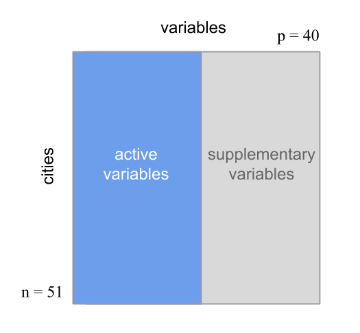
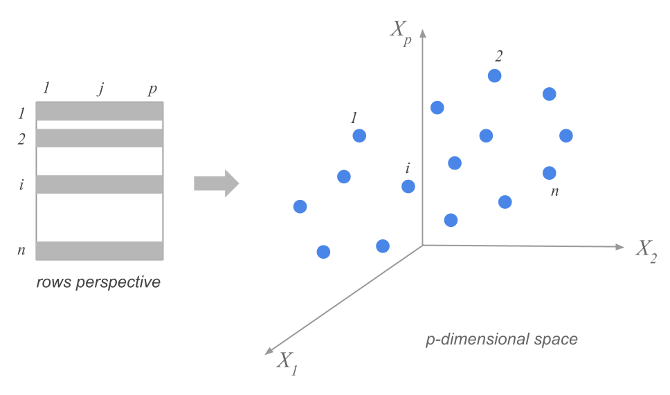
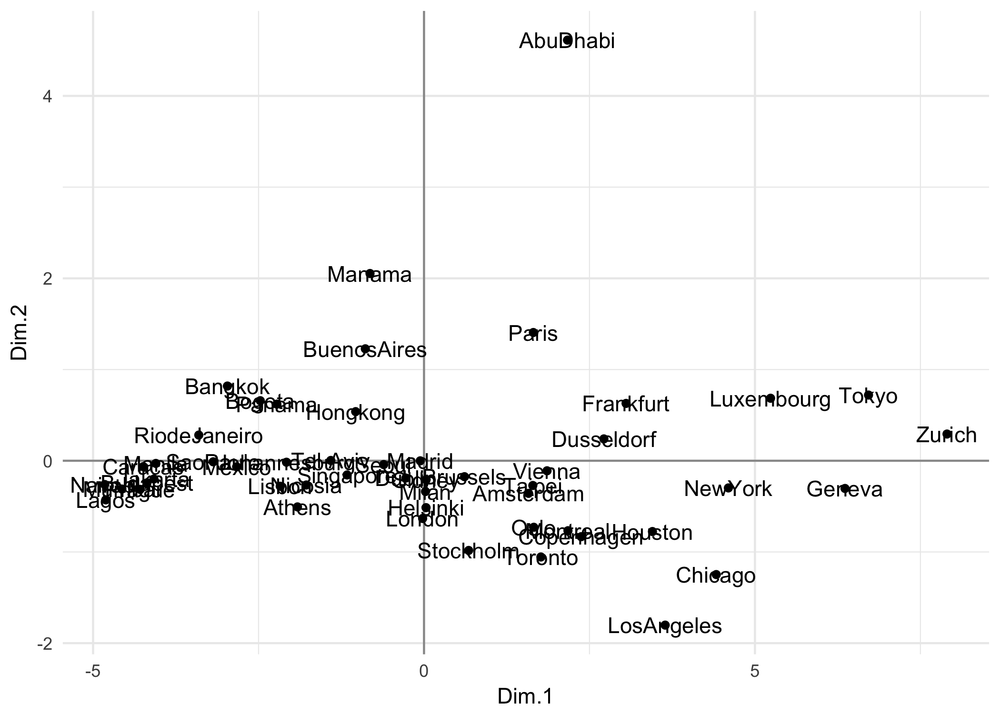
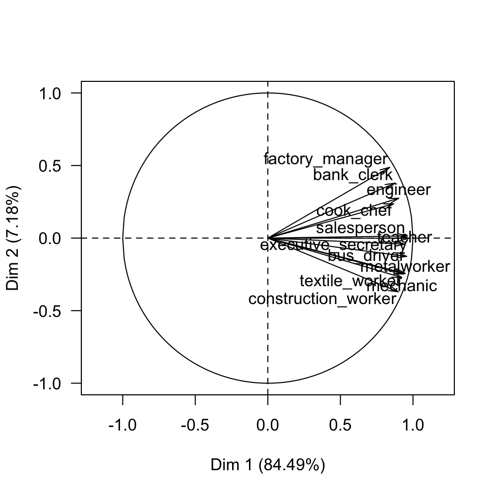
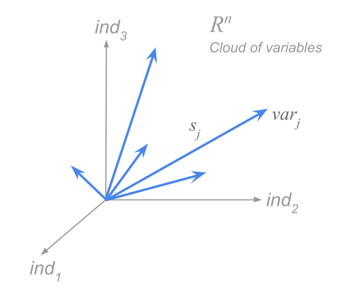

# Basic Elements {#basic}

Principal Component Analysis (PCA) is a statistical technique with a strong
descriptive flavor that can be used to get an approximate visualization
(optimal in a certain sense) of the information contained in a data table.
Simply put, PCA allows us to simultaneously describe the association between 
variables, as well as the ressemblance among individuals. PCA can also be 
regarded to as a dimension reduction technique of quantitative variables, often 
employed as an intermediate step towards a subsequent model building phase.

In this chapter, we describe PCA as an exploratory tool that will allows us
to visualize and gain insight into the structure of a data set.


## Data and Goals

Behind a Principal Component Analysis, the analyst has to deal with several 
continuous variables measured on a number of individuals. The goal is to learn and gain insight about the available data. For instance, a common application of PCA has to do
with building an economic index that measures the economic capacity of a group
of individuals; PCA can also be used to obtain an optimal subset of points
in order to control the polution in a certain geographic region; or to segment
a population in terms of preference evaluations given to a group of similar
products in a certain market.

Often, PCA can be used as an intermediate step in which its outputs will be 
part of a subsequent analysis such as regression, clustering, or 
classification. Likewise, it is also possible to employ PCA as a data 
compression methodology.

The starting point is a data set in which a number of continuous variables
have been measured on a group of individuals. Sometimes, qualitative variables 
may also be present in the data.

The typical convention is to have a data set in a tabular format like in a 
spreadsheet (e.g. rows and columns). Virtually in all cases, the dimensions of 
the table will make it impossible to observe, by simple inspection, which 
individuals are similar, or which variables are measuring similar features 
among the individuals. 
In other words, the association structure of the variables, as well as the 
configuration of the similarities among individuals, remains hidden.


```{r echo = FALSE}
cities <- read.csv('data/cities94.csv', stringsAsFactors = FALSE)

active <- c(
  "teacher", "bus_driver", "mechanic", "construction_worker",
  "metalworker", "cook_chef", "factory_manager", "engineer",
  "bank_clerk", "executive_secretary", "salesperson", "textile_worker")

dat <- na.omit(cities[ ,c('city', active)])
```


Let's consider a simple example that will allows us to settle the various
concepts underlying a Principal Component Analysis. 
The goal is to compare a given number of cities according to the mean
salary-level of a dozen of occupations. The aim is to contrast the coherence 
of the description against our global economic knowledge.

The data set pertains to the year 1994, and it consists of 51 cities around the world, on which 40 economic variables have been measured. The cities are grouped in 10 regions around the world. 

| Num | Variable                | Description                          |
|:----|:------------------------|:-------------------------------------|
|  1  | `city`                  | Name of the city                     |
|  2  | `region`                | Region of the world                  |
|  3  | `price_index_no_rent`   | Index of prices without renting cost |
|  4  | `price_index_with_rent` | Index of prices with renting cost    |
|  5  | `gross_salaries`        | Index of gross salaries              |
|  6  | `net_salaries`          | Index of net salaries                |
|  7  | `work_hours_year`       | Yearly worked hours                  |
|  8  | `paid_vacations_year`   | Yearly paid vacations                |
|  9  | `gross_buying_power`    | Gross buying power                   |
| 10  | `net_buying_power`      | Net buying power                     |
| 11  | `bread_kg_work_time`    | Worked time to buy 1 kg of bread     |
| 12  | `burger_work_time`      | Worked time to buy a burger          |
| 13  | `food_expenses`         | Food expenses                        |
| 14  | `shopping_basket`       | Cost of shopping basket (groceries)  |
| 15  | `women_apparel`         | Cost of women apparel                |
| 16  | `men_apparel`           | Cost of men apparel                  |
| 17  | `bed4_apt_furnished`    | Cost of 4-bedroom appt. furnished    |
| 18  | `bed3_apt_unfurnished`  | Cost of 3-bedroom appt. unfurnished  |
| 19  | `rent_cost`             | Cost of house rent                   |
| 20  | `home_appliances`       | Cost of home appliances              |
| 21  | `public_transportation` | Public transportation (bus, train, metro) |
| 22  | `taxi`                  | Cost of taxi                         |
| 23  | `car`                   | Cost of car                          |
| 24  | `restaurant`            | Cost of restaurant                   |
| 25  | `hotel_night`           | Cost of one hotel night              |
| 26  | `various_services`      | Cost of various services             |
| 27  | `tax_pct_gross_salary`  | Taxes as percentage of gross salary  |
| 28  | `net_hourly_salary`     | Net hourly salary                    |
| 29  | `teacher`               | Salary of School teacher             |
| 30  | `bus_driver`            | Salary of Bus driver                 |
| 31  | `mechanic`              | Salary of Car mechanic               |
| 32  | `construction_worker`   | Salary of Construction worker        |
| 33  | `metalworker`           | Salary of Metalworker                |
| 34  | `cook_chef`             | Salary of Cook chef                  |
| 35  | `departmental_head`     | Salary of Departmental head          |
| 36  | `engineer`              | Salary of Engineer                   |
| 37  | `bank_clerk`            | Salary of Bank clerk (cashier)       |
| 38  | `executive_secretary`   | Salary of Executive secretary        |
| 39  | `salesperson`           | Salary of Salesperson (sales associate) |
| 40  | `textile_worker`        | Salary of Textile worker             |


In the data table, the rows correspond to the _individuals_, which in this case
have to do with the cities. In turn, the columns correspond to the _variables_ 
which have to do with the characteristics measured on the cities.

```{r fig-1-1, echo = FALSE, out.width = '50%', fig.cap='Standard format of a data matrix'}
knitr::include_graphics("images/figure-1-1.png")
```

Before performing the actual PCA, we should always carry out an exploratory
analysis. This analysis refers to computing summary statistics such as maximum
values, miminum values, range, measures of center, measures of spread, 
looking at the distribution of the variables (e.g. boxplots, histograms), etc.
This preliminary analysis could help us identify outliers, errors, or other
major anomalie in the data that can disturb that analysis and make the results
worthless.


### Active Variables

The data set of cities and economic variables is relatively small. However, 
the information contained in this data is very rich. There is a wide number
of variables, which is typical of this type of applications. The variables
can be grouped by topics. For instance, there is a series of variables that
correspond to expenses (in clothes, home rent, vehicles, utilities, etc.).
that reflect the cost of living in each city. Other variables involve 
information about the salary, broken down into 12 professions. Likewise, other
variables convey information about the quality of life, such as taxes, 
payed vacations, work days, and so on.

To compare the cities, we can certainly take all the (continuous) variables
and perform a Principal Component Analysis. Notice that this task will lead us
to compare the cities in terms of prices, salaries, taxes, work-hours necessary
to buy a hamburger, etc. The observed differences among cities are difficult 
to interpret; they can have multiple causes, and have values of very different nature.

Instead of selecting all the available variables, it is preferable to select a group of variables, more homogeneous according
to a certain topic, and more aligned with the goals of the analysis. In this sense,
what we call a _topic_ is a group of variables which defines a certain 
standpoint, chosen by the analyst, to compare the cities. In this way, the
interpretation of the proximities among cities will be easier.

```{r fig-1-2, echo = FALSE, out.width = '50%', fig.cap='Selection of active variables and supplementary variables'}

```

The chosen variables, called _active variables_, comprise the unique elements
that will be used to compare the cities among them. The rest of the variables 
that are not active are called _supplementary variables_. This does not mean 
that the information of the supplementary variables will not be used. We will
use the supplementary variables as additional information that may help us to
explain the observed (dis)similarities among the cities.

In our example, we will take as active variables the net income, measured in 
dollars, for the 12 selected professions. Two cities will be close to each 
other if the incomes of these 12 professions are very similar, independently
of any other variables that may make them different (e.g. size, prices, 
altitude, etc.). In the following list we provide the 12 available professions:

- `Teacher`
- `Bus driver`
- `Car Mechanic`
- `Construction worker`
- `Metalworker`
- `Cook chef`
- `Factory manager`
- `Engineer`
- `Bank clerk`
- `Executive secretary`
- `Salesperson`
- `Textile worker`

The rest of the variables will be considered supplementary and they will be
employed during the interpretation of the results.


## Analysis of Distances

The results obtained in a PCA will allows us to get a visualization of the
differences among the 51 cities, according to the net salaries of the
chosen professions, as well as a visualization of the global association 
among such professions.

To get such visual displays, we utilize a geometric approximation that is 
fairly simple and intuitive. As a matter of fact, this type of approximation is
the foundation of all component-based exploratory methods, which consists of
regarding a data matrix from the dual point of view of rows and columns. 
Each perspective involves considering a _cloud of points_, one for the rows,
and one for the variables.


### Cloud of Row-Points

We can regard each row of the data table (each city) as one point with 12 
coordinates. Each coordinate corresponding to each of the 12 professions.

If we had only recorded three professions, the values taken by each city would
be located in a three dimensional space, defining a cloud of 51 city-points.
We can generalize this idea to any number of professions. If we consider our
12 selected professions, then the cloud of points will be located in a 
12-dimensional space.

In general, the rows of a data matrix will form a cloud of $n$ points in a 
$p$-dimensional space (as many dimensions as active variables). We call
this cloud the _cloud of row-points_ or simply the _cloud of individuals_.

```{r fig-1-3, echo = FALSE, out.width = NULL, fig.cap='Cloud of n Row-points'}

```


In this cloud, two points that are close to each other will indicate two cities
with similar values in each of the 12 professions. In contrast, two points that
are further apart will indicate two cities with distinct salary levels.

To measure the notion of _proximity_ between row-points (the cities) we need
to define a measure of distance. The most intuitive distance measure is the
__euclidean__ distance between two points given by:

$$
d^2(i, i') = \sum_{j=1}^{p} (x_{ij} - x_{i'j})^2
(\#eq:1)
$$

The main problem with visualizing the distance among the points, resides in 
the high dimensionality of the cloud of points (12 dimensions in our example)
which makes it impossible to our human vision to visualize.


### Cloud of Column-Points

In a similar way to the cloud of row-points, we can geometrically represent 
the $p$ columns of the data matrix in an $n$-dimensional space (one dimension
for each individual). The $n$ coordinates of a column-point are given by the 
$n$ values of the corresponding variable in the data table.

```{r fig-1-4, echo = FALSE, out.width = NULL, fig.cap='Cloud of p Column-points'}
knitr::include_graphics("images/figure-1-4.png")
```


The interesting part of this cloud of variable-points lies in the fact that 
it is a representation of the associations between the variables. Each of them
measures an observed characteristic on the cities. Consequently, we can see
which variables measure similar things among the cities. Analogous to the 
distance between cities, we need to define a distance between the variable-points
that captures the intensity and the nature of the association between the 
variables.

Two variable-points that are close to each other, will indicate two variables
that take related values in the entire set of cities: if we know the values
of one variable, we can know the values of the other one.

A very common measure to quantify the association between variables is the
__linear correlation coefficient__. If we used this coefficient as a distance,
then the visualization of the variables becomes a visual display of the 
matrix of correlations among variables.


## How to see the distances between points

Because both types of clouds---row-points and column-points---are located in
high dimensional spaces, we cannot observe them directly. The essence of
Principal Component Analysis involves searching for a plane on which we project
the cloud of points in such a way that the obtained configuration is as close
as possible to the original configuration of the cloud in the high-dimensional
space. We call this plane the _factorial plane_.

The way in which we obtain the desired plane, is by making the overall distances
between projected points as close as possible to the real distances between
points in the space of origin.

Let's consider in first place the cloud of $n$ individual-points located in
the space where each axis corresponds to a variable. The following figure
depicts this idea when we have only three variables.

```{r fig-1-5, echo = FALSE, out.width = '90%', fig.cap='Cloud of row-points in first factorial plane'}
knitr::include_graphics("images/figure-1-5.png")
```

The problem consists of finding the factorial plane such that the set of
of all pairs of distances $d_F(i,i')$ between points, is as close as possible
to the real distances $d_X(i,i')$ measured in the space of origin.


###  How to find the projection planes

Our goal has to do with finding a subspace of reduced dimension that conserves
tha maximum of information from the original configuration of the cloud. For
instance, let's pretend that the original cloud has the shape of a mug, like
in the following figure:

```{r echo = FALSE, out.width = '30%'}
knitr::include_graphics("images/mug-shaped-cloud.png")
```

Furthermore, let's assume that we can only observe the projection of the mug
on a plane of reduced dimension. The question is: Which plane should we choose?

```{r fig-1-6, echo = FALSE, out.width = NULL, fig.cap='Three projections of a mug-shaped cloud points'}
knitr::include_graphics("images/figure-1-6.png")
```

We can consider of projecting this mug cloud over different planes. 
As you can tell, the projection on the plane $H_A$ is much more informative 
that the projection on the plane $H_B$. At least we can see that the figure
on $H_A$ has to do with a lengthened object, and that one of its ends is wider 
than the other end. In contrast, all the points of the projected cloud on 
the plane $H_B$ are confounded, and it does not convey a clear idea the
original cloud, except for the shadow of the handle. However, the best 
projection among the three planes is that of $H_C$.

We obtain the plane $H_C$ by searching for the plane that makes the dispersion
of the projected points as large as possible: 

$$
Max_H \sum_i \sum_{i'} d^{2}_{H} (i, i')
(\#eq:2)
$$

where $H$ represents the subspace of the projection.

Searching for the maximum can be written as:

$$
Max_H \sum_i \sum_{i'} d^{2}_{H} (i, i') = Max_H \left \{ 2n \sum_i d^{2}_{H} (i, G) \right \}
(\#eq:3)
$$

The problem of preserving the projected distances between all pairs of points
becomes a problem of preserving the distances between each point and the center of
gravity $G$.

```{r fig-1-7, echo = FALSE, out.width = '60%', fig.cap='Decomposition of the distance between a row-point and the center of gravity'}
knitr::include_graphics("images/figure-1-7.png")
```

The formula in equation \@ref(eq:4) is actually an expression for the Pythagorean theorem. The spread of the cloud of points can be decomposed into two terms: the spread in the projection plane, and another (orthogonal) term given by the sum of the distances of the points to the projection plane:

$$
\sum_{i} d^{2} (i, G) = \sum_i d^{2}_{H} (i, G) + \sum_i d^{2}_{\bar{H}} (i, G)
(\#eq:4)
$$

In this way, the projection plane that guarantees the maximum dispersion between the points, is also the plane that gets as close as possible to the original cloud (in the sense of least squares criterion). This is expressed in the following relation \@ref(eq:5)

$$
Max \hspace{2mm} \sum_{i} d^{2}_{H} (i, G) \quad \Longleftrightarrow \quad Min \hspace{2mm} d^{2}_{\bar{H}} (i, G)
(\#eq:5)
$$


### How to take into account the importance of individuals

Sometimes we may be interested in assigning weights to the individuals based on their relative importance or relevance. When all the individuals have the same importance, we can give a weight equal to $1/n$ to each of them. Thus, the fit criterion becomes:

$$
Max \hspace{2mm} \sum_{i} \frac{1}{n} d^{2}_{H} (i, G) = Max \hspace{2mm} \frac{\sum_i (x_{iH} - \bar{x}_H)^2}{n}
(\#eq:6)
$$

In the general case where each individual has its own weight $p_i$ with $\sum_i p_i = 1$, then the fit criterion is expressed as:

$$
Max \hspace{2mm} \sum_{i} p_i \hspace{1mm} d^{2}_{H} (i, G)
(\#eq:7)
$$

The product of the weight of a point, $p_i$, times the squared of its distance to the center of gravity, $d^{2}_{H} (i, G)$, is known as _inertia of the point_. In this case, the problem involves looking for the projection plane that maximizes the projected inertia.


### Inertia Decomposition

The total inertia is defined as:

$$
I = \sum_{i=1}^{n} p_i \hspace{1mm} d^2(i,G)
(\#eq:8)
$$


The total inertia can be broken down into two additive terms:

- projected inertia on a subspace $H$
- inertia orthogonally projected on a subspace $\bar{H}$

$$
I = I_H + I_{\bar{H}}
(\#eq:9)
$$


The problem of searching for the subspace that makes the dispersion of the projected points as large as possible can also be put in terms of inertias. Namely, we look for a plane $H$ that maximizes the projected inertia (see figure below).

```{r fig-1-8, echo = FALSE, out.width = '60%', fig.cap='Successive directions of maximum inertia'}
knitr::include_graphics("images/figure-1-8.png")
```

In order to find the optimal subspace, we begin by looking for a one-dimensional space (i.e. a line) of maximum projected inertia. If all individuals have the same weight, then this first subspace coincides with the direction of maximum stretch of the cloud.

Having found the first one-dimensional subspace, the next step involves finding a two-dimensional subspace (i.e. a plane) with maximum projected inertia. Then, we look for a three-dimensional space, and so on and so forth. At each step, we look for a higher dimensional space such that the projected inertia is as large as possible.

It can be proved that the two-dimensional plane must contain the one-dimensional space (i.e. the line) of maximum projected inertia. Having found the first direction of maximum inertia, one needs to find another line, orthogonal to the first one, such that the plane formed by them has maximum inertia. Analogously, the subspace of three dimensions is formed with the two-dimensional space by adding an orthogonal direction to this plane (see figure \@ref(fig:fig-1-8)).

Because the inertia is additive in orthogonal directions, PCA involves the decomposition of the total inertia in $p$ additive components, as many as the number of dimensions in the original space.

$$
I = I_1 + I_2 + \dots + I_p
(\#eq:10)
$$

Interestingly, the inertias (the dispersions) are decreasingly ordered, which means that subsequent orthogonal directions become smaller, that is, $I_1 \geq I_2 \geq \dots \geq I_p$.

This implies that the configuration of the projected cloud on the first fatorial plane is as close as possible (in the least squares sense) to the original configuration.

For example, the figure below shows the plane of maximum projected inertia for in the data of the Cities.

```{r fig-1-9, echo = FALSE, out.width = '80%', fig.cap='Cloud of variable-points in the standardized PCA'}

```

This is the representation of the cities, in a factorial plane, that best resembles the existing distances between the cities according to the salary level. For instance, we can tell that Tokyo, Zurich and Geneva are close to each other, indicating similar salaries among the analyzed professions. The same can be said about Manila, Mumbai, Lagos, and Prague; these cities have similar salaries among them, but they have a contrasting difference with the former group (Tokyo, Zurich, and Geneva).

We can also assume a certain similarity between northen cities such as Stockholm, and Copenhagen, whereas there seems to be a substantial salary difference between Paris and American cities (Los Angeles, Chicago, Toronto, Houston).

The center of the graph represents the average point of the cloud. This corresponds to cities with salaries closer to the mean values.

Notice the difference in scale utilized in the x-axis and the y-axis. Actually, the cloud of points is very extended along the x-axis $F_1$.


### Visualizing association between variables.

Let's discuss what the analysis involves regarding the cloud of variable-points. Recall that the cloud of variable-points is defined by the columns of the data matrix $\mathbf{X}$. Without loss of generality, we will assume that the variables are mean-centered and normalized by the standard deviation.

The first thing to do is to define a measure of distance between variables. One way to represent a certain notion of proximity among variables is given by the following formula:

$$
d^2(j, j') = 2 (1 - cor(j, j'))
(\#eq:11)
$$


If two variables $j$ and $j'$ measure the same thing (in the sense of having a linear correlation of 1) then their points will be overlapped.

In the case where two variables $j$ and $j'$ have a linear correlation equal to -1 (when one increases, the other decreases), the two variable-points will have a maximum distance in opposite directions.

When one variable does not provide any information about the other one, we have a situation when their correlation coefficient will be zero. This would correspond to an intermediate distance in which the variables form an orthogonal angle. These cases are illustrated in figure \@ref(fig:fig-1-10).

```{r fig-1-10, echo = FALSE, out.width = '70%', fig.cap='Cloud of variable-points in the standardized PCA'}
knitr::include_graphics("images/figure-1-10.png")
```

If the correlation is equal to 1, the squared distance is zero. Likewise, if the correlation is -1 the distance is 4, and if the correlation is zero then the distance is 2. This formulae define the so-called standardized Principal Components Analysis.

It can be shown that all the variable-points are located within a one-unit distance from the origin (inside a hypersphere of radius 1). The cloud of variable-points is defined by a set of vectors that start from the center of the sphere. The correlation coefficient between two variables coindices with the cosine of the angle formed by two corresponding vectors (associated to the variables).

Two variables that are close to each other will form a small angle, which corresponds to a large correlation coefficient. Two independent variables will have a zero correlation coefficient, thus forming a square angle between them. In turn, two opposed variables will have a correlation coefficient close to -1 and thus will appear on two opposite locations in the sphere.

Analogously to the cloud of row-points, we also seek to find a projection plane providing the largest amount of information about the associations between the variables. More precisely, we look for a plane that provides information about the angles between variables, that is, about their correlations.

In the case of the 12 variables observed on the 51 cities, we obtain the configuration on the first factorial plane, displayed in figure \@ref(fig:fig-1-11).

```{r fig-1-11, echo = FALSE, out.width = '70%', fig.cap='Circle of correlations on the first factorial plane'}

```

Notice that in this case all the variables are positively correlated. Moreover, from the circle of correlations, it is possible to observe two groups of variables. One group is formed by `departmental_head`, `engineers`, `bank_clerk`, and `cook_chef`. The other group is formed by the rest of the professions.

In the matrix of correlations (see table \@ref(tab:table-1-3)) we can see the magnitude of the association between the variables. As you can tell, all the correlations are positive and with large value tanging from 0.59 to 0.96.

```{r table-1-3, echo = FALSE}
# profession-correlations
cor_dat <- cor(dat[ ,-1], use = 'complete.obs')
var_labels <- c(
  'tea', 'bus', 'mec', 'con', 'met', 'coo', 'dep',
  'eng', 'ban', 'exe', 'sal', 'tex'
)

colnames(cor_dat) <- var_labels
rownames(cor_dat) <- var_labels

knitr::kable(
  round(cor_dat, 2),
  booktabs = TRUE,
  caption = 'Matrix of correlations.'
)
```

The fact that all the variables are positively correlated implies that if one type of salary in a city is high, then the other salaries in that city will also be high.

In later sections of the book we will emphasize the idea that  Principal Component Analysis can be approached from the point of view of the variable-points having a distance based on the correlation between the variables. In other words, a PCA on the row-points is not an independent analysis from a PCA on the variable-points. Quite the opposite in fact, it is possible to obtain the results of a PCA on a set of points (e.g. variables) given the results of the other set (e.g. the rows). This, as we'll see, provides a set of rules extremely valuable in the interpretation of results.


### Normalized PCA or non-normalized PCA?

As we've seen, Principal Component Analysis consists of decomposing the inertia of the original cloud, based on some orthogonal directions. Each of the obtained orthodonal directions accounts for a proportion of the original inertia.

But, what is the contribution of each variable to the original inertia?

The distance between variable-points defined in equation \@ref(eq:11) implies that the contribution, of each variable, to the total inertia is the same for all variables, equal to $1/p$.

The inertia of the cloud of variable-points with respect to the origin coincides with the number of active variables.

$$
I_T = \sum_{j=1}^{p} d^2(j, O) = p
(\#eq:12)
$$

In order for equation \@ref(eq:12) to make sense, we need to use standardized values (mean-centered and unit-variance):

$$
z_{ij} = \frac{x_{ij} - \bar{x}_j}{s_j}
(\#eq:13)
$$

where $\bar{x}_j$ is the mean of variable $j$ and $s_j$ is the corresponding standard deviation. In this case we talk about _Normalized Principal Component Analysis_.

With standardized data, the distance of each variable and the origin is equal to 1:

$$
d^2(j, O) = \sum_{j=1}^{n} \frac{1}{n} \left ( \frac{x_{ij} - \bar{x}_j}{s_j} \right )^2 = \frac{\frac{1}{n} \sum_j (x_{ij} - \bar{x}_j)^2}{s_{j}^{2}} = 1
(\#eq:14)
$$

We should mention that the use of Normalized PCA is not always justified. For example, if a PCA is performed by an analyst working for a bank, if may be more interesting to assign a larger weight to the products that contribute to the volume of the deposits. That is, the importance given to different variables should be done by taking into account the goal of the analysis.

If we use the _raw_ data (i.e. mean-centered only, no scaling by the standard deviation), we could see what the contribution of each variable is to the total inertia. The squared distance of one variable to the origin is given by:

$$
d^2(j,O) = \sum_{j=1}^{n} \frac{1}{n} (x_{ij} - \bar{x}_j)^2 = var(j)
(\#eq:15)
$$

With non-normalized data, the variables are no longer found inside a sphere of radious 1. Instead, the length of the segment (i.e. the vector) of each variable is equal to its standard deviation. We can then think of the cloud of variable-points as a set of vectors, each one of length equal to the standard deviation of the variable, and forming angles defined by the correlation coefficient between the variables.

This type of analysis is called _Non-Normalized Principal Component Analysis_.

With this type of PCA, the distance between two variables depends on the correlation (i.e. the angle between them), as well as on their variances.

```{r fig-1-12, echo = FALSE, out.width = '50%', fig.cap='Cloud of variable-points in a non-normalized PCA'}

```


The total inertia of the cloud of variable-points is given by the sum of the variances of each variable:

$$
I_T = \sum_{j=1}^{p} d^2(j,O) = \sum_{j=1}^{p} var(j)
(\#eq:16)
$$


The contribution of each variable to the total inertia is given by:

$$
ctr_j = \frac{var(j)}{\sum_j var(j)}
(\#eq:17)
$$

The variance is a function of the unit of measurement in which a variable is measured. This provides a valuable degree of freedom to tune the importance of each variable in the analysis.

In practice, it is preferable to assigne the same importance to all the variables. This is a requirement for when the active variables have different units of measurement (e.g. euros, grams, meters, etc).

In our working example with the data about salaries in various cities, the summary statistics for the active variables are displayed in the following table \@ref(tab:table-1-4)

```{r table-1-4, echo = FALSE}
# summary statistics of active variables
active_vars_statistics <- cbind.data.frame(
  weight = nrow(dat),
  mean = colMeans(dat[ ,-1]),
  stdev = apply(dat[ ,-1], 2, sd),
  min = apply(dat[ ,-1], 2, min),
  max = apply(dat[, -1], 2, max)
)

knitr::kable(
  round(active_vars_statistics, 2),
  booktabs = TRUE,
  caption = 'Summary statistics of active variables.'
)
```

From the table above, we see that professions `factory manager` and `engineer` are the ones that have, on average, the higher salaries. Then we have `bank clerk`, `teacher`, `cook chef`, and `metalworker`. And in the last two places there is `salesperson` and `textile worker`, which are considered to be low-skills professions mostly performed by women.

Because all active variables are measured in the same unit (in dollars), we could carry out a non-normalized PCA. However, if we did this type of analysis, it would imply giving more importance to those professions with higher salary. Why? Because these are the variables that have a larger spread. If our goal is to compare the cities by giving the same importance to all professions, then it is more suitable to apply a normalized PCA. This, in turn, let us focus on the matrix of correlations among the active variables.

Interestingly, both cloud of points---individuals and variables---have the same inertia. On one hand, the inertia of the cloud of row-points is the sum of the squared distances between each point and the center of gravity, weighed by the importance of each individual. This inertia can be expressed with respect to each axis in the original space (in which each axis corresponds to a variable):

$$
I_T = \sum_{i=1}^{n} \frac{1}{n} \sum_{j=1}^{p} (x_{ij} - \bar{x}_j)^2 =
\sum_{j=1}^{p} \sum_{i=1}^{n} \frac{1}{n} (x_{ij} - \bar{x}_j)^2 = \sum_{j=1}^{p} var(j)
(\#eq:18)
$$

The variance along a given axis is the spread of the projected coud on that axis. Because the axes are orthogonal, the total inertia is equal to the sum of the variances of the variables. Therefore, the inertias of both clouds are the same.


### Distance Matrices

The rows (i.e. the cities) are located in a space where we measure distance in the classic sense. In a normalized PCA we have:

$$
d^2(i, i') = \sum_{j=1}^{p} \left ( \frac{x_{ij} - x_{i'j}}{s_j} \right )^2
(\#eq:19)
$$


And in the case of a non-normalized PCA:

$$
d^2(i, i') = \sum_{j=1}^{p} (x_{ij} - x_{i'j})^2
(\#eq:20)
$$


In the cloud of variable-points, the distance is defined by the formula \@ref(eq:11) when we are carrying out a normalized PCA. In the case of a non-normalized PCA then distance becomes:

$$
d^2(j, j') = var(j) + var(j') - 2 cov(j,j')
(\#eq:21)
$$


All these distances can be organized in square matrices: an $n \times n$ distance matrix for the distances between individuals, and a $p \times p$ matrix for the distances between variables.

If we don't defined how to measure the distances between points, then the clouds of points remain undefined. In our approximation, we assume that the rows (the cities) are located in a metric (Euclidean) space, which means that the distance is measured by the classic formula of the sum of squared differences:

$$
d^2 (i, i') = \sum_{j=1}^{p} (x_{ij} - x_{i'j})^2 = (x_i - x_{i'}) \mathbf{I} (x_i - x_{i'})
(\#eq:22)
$$


Notice that in this case, calculating the distance between two individuals takes the form of a scalar product, where the metric matrix is the identity matrix. This corresponds to a non-normalized PCA.

In contrast, when we carry out a normalized PCA, the distance between two individuals is measured by the formula:

$$
d^2(i, i') = \sum_{j=1}^{p} \left ( \frac{x_{ij} - x_{i'j}}{s_j} \right )^2 = 
(x_i - x_{i'}) \mathbf{S}^{-2} (x_i - x_{i'})
(\#eq:23)
$$

where:

$$
\mathbf{S}^{-2} = \left(\begin{array}{cccc}
\dots & 0 & 0 & 0  \\
0 & 1/s_{j}^{2} & 0 & 0  \\
0 & 0 & \dots & 0 \\
0 & 0 & 0 & \dots  \\
\end{array}\right)
$$

In this case, the metric matrix is given by $\mathbf{S}^{-2}$ (diagonal matrix of inverses of variable variances). Notice that all euclidean metrics can be expressed in a canonical form by using a change of coordinates. When using $\mathbf{S}^{-2}$ such change of coordinates involves dividing the coordinates of the points by the standard deviation of each variable.

Regarding the cloud of variable-points, the distance between variables is defined based on the correlation between two variables. In general, this distance is given by the scalar product between two vectors:

$$
cor(j,j') - \sum_{i=1}^{n} \frac{1}{n} \left ( \frac{x_{ij} - \bar{x}_j}{s_j} \right ) \left ( \frac{x_{ij'} - \bar{x}_{j'}}{s_{j'}} \right ) = \mathbf{z_{j}^{\mathsf{T}} N z_j}
(\#eq:24)
$$

The natural metric matrix to be used in this case is the diagonal matrix $\mathbf{N}$ of weights for individuals ($1/n$ or $p_i$). Thus, the distance between variables is defined as:

$$
d^2(j,j') = <z_j, z_{j'}> + <z_j, z_{j'}> - 2<z_j, z_{j'}>
(\#eq:25)
$$

which coincides with \@ref(eq:17) when using mean-centered data and standardized (normalized PCA), or with \@ref(eq:16) when using non-centenred data (non-normalized PCA).
