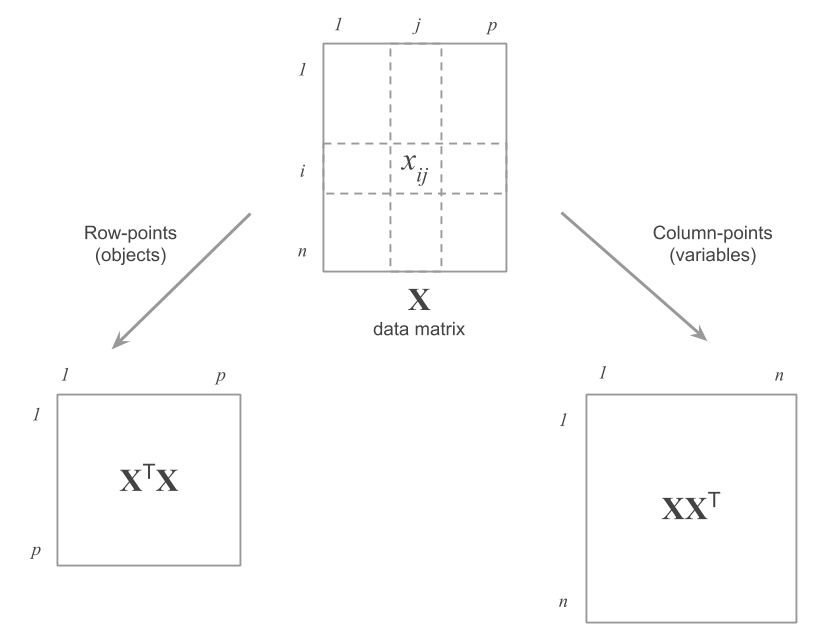

# (PART) Mechanics {-}

# How Does PCA Work? {#mechanics}

At its heart, performing a Principal Component Analysis involves taking a data table that contains the information about a certain phenomenon, in order to transform such data into a set of visual representations in some optimal sense. During the transformation process part of the information is "lost". However, PCA seeks to minimize this loss of information. There is a tradeoff between the amount of information that is lost, in exchange of gaining understanding and insight. We go from a raw data table to a set of graphical representations that should be easier to understand. In order to be able to _read_ the results and graphics obtained from a PCA, we need to discuss the mechanics of this technique and its underlying rationale.


## Principal Components

Let's consider the cloud of row-points, also known as the cloud of individuals. As we've mentioned, we are interested in decomposing the inertia (i.e. the spread) of this cloud in terms of a series of orthogonal directions.

The first step consists of looking for the most basic type of subspace, namely, a line. Geometrically, a line can be defined by a vector $\mathbf{u}$ of unit norm. Based on the discusion from the previous chapter, we will attempt to define $\mathbf{u}$ in such a way that the projected points on this direction have maximum inertia (see figure \@ref(fig:fig-2-1)). In other words, $\mathbf{u}$ will be defined such that the distances between pairs of projected points are as close as possible to the original distances.


```{r fig-2-1, echo = FALSE, out.width = '75%', fig.cap='Projection of a row-point on the direction defined by a unit vector'}
knitr::include_graphics("images/figure-2-1.png")
```


The projection (or coordinate) of a row-point on the direction defined by $\mathbf{u}$ is given by:

$$
\psi_i = \sum_{j=1}^{p} (x_{ij} - \bar{x}_j) u_j
(\#eq:2-1)
$$


The inertia (or variance) of all the projected points on $\mathbf{u}$ is then:

$$
\sum_{i=1}^{n} = p_i \hspace{1mm} \psi_{i}^{2} = \lambda
(\#eq:2-2)
$$

The goal is to look for a line $\mathbf{u}$ that maximizes the value $\lambda$.

Let $\mathbf{X}$ be the mean-centered data matrix. Obtaining $\mathbf{u}$ implies diagonalizing the cross-product matrix $\mathbf{X^\mathsf{T} X}$. This matrix is the correlation matrix in a normalized PCA, whereas in a non-normalized PCA this matrix becomes the covariance matrix.

It turns out that the unit vector $\mathbf{u}$ is the eigenvector associated to the largest eigenvalue from diagonalizing $\mathbf{X^\mathsf{T} X}$.

Analogously, the orthogonal direction to $\mathbf{u}$ that maximizes the projected inertia in this new direction corresponds to the eigenvector associated to the second largest eigenvalue from diagonalizing $\mathbf{X^\mathsf{T} X}$. This maximized inertia is equal to the second eigenvalue, so on and so forth.

The eigenvalues provide the projected inertias on each of the desired directions. Moreover, the sum of the eigenvalues is the sum of the inertias on the orthogonal directions, and this sum is equal to the global inertia of the cloud of points.

| Eigenvalues | Eigenvectors   |
|:-----------:|:--------------:|
| $\lambda_1$ | $\mathbf{u_1}$ |
| $\lambda_2$ | $\mathbf{u_2}$ |
|   $\dots$   |   $\dots$      |
| $\lambda_p$ | $\mathbf{u_p}$ |


$$
I_T = \lambda_1 + \lambda_2 + \dots + \lambda_p = \begin{cases}
  p & \text{in normalized PCA} \\
  & \\
  \sum_{j=1}^{p} var(j) & \text{in non-normalized PCA}
\end{cases}
(\#eq:2-3)
$$

The eigenvectors give the directions of maximum inertia and we call them 
factorial axes.

On these directions we project the individuals, obtaining what is called the
__principal components__ (see formula \@ref(eq:2-1)). As we can tell, each 
component is obtained as a linear combination of the original variables:

$$
\boldsymbol{\psi}_{\alpha} = u_1 \mathbf{x_1} + \dots + u_p \mathbf{x_p}
$$

Likewise, each component has a variance equal to its associated eigenvalue:

$$
var(\boldsymbol{\psi}_{\alpha}) = \lambda_\alpha
$$

In summary, a Principal Component Analysis can be seen as a technique in which we go from $p$ original variables $\mathbf{x_j}$, each having an importance given by its variance, into $p$ new variables $\boldsymbol{\psi}_{\alpha}$. These new variables are linear combination of the original variables, and have an importance given by their variance which turns out to be their eigenvalues (see figure \@ref(fig:fig-2-2)).

```{r fig-2-2, echo = FALSE, out.width = '75%', fig.cap='Change of basis and dimension reduction'}
knitr::include_graphics("images/figure-2-2.png")
```


### Interpreting the Inertia Proportions

In our working example with the data about the cities, we obtain the following 
12 eigenvalues:

```{r table-2-1, echo = FALSE}
# table of eigenvalues
eigs <- read.csv('data/eigenvalues.csv', row.names = 1)

knitr::kable(
  eigs,
  booktabs = TRUE,
  caption = 'Distribution of eigenvalues.'
)
```

Notice that we obtain a first principal component that stands out from the rest. 

The column `eigenvalue` provides the explained inertia for each direction. The sum of all of the inertias corresponds to the global inertia of the cloud of cities. Observe that this global inertia is equal to 12, which is the number of variables. Recall that this is property from a normalized PCA.

The column `percentage`, in turn, expresses the porpotion of the explained inertia by each axis. As we can tell from the table, the first direction explains about 85% of the global inertia, which is contained in a 12-dimensional space. Because of the very large value of this principal component, one could be tempted to neglect the rest of the components. However, we'll see that such an attitude is not excempt of risks. This does not imply that the rest of the components are useless or uninteresting. Quite the opposite, they may help reveal systematic patterns of variation in the data.

The last column of table \@ref(tab:table-2-1) provides the cumulative percentage of inertia. With the first three factorial axes we summarize about 95% of the inertia (or spread) of the cloud of points.


### How many axes to retain?

From the previous results, we've seen that with the first principal components, we get to recover or capture most of the spread in the cloud of points. A natural question arises: How many axes should we keep?

This is actually not an easy question, and the truth is that there is no definitive answer. In order to attempt answering this question, we have to consider another inquiry: What will the axes be used for? Let's see some examples.

__Example 1.__ One possibility involves using the axes to obtain a simple graphic representation of the data. In this case, the conventional number of axes to retain is 2, which are used to graph a scatter diagram: say we call these axes $F_1$ and $F_2$. With a third axis, we could even try to get a three-dimensional representation ($F_1$, $F_2$, and $F_3$). Beyond three dimensions, we can't get any visual representations.

Optionally, we could try to look at partial displays of the $p$-dimensional space. For instance, we can get a scatterplot with $F_2$ and $F_3$, and then another scatterplot with $F_1$ and $F_4$. Keep in mind that all these partial views require a considerable "intelectual" effort. Why? Because of the fact that in any of these partial configurations, the distances between points come from compressed spaces in which some directions have dissapeared. If the goal is to simply obtain a two-dimensional visualization, it usually suffices with looking at the first factorial plane ($F_1$ and $F_2$). To look "beyond" this plane, we will use outputs from clustering methods.

__Example 2.__ If the purpose is to keep the factorial axes as an intermediate stage of a clustering procedure, then this changes things drastically. In this situation, we want to retain several axes (so that we get to keep as much of the spread of the original variables). Usually we would discard those directions associated to the smallest eigenvalues. The reason to do this is because such directions typically reflect random fluctuations---"noise"---and not really a signal in the data.

__Example 3.__ If the goal is to use the factorial axes as explanatory variables in a regression model or in a classification model, we will try to keep a reduced number of axes, although not necessarily the first ones. It is certainly possible to find discriminant directions among axes that are not in the first positions.

As you can tell, deciding on the number of axes to retain is not that simple. This is a decision that is also linked to the stability of results.

We recommend not to blindly trust in automatic rules of thumb for deciding the number of directions to be kept. Our experience tells us that it is possible to find stable factorial axes with relatively small eigenvalue.

_Note:_ To decrease the percentage of inertia of each axis, one can add new uncorrelated variables to the data table (i.e. white noise). Doing so should not have an effect on the first factorial axes, which should still be able to capture most of the summarized "information".


### Coordinates of row-points

The table below contains the results about the cities with respect to the first 
two factorial axes:

```{r table-2-2, echo = FALSE, comment = ''}
load('data/table-2-2.RData')
#cat('Table 2.2: Results of the individuals\n')
#pca_inds

# print table with kable
knitr::kable(
  pca_inds,
  
  booktabs = TRUE,
  caption = 'Results of the individuals'
)
```


The column `wgt` indicates the weight of each city, which in this case is a 
uniform weight of 100 / 51 = 1.96.

The column `disto` provides the squared distance of each city to the center of 
gravity. This column allows us to find which cities are the _typical_ cities 
(i.e. the closest ones to the center of gravity), such as Helsinki. Likewise, 
it allows us to identify the _unusual_ or _unique_ cities (i.e. those that have 
a large distance to the center of gravity) like Zurich or Tokyo. In general, 
the distance to the center of gravity is a criterion of the _singularity_ of 
each city.

The third and fourth columns correspond to the coordinates obtained from 
projecting the cities onto the first two factorial axes. The representation on 
the first factorial plane is obtained with these coordinateas ($F_1$ and $F_2$),
given in figure \@ref(fig:fig-1-9).

It is important to mention that the orientation of a factorial axis is arbitrary:
the important trait is the direction. We could change the orientation of an axis 
by changing the sign of the coordinates on this axis. Graphically, this means 
that all symmetries are possible. The user has to make the decision of which 
orientation is the most convenient.


### Interpretation Tools

#### Contributions {-}

The next two columns, `contr1` and `contr2`, provide the _contributions_ (in percentages) of the cities to the explained inertia by each axis. The inertia of an axis is obtained via formula \@ref(eq:2-2). Thus, we can measure the part of an axis' inertia that is due to a given row-point by means of the quotient:

$$
CTR(i, \alpha) = \frac{p_i \psi^{2}_{i \alpha}}{\lambda_{\alpha}} \times 100
(\#eq:2-4)
$$


The above quotient is the contribution of a point $i$ to the construction of 
axis $\alpha$.

We can use the contributions to identify the cities that contribute the most to 
the construction of the factorial axes.

If all cities had the same contribution, this would have a value of about 2%
(100/51). Consequently, all those cities with contributions greater than 2% can 
be considered to have influence above the average.

_When is a contribution considered to be "high"?_

The answer to this question is not straightforward. A contribution will be
considered "high" when, compared to the rest of contributions, it has an unusual 
large value.

For example, the city that contributes the most to the second axis is Abu Dhabi (48%). Almost half of the inertia of this axis is due to this city alone. Abu Dhabi is clearly very influent in the construction of this axis. We can actually ask about the stability of this axis, meaning, how much the result would change if Abu Dhabi were to be eliminated?

The next figure \@ref(fig:fig-2-3) shows the cities with a size proportional to their contributions on the first factorial plane (sum of the contributions of the first two axes).

```{r fig-2-3, echo = FALSE, out.width = '80%', fig.cap='Contributions of the cities in the first factorial plane'}
knitr::include_graphics("images/figure-2-3.png")
```

All the active points play a role in the construction of an axis. We can check that the sum of all the contributions in an axis add up to 100.

$$
\sum_{i=1}^{n} CTR(i, \alpha) = 100
(\#eq:2-5)
$$


#### Squared Cosines {-}

The last columns of the table of results, `cosqr1` and `cosqr2`, contain the values of the __squared cosines__. These are used to assess the quality of the obtained factorial configuration when compared to the original configuration of the row-points.

Because the obtained representations are an approximation of the real distances between points, it is expected that some distances between pairs of points will be better represented whereas other distances will not reliably reflect the real distance between two points.

The goal is to have a good idea of how close is a point with respect to the factorial plane. If two points are close to the factorial plane, then the projected distance will be a good approximation to the actual distance in the original space. However, if at least one point is further away from the projection plane, then the real distance can be very different from that represented in the factorial plane.

This proximity to the factorial plane is measured with the squared cosine of each point to the factorial axes. 

```{r fig-2-4, echo = FALSE, out.width = '60%', fig.cap='The squared cosine as a measure of proximity'}
knitr::include_graphics("images/figure-2-4.png")
```

The figure \@ref(fig:fig-2-4) illustrates the definition given in equation \@ref(eq:2-6)

$$
COS^2(i, \alpha) = \frac{\psi^{2}_{i \alpha}}{d^2(i, G)}
(\#eq:2-6)
$$


A squared cosine of 1 means that the city is on the factorial axis (i.e. the 
angle $\omega$ is zero), whereas a squared cosine of 0 indicates that the city 
is on an orthogonal direction to the axis.

Notice that the sum of the squared cosines over all $p$ factorial axes is equal 
to 1. This has to do with fact that all axes are needed in order to have the 
exact position of a point in the entire space.

$$
\sum_{\alpha = 1}^{p} COS^2(i, \alpha) = 1
(\#eq:2-7)
$$

Interestingly, the sum of the squared cosines of a given point over the first axes provides, in percentage, the "quality" of representation of the point in the subspace defined by these axes.

_What value of a squared cosine indicates that a point is "well represented" on a factorial plane?_

Similar to the contributions, the answer to the above question is not straightforward. A squared cosine (or the sum on the first two axes of the factorial plane) has to be compared with the rest of the squared cosines in order to determine if it is large or small.

In our working example, the cities are in general well represented on the first factorial plane. The sum of the squared cosines over the first two axes is close to 1. However, cities such as Dublin, Madrid, Sidney or Milan, which are close to the center, are not well represented. In contrast, Mumbai or Caracas are perfectly represented. Figure \@ref(fig:fig-2-5) shows the cities with a size proportional to their squared cosine on the first factorial plane.

```{r fig-2-5, echo = FALSE, out.width = '80%', fig.cap='Squared cosines of the cities on the first factorial plane'}
knitr::include_graphics("images/figure-2-5.png")
```

The cities that are deficiently represented in this plane are the "average" cities. We can only interpret the proximity between cities if they are well represented on the factorial plane.


## Projections of Variables

Just like row-points can be represented on a low-dimensional factorial space that preserves as much as possible the original distances, we can do the same with the column-points (i.e. the variables).

Mathematically, working with the column-points implies diagonalizing the cross-product matrix $\mathbf{X X^\mathsf{T}}$.

```{r fig-2-6, echo = FALSE, out.width = '75%', fig.cap='Matrices to be diagonalized depending on the type of points'}

```

Analogously to the row-points, we can obtain the decomposition of the inertia depending on the directions defined by the eigenvalues of the matrix $\mathbf{X X^\mathsf{T}}$. The projected inertia on each direction is equal to its associated eigenvalue.

```{r fig-2-7, echo = FALSE, out.width = '70%', fig.cap='Cloud of variables and factorial axes in the space of individuals'}

```

The line of maximum inertia is given by the eigenvector $\mathbf{v}$ (defining the direction $F_1$), associated to the largest eigenvalue. The plane of maximum inertia is formed by adding the line that defines the direction $F_2$. This second direction corresponds to the eigenvector associated to the second largest eigenvalue, and so on.

The representation of the variables on an axis is obtained by projecting the variable-points onto a unit vector $\mathbf{v}$ that defines the direction of the axis.

Let $\varphi_{j \alpha}$ be the coordinate of the $j$ variable on the axis $\alpha$

$$
\varphi_{j \alpha} = \sum_{i=1}^{n} \frac{x_{ij} - \bar{x}_j}{s_j} \hspace{1mm} v_{i \alpha}
(\#eq:2-8)
$$

where $\bar{x}_j$ is the mean of the $j$-th variable.

```{r fig-2-8, echo = FALSE, out.width = '85%', fig.cap='Projection of the variables on the first factorial plane'}
knitr::include_graphics("images/figure-2-8.png")
```

The inertia on an axis is given by the sum of the inertias of each variable-point projected onto the axis. In PCA there is not an explicit  weight for the variable-points. However, each variable can play a role more or less important by changing the unit of measurement, which in turn will increase (or decrease) its variance in a non-normalized PCA.

$$
\sum_{j=1}^{p} \varphi^{2}_{j \alpha} = \lambda_{\alpha}
(\#eq:2-9)
$$

Notice that the inertia of the variable-points that are projected onto an axis is the same as the inertia of the row-points projected on the axis of same rank.

Among the factorial axes of both clouds of points, the factorial axes in one space are related to the factorial axes in the other space. These relationships allow us to obtain the directions of one space taking into account the directions of the other space. Such relationships are known as _transition relationships_.

By using the transition relationships, we just need to perform a PCA on one of the spaces (e.g. the rows), and then use these results to derive the results of the other space (e.g. the columns), without having to diagonalize two different cross-products.

In general, we perform the analysis on the cross-product with the smaller dimensions. Usually, this involves working with the matrix $\mathbf{X^\mathsf{T} X}$, assuming that the data matrix has more rows than columns: $n > p$. In this scenario, we obtain the projection of the row-points given in equation \@ref(eq:2-1). The projection of the variables is then calculated from the directions $\mathbf{u}$, which define the factorial axes of the cloud of row-points.

$$
\varphi_{j \alpha} = \sqrt{\lambda_{\alpha}} \hspace{1mm} u_{j \alpha}
(\#eq:2-10)
$$

The above formula allows us to interpret the simultaneous representation of both the cities and the professions.

In our working example, the results about the variables are displayed in table 2.3

```{r table-2-3, echo = FALSE, comment = ''}
load('data/table-2-3.RData')
#cat('Table 2.3: Results of the variables\n')
#pca_vars

# print table with kable
knitr::kable(
  pca_vars,
  
  booktabs = TRUE,
  caption = 'Results of the variables'
)
```


The coordinates of all the variables in the first axis have the same sign, which indicates that the cloud of points is not centered.

Notice also that, in the case of normalized analysis, the coordinate coincides with the correlation of a variable and the principal component (projection of the points onto the factorial axis of same rank):

$$
\varphi_{j \alpha} = cor(\mathbf{x_j}, \boldsymbol{\psi_{\alpha}})
(\#eq:2-11)
$$

This formula plays an important role in the interpretation of the results because it connects the representation of the row-points with the representation of the column-points.

A high correlation implies that the configuration of the individuals on a factorial axis resembles the positions of the individuals on that variable (a unit correlation would indicate that the principal component is a linear function of the variable). A correlation close to zero indicates that there is no _linear_ association between the principal component and the variable.


### Size Effect

As we've described it, the first principal component arises from the high correlation that exists among all the variables, which geometrically forms a very homogeneous array of vectors. This first component approximately corresponds to the bisector of this array of vectors, and will therefore be highly correlated to the original variables.

How can we interpret this phenomenon? Broadly speaking, for any city, if a salary is high in a given profession, then this is also true for the set of professions in that city. This general phenomenon is actually present in the entire data table as a structural pattern, which generates the first factor. And it is for this reason that we call the first component the __size factor__ or __size effect__.

```{r table-2-4, echo = FALSE, comment = ''}
load('data/table-2-4.RData')
options(knitr.kable.NA = '')

# print results without kable
#cat('Table 2.4: Correlation matrix ordered based on the size factor\n\n')
#print(var_corrs, na.print = "", print.gap = 2)

# print table with kable
knitr::kable(
  var_corrs,
  
  booktabs = TRUE,
  caption = 'Correlation matrix ordered based on the size factor'
)
```


Having a first principal component that captures the _size effect_ is a common phenomenon in PCA. A distinctive trait is that the matrix of correlations between the variables can be arranged based on the correlations with the first principal component. As we can tell from table 2.4, there are high correlations close to the diagonal, and then they decrease as one moves away from this diagonal.


#### Interpretation of the Axes {-}

To better interpret a factorial axis we should take into account the variables that have a relative high correlation with the axis.

We have seen that the first axis is interpreted as a factor of size: differentiating cities according to their overall salary levels. The subsequent principal components comprise factors that are orthogonal to the first one.

The first principal component (projection of the cities onto the first direction of the cloud of row-points) provides an ordination of the cities depending on their salary levels. This first component opposes Swiss cities (Zurich and Geneva) and Tokyo to cities like Mumbai, Manila and Nairobi.

The second factorial axis, showing lower correlations with the original variables, opposes the professions `factory_manager`, `engineer`, `bank_clerk`, and `cook_chef` to `textile_worker`, `construction_worker`, `mechanic`, and `metalworker`. In other words, the second axis has to do with the fact that, independently from the salaries of a city, certain professions have a higher salaries than others.

The projection onto the second axis allows to distinguish cities with similar overall level of salaries: certain cities tend to value the _managerial_ jobs, whereas other cities tend to value the professions less socially appreciated.


### Tools for Interpreting Components

#### Cosine Squares {-}

In a similar fashion to the analysis of the individuals (i.e. the cities), we can also define a set of coefficients, squared cosines, and contributions, that will help us in the interpretation of results in the analysis of the variables.

The squared cosines are defined as the quotient between the projected squared distance on an axis and the squared distance to the origin.

We know that the squared distance of a variable to the origin is equal to its variance:

$$
COS^2(j, \alpha) = \frac{\varphi^{2}_{j \alpha}}{var(j)}
(\#eq:2-12)
$$


The sum of the squared cosines over all the axes is always equal to one:

$$
\sum_{\alpha = 1}^{p} COS^2(j, \alpha) = 1
(\#eq:2-13)
$$

In the normalized PCA, the variances are equal to one; thus the squared cosines will be squared of the coordinates of the variables:

$$
COS^2(j, \alpha) = \varphi_{j \alpha}^{2} \qquad \text{in normalized PCA}
$$

In general, we have that:

$$
COS^2(j, \alpha) = CORR^2(\text{variable}, \text{factor})
$$


#### Contributions {-}

The contribution of each variable to the inertia of an axis is the part of the inertia accounted for the variable. The inertia of an axis (see eq \@ref(eq:2-9)) is expressed as:

$$
\lambda_{\alpha} = \sum_{j=1}^{p} \varphi_{j \alpha}^{2}
$$

The contribution of a variable to the construction of an axis is:

$$
CTR(j, \alpha) = \frac{\varphi_{j \alpha}^{2}}{\lambda_{\alpha}} = \frac{(\sqrt{\lambda_{\alpha}} \hspace{1mm} u_{j \alpha})^2}{\lambda_{\alpha}} = u_{j \alpha}^{2}
(\#eq:2-14)
$$

where $u_{j \alpha}^{2}$ is the coordinate of the former unit axis associated to the variable $j$, projected on the axis $\alpha$.

We have the following result:

$$
CTR(j, \alpha) = (\text{former unit axis})^2
$$

To find how much a variable contributes to the construction of an axis, it suffices to square each component of the vector $\mathbf{u}$. These contributions indicate which variables are responsible for the construction of each axis. The sum of all the contributions to an axis is equal to 1 (or 100 in percentage).

$$
\sum_{j=1}^{p} CTR(j, \alpha) = 100
(\#eq:2-15)
$$

The elements of $\mathbf{u}$ define the linear combinations of the original variables, orthogonal among each other, and of maximum variance (i.e. the principal components). For example, the linear combination of the first component is:

$$
\boldsymbol{\psi_1} = 0.30 \texttt{ teacher} + 0.30 \texttt{ bus_driver} + 0.29 \texttt{ mechanic} \\
+ 0.28 \texttt{ construction_worker} + 0.30 \texttt{ metalworker} + 0.27 \texttt{ cook_chef} + \\
+0.26 \texttt{ factory_manager} + 0.28 \texttt{ engineer} + 0.28 \texttt{ bank_clerk} + \\
+ 0.31 \texttt{ executive_secretary} + 0.30 \texttt{ salesperson} + 0.29 \texttt{ textile_worker}
$$

where each variable has been mean-centered and standardized (because we have performed a normalized PCA).

The first component is therefore defined by a set of coefficients, very similar to each other. In this particular case, the first component is not that different from the average of all the profession salaries.

The set of components $u_{j \alpha}$ also define the projection of the former unit axes onto the new factorial axes.


## Beyond the First Factor {#size-factor}

The most striking fact from the results discussed so far is the so-called _size factor_ (or size effect) which is extremely dominant in our working example. This size factor, reflected in the first principal component, exclusively shows the salary inequality among the cities. The rest of the factors are somewhat "squeezed" by the strength of this phenomenon in the data table.

When a size factor dominates the analysis, it is interesting to rerun a Principal Component Analysis but controlling (eliminating) for the size effect. This involves taking into account the previous knowledge about the salaries in the cities in order to go beyond their salary inequality.

A simple way to achieve this consists of dividing the salaries of each profession by the mean salary in each city, thus eliminating the aforementioned effect of salary inequality. The mean salary of a city can be obtained as the average of the salaries in that city. However, we have decided to obtain the mean salaries of cities in a slightly different form: as the product of the _net hourly salary_ times the _number of hours worked per year_ (i.e. the product of columns `net_hourly_salary` and `work_hours_year`).

At the same time, we have decided to create two new artificial variables (for illustrative purposes). One indicates the "salary inequality" of each city: as the difference between its higher salary and its lower salary, with respect to mean salary of the city:

$$
\text{salary inequality} = \frac{\text{salary}_{max} - \text{salary}_{min}}{\text{mean salary of the city}}
$$

Another variable about the salary of the manual jobs with a certain qualification, is obtained as the mean salary of `mechanic` and `metalworker`:

$$
\text{qualified manual jobs} = \frac{\texttt{mechanic} + \texttt{metalworker}}{2 \times \text{mean salary of the city}}
$$

The new data table contains 12 new variables of salaries (quotient between the salary of a profession relative to the mean salary of the city). We can then perform a Principal Component Analysis on this new table. The table 2.5 contains the summary statistics of these new 12 active variables:

```{r table-2-5, echo = FALSE}
# table of summary statistics
table_2_5 <- load('data/table-2-5.RData')

knitr::kable(
  trans_vars_statistics,
  booktabs = TRUE,
  caption = 'Summary Statistics of the second analysis'
)
```

<br>

We can see that the best paid profession is `factory_manager` which, in average, is two and half times above the mean salary. In contrast, the worst paid profession if `textile_worker` with a salary of 2/3 the mean salary.

When looking at the matrix of correlations (see table \@ref(tab:table-2-6)) we now have values that are very different from table \@ref(tab:table-1-3). These new correlations are actually partial correlations, because we have removed the effect that is due to the salary level per city.

```{r table-2-6, echo = FALSE}
# table of summary statistics
table_2_6 <- load('data/table-2-6.RData')
options(knitr.kable.NA = '')

knitr::kable(
  var_trans_corrs,
  
  booktabs = TRUE,
  caption = 'Correlations'
)
```

<br>

Observe that we now have negative correlations, indicating that when a profession is well paid in a given city, it is detrimental to other profession (values below 0.28 in absolute value, indicate correlations non-significantly different from zero).

The diagonalization of the correlation matrix provides the eigenvalues displayed in table \@ref(tab:table-2-7):

```{r table-2-7, echo = FALSE}
# table of eigenvalues
eigs2 <- read.csv('data/table-2-7.csv', row.names = 1)

knitr::kable(
  eigs2,
  booktabs = TRUE,
  caption = 'Distribution of eigenvalues.'
)
```

```{r echo = FALSE, fig.align='center'}
barplot(eigs2[,2], border = NA, las = 1, 
        ylim = c(0, 5), names.arg = eigs2[,1],
        main = 'Distribution of eigenvalues')
```

The projection of the new (transformed) variables on the three axes obtained in the second analysis, are contained in the table \@ref(tab:table-2-8) shown below 

```{r table-2-8, echo = FALSE}
# table of eigenvalues
load('data/table-2-8.RData')

knitr::kable(
  pca2_vars,
  booktabs = TRUE,
  caption = 'Results for the variables in the second analysis'
)
```

<br>

The first component shows the opposition of `executive_secretary`, `factory_manager`, `engineer`, `cook_chef`, and `bank_clerk` against the rest of the professions, and in particular with `construction_worker`. 

The second axis is formed by the professions `mechanic`, and `metal_worker`, opposed to `teacher`, `bus_driver`, and `textile_worker`.

Having eliminated the size factor in this second analysis, we can say that the first factorial plane provides the structure of association among the professions with a constant global salary, with respect to all the cities (see figure \@ref(fig:fig-2-9)).

```{r fig-2-9, echo = FALSE, out.width = '70%', fig.cap='Circle of correlations on the first factorial plane of the second analysis'}
knitr::include_graphics("images/figure-2-9.png")
```

The results regarding the cities are shown in table \@ref(tab:table-2-9)

```{r table-2-9, echo = FALSE}
# table of eigenvalues
pca2_inds <- read.csv('data/table-2-9.csv', row.names = 1)

knitr::kable(
  pca2_inds,
  booktabs = TRUE,
  caption = 'Results for the cities in the second analysis'
)
```

<br>

There are few cities farther apart from the center of gravity: Abu Dhabi, Nairobi, and Buenos Aires. Figure \@ref(fig:fig-2-10) shows the factorial plane. On the right side we find the cities with salaries of "managerial" professions _relatively_ higher. To the left of the graph we find cities that could be labeled as more "egalitarian" (in terms of their salaries).

```{r fig-2-10, echo = FALSE, out.width = '80%', fig.cap='Projection of the individuals in the first factorial plane'}
knitr::include_graphics("images/figure-2-10.png")
```

In the lower half of the graph we find cities that provide more value to the qualified manual jobs, whereas the upper half of the graph contains cities that tend to provide more value to the public service types of jobs.

All these results suggest that the salaries can be explained from the level of salaries of each city (first factor from first analysis), the degree of "egalitarianism" between professions and the orientation of the types of jobs (manual jobs versus service jobs).


## Using Supplementary Elements

In section 1.1 we described the data set containing 51 cities on which 40 economic variables have been measured. Until now we have performed a couple of Principal Component Analysis using only the so-called active variables (i.e. the variables about the salaries of 12 professions). However, the data table contains additional variables that can be taken into account in order to enrich our analysis.


### Continuous Supplementary Variables

The continuous supplementary variables can be positioned in the factorial spaces using the same formulas applied to the active variables.

Within a normalized PCA, we use the correlation of a supplementary variable $\mathbf{x^{+}_{j}}$ with the principal components $\boldsymbol{\psi_{\alpha}}$

$$
\phi^{+}_{j \alpha} = cor(\mathbf{x^{+}_{j}}, \boldsymbol{\psi_{\alpha}})
(\#eq:2-16)
$$

(the superindex + indicates that this is a supplementary variable)

With a non-normalized PCA, we just need to multiply the correlation by the standard deviation of the supplementary variable:

$$
\phi^{+}_{j \alpha} = s_j \hspace{1mm} cor(\mathbf{x^{+}_{j}}, \boldsymbol{\psi_{\alpha}})
(\#eq:2-17)
$$

The position of the supplementary variables with respect to the factorial axes is interpreted in the same way as with the active variables.

_The position of a supplementary variable in a factorial plane allows us to visualize the relationship of the variable with the set of active variables via the factorial axes._

Notice that we have not defined a distance between two supplementary variables. The relative positions between two supplementary variables does not imply any correlation between them. However, as long as the supplementary variables are well represented on the first factorial plane, and close to each other, we can expect that the similarity of their correlations with the axes (similarity of their coordinates) is a consequence of a strong correlation between them.


#### Visualized Regression {-}

The position of a continuous supplementary variable in a factorial plane resembles that of a "visual regression". From this point of view, the supplementary variable plays the role of response variable. In turn, the projection subspace (first factorial planes) play the role of explanatory variables. This analogy is depicted in figure \@ref(fig:fig-2-11)

```{r fig-2-11, echo = FALSE, out.width = '80%', fig.cap='Equivalence between a regression and the projection of supplementary'}
knitr::include_graphics("images/figure-2-11.png")
```

In a regression, we are mostly interested in the value of the coefficients, and we care about whether the explanatory variables allows us to predict the response variable $\mathbf{y}$.

In a PCA, there is usually a considerable number of variables of type $\mathbf{y}$. Their projections onto the first factorial plane indicate, in a quick way, which are well (or not) related with the set of active variables. On the other hand, their positions with respect the axes provide what we call interpretation elements of the axes.


#### Quality of Representation for Supplementary Variables {-}

To compute the quality of representation for the supplementary variables we calculate the squared cosines of each supplementary variable with the different factorial axes. Keep in mind that the overall sum of the squared cosines on the $p$ axes will (in general) be less than one.

$$
COS^2 (j^{+}, \alpha) = cor^2 (\text{variable}^{+}, \text{factor})
$$

To get the location of a supplementary variable in the original space, we need to know its $n$ elements (its values for the $n$ individuals). This is analogous to an active variable, except that the set of active variables is found in a subset of dimension $p$ (the rank of $\mathbf{X}$, or the rank of $\mathbf{X^\mathsf{T} X}$). The coordinates on the $p$ factorial axes allow to locate any active variable. This property is not present for supplementary variables.

It doesn't make sense to calculate the contributions of the supplementary variables to the inertia of the axes, because these variables have not intervened in its construction.

In the second analysis of the cities, we have decided to treat the following variables as supplementary variables: the 12 active variables used in the first PCA, the rest of the 16 continuous variables, as well as the variables derived in the 2nd analysis, namely, `salary_inequality` and `manual_qualified`. In addition, we have also decided to consider the five axes obtained in the first analysis as supplementary variables; we do this to study the relationship of both PCA analyses.

```{r table-2-10, echo = FALSE, comment = ''}
load('data/table-2-10.RData')
#cat('Table 2.10: Results of the continuous supplementary variables\n')
#quant_supp_table

# print table with kable
knitr::kable(
  quant_supp_table,
  
  booktabs = TRUE,
  caption = 'Results of the continuous supplementary variables'
)
```

<br>

From the above table, we see that the salaries of the 12 professions, as well as most of the expenses, are negatively correlated with the first dimension. This indicates that the cities with higher salaries tend to remunerate (relatively) less the managerial professions.

Also, the correlations of variables `price_index_no_rent` and `price_index_with_rent` are a bit smaller than the correlations of  `gross_salaries` and `net_salaries`. This indicates that the most expensive 
cities have also a higher buying capacity, and elevated taxes and social services.

The first axis opposes cities with low salaries that pay relatively well to `factory_manager`, `engineer` and `executive_secretary`, to the cities with higher salaries that pay relatively better those professions that are less socially well considered. This axis can thus be labeled as a _salary inequality_. In fact, the derived variable `salary_inequality` is the most correlated to this axis.

This first axis is correlated to the first axis of the first PCA analysis (i.e. the so-called _size effect_). In other words, the first axis of salary inequality is correlated to the salary level: the higher the level of salary, the less the salary inequality. However, notice that the largest correlation occurs with the second axis from the first analysis. This indicates a rotation: the first axis from the analysis on the ratios corresponds to the second axis from the analysis on the raw data. This is a common phenomenon that occurs in an analysis in which we eliminate the size effect.


### Nominal Supplementary Variables

A categorical variable observed on a set of individuals defines a partition of such individuals into groups; there are as many groups as categories in the variable.

When considering the cloud of row-points, we can distinguish the various groups of individuals for each category. For each group of points we can calculate the _average point_ or center of gravity (see figure \@ref(fig:fig-2-12)).

```{r fig-2-12, echo = FALSE, out.width = '80%', fig.cap='Partition of individuals based on a nominal variable'}
knitr::include_graphics("images/figure-2-12.png")
```

The projection of a supplementary categorical variable is the projection of the centroids onto the space of row-points. We obtain as many projected points as categories of the nominal variable.

In our working example, we use the variable `region` as the supplementary categorical variable. In this case we obtain the following representation in the first factorial plane (see figure \@ref(fig:fig-2-13)). Each category groups the cities of a given `region` of the world.

```{r fig-2-13, echo = FALSE, out.width = '80%', fig.cap = 'Regions of the world as supplementary categories (second PCA analysis)'}
knitr::include_graphics("images/figure-2-13.png")
```

This plot provides a simplified visualization of the cloud of row-points according to the chosen supplementary categorical variable---in this case `region`. The configuration of the category-points allows us to assess certain areas of the graph. This could suggest some elements useful in the interpretation of the factorial directions. For example, the opposition of Europe and North America against the rest of the world regions.


#### Supplementary Category and Supplementary Individual {-}

In summary, a supplementary category is positioned as the average point (i.e. centroid) of the individuals that form such category. Consequently, the definition of a nominal variable with three categories is equivalent to defining three supplementary individuals equal to the center of gravity of the active variables for each category. The supplementary individuals are located in the same factorial plane as the active individuals, with the same rules of interpretation.


### Profiling with V-test

The projection of a category is interpreted as the position of the average individual of the group defined by such category---the centroid. This position can be close to the center of gravity of all the individuals (i.e. the origin of the factorial coordinates).

The proximity to the overall center of gravity suggests that there is little difference between the individuals that have such category and the set of all the individuals.

In contrast, when the projected category is clearly separated from the overall centroid, this indicates that there is a relationship between the active variables and the given category.

It would be interesting to assess what category (i.e group of individuals) seems to indicate an relevant area in the factorial plane.

We can regard the overall center of gravity to be the _center of atraction_ of 
the average points of all groups randomly selected. By doing this, we can 
highlight those centroids that differ "significantly" from the overall centroid. 
The individuals that form such group will have a high degree of resemblance 
among them, and therefore will be sufficiently unique to differentiate 
themselves from the center of gravity.

Suppose that we randomly select a group of $n_j$ individuals from the total of 
$n$ individuals. The graph of these individuals over the first factorial plane 
will be a random scatter plot over this plane.

The average point of these $n_j$ individuals will differ only by the random fluctuations from the overall average represented by the origin of the coordinates (see figure \@ref(fig:fig-2-14)).

```{r fig-2-14, echo = FALSE, out.width = '75%', fig.cap='Random selection of a group of individuals'}

```

Suppose that we repeat the random selection of $n_j$ individuals a large number of times. For each repetition we calculate the average point of the selected individuals. We should expect the center of all these groups to coincide with the overall center of gravity.

Now, suppose that a set of $n_k$ individuals having the same category, non-randomly selected, are located in a certain region of the factorial plane (see figure \@ref(fig:fig-2-15)). 

```{r fig-2-15, echo = FALSE, out.width = '75%', fig.cap='Group of individuals defined by a certain category'}
knitr::include_graphics("images/figure-2-15.png")
```

We can calculate the average point of these individuals. Furthermore, we can compute the distance between this average point and the overall centroid. Is the position of this average point compatible with the hypothesis that the individuals have been randomly selected? The more the evidence againts this hypothesis, the more interesting this category will be to profile the region of the factorial plane that it occupies.


#### Interpreting results with the v-test {-}

The idea behind the so-called v-test involves performing a hypothesis test. The null hypothesis $H_0$ consists in the assumption that a set of $n_k$ individuals are randomly selected, without replacement, from the total of $n$ individuals.

Under the null hypothesis, we calculate the probability of observing a configuration as the one obtained, or more extreme. This is the critical probability associated to $H_0$. The smaller this probability, the less likely is the hypothesis of individuals being randomly selected.

In order to classify the elements in terms of importance, we rank them based on their critical probability. The elements that are most characteristic are those with a smaller critical probability.


The more significant is the difference between the average of the coordinates in group $k$ and the overall centroid, the more interesting the position will be of this group in the factorial plane.

Let $m$ be the average of the coordinates and $s^2$ the empirical variance calculated from the $n$ observations, which will be equal to the eigenvalue of the corresponding axis. Let $m_k$ be the average of the $n_k$ observations in group $k$. We call $M_k$ to the random variable "average of the $k$ extractions." Under the null hypothesis of random selection without replacement from a _finite populatoin_, we have that:

\begin{align*}
E_{H_0} [M_k] &= 0 \\
Var_{H_0} [M_k] &= \frac{n - n_k}{n - 1} \times \frac{\lambda_{\alpha}}{n_k} = s^{2}_{k}
\end{align*}

The average $M_k$ coincides with the average of the coordinates ($\sum_i \psi_{i\alpha} = 0$) and its variance is equal to the variance of the coordinates of the axis $\alpha$ ($\lambda_{\alpha}$) divided by the number of observations from group $k$ and scaled by the factor $(n - n_k) / (n-1)$.

If $n$ and $n_k$ are not very small, the central limit theorem is applicable (even though the extractions are not independent) and in this case the variable:

$$
U = \frac{M_k - m}{s_k}
$$

approximately follows a standard normal distribution.

The critical probability associated to this variable is the probability of a normal distribution of observing a value greater than $u$ calculated on the $n_k$ individuals for the random variable $U$.

We obtain the most characterizing probabilities of an axis, selecting the categories with the smaller critical probabilities. This is equivalent to selecting the categories that have the larger values:

$$
u = \frac{m_k - m}{s_k}
(\#eq:2-18)
$$

The statistic $u$ is what we call the __v-test__. This value expresses, in number of standard deviations, the difference between the average $m_k$ of group $k$, and the overall average $m$.

We interpret this value as follows: the probability of having a difference between both averages is the probability of exceeding this number of standard deviations in a normal distribution.

What we are doing is evaluating some sort of distance between the overall average and the average of a group, measured in terms of standard deviations from a normal distribution. By standardizing these values, we have a common unit that allows us to compare different categories, and rank them according to their importance. In this way, we assess the likelihood of the null hypothesis: that individuals from category $k$ have been randomly selected.

The larger this v-test (in absolute value), the more this indicates that the group of individuals occupies a significant position, and characterizes the region of the factorial plane where they are.

```{r fig-2-16, echo = FALSE, out.width = '55%', fig.cap='V-test associated to a critical probability'}
knitr::include_graphics("images/figure-2-16.png")
```

In practice, we often use the threshold of 2 standard deviations in order to determine if the variable is significant.

Values larger than 2 indicate less likely value under the null hypothesis of random selection. We can think that these individuals have some kind of relationship with the set of active variables, which makes them have an excentric position in the cloud of individuals.

However, we should take into account the total number of individuals. One could double the data table indefinitly to make the v-test as large as desired.

We must say that the v-test is used as a tool to arrange the categories according to their association with the factorial axes. We don't really use the v-test to formally test a null hypothesis.

In our working examples of the cities, we have a nominal categorical variable: the region of the world in which a city is located. This variable allows us to obtain a simplified representation of the cloud of cities. The results obtained with the first three axes are displayed in \@ref(tab:table-2-11).

```{r table-2-11, echo = FALSE}
# table of v-test values
vtests <- read.csv('data/table-2-11.csv', row.names = 1)

knitr::kable(
  vtests,
  booktabs = TRUE,
  caption = 'V-test of the variable `world region`, used in the second PCA.'
)
```

The first column, named `EFF`, provides the effective of each category (total number of cities of each category). The second column, named `PABS` provides the weight (sum of the weights of all the cities in a given category). When we have uniform weights, the weight and the effective are the same. The first category is formed by six cities of Northern Europe.

The v-test controlled, for each axis, the  hypothesis of random distribution for these 6 cities among the 51 cities. In the first axis, for example, we see a significant opposition of North America with respect to South America and Middle East, the latter being the most unequal regions of the world, whereas Central
Europe corresponds to where the service professions are (relatively) better paid.

The second axis separates with significant v-tests the cities of Central Europe 
with the cities in Africa.


### Axes Characterization using Continuous Variables

We've seen that on each axis we have the projection of the active continuous variables, of the supplementary continuous variables, of the individuals, as well as the categories of supplementary qualitative variables.

In order to interpret the axes we should pay attention to the projected elements in their extremes. A first quick approximation to characterize the axes involves listing the projected elements on their more extreme positions (with coordinates further from the origin). To sort the categories we can use the larger v-tests on each axis.

With our working example about the international cities, the continuous variables---both active and supplementary---are arranged based on their correlation displayed in table \@ref(tab:table-2-12).

```{r table-2-12, echo = FALSE}
# table of v-test values
characterize_axis1 <- read.csv('data/table-2-12.csv', row.names = 1)

knitr::kable(
  characterize_axis1,
  booktabs = TRUE,
  caption = 'Characterization of the first axis from second PCA.'
)
```


We can easily identify the variables that are more correlated with the first axis. The second axis opposes the `mechanic` with the rest of the professions, especially `teacher` (see table \@ref(tab:table-2-13)).

```{r table-2-13, echo = FALSE}
# table of v-test values
characterize_axis2 <- read.csv('data/table-2-13.csv', row.names = 1)

knitr::kable(
  characterize_axis2,
  booktabs = TRUE,
  caption = 'Characterization of the second axis from second PCA.'
)
```


### V-test and Data Science

The v-test values are a quick and fast tool for data science (e.g. automatic exploration of significant associations) for the raw data, as well as for the results from dimension reduction techniques (e.g. PCA) and cluster analysis. When dealing with _large_ data tables, to read complex multidimensional analysis, sorting the elements according to the v-test in decreasing order, will allow us to highlight the relevant features. This enables us to see where are the systemic patterns, which in turn will accumulate progressive knowledge about the data under analyisis.

All the available information in a data table can be ordered according to the v-tests over a fatorial plane. For example, when analyzing survey data, we could include information such as "hour of the interview", or the interaction between sex-age of the pair interviewer-interviewee, etc. These attributes, located on the factorial planes, and associated with their most significant v-test, form an interesting validation tool of the survey results.

Figure \@ref(fig:fig-2-17) shows the position of the _time of interview_ and the _age of interviewer_. The "interview in the afternoon", for instance, is the center of gravity of all the interviewed persons in the afternoon.

```{r fig-2-17, echo = FALSE, out.width = '75%', fig.cap='Position of additional information.'}
knitr::include_graphics("images/figure-2-17.png")
```

The v-test allows us to characterize all the significant associations, although we don't take into account the redundancies nor the dependencies between elements. This fact causes multiple redundancies, and consequently, improves our knowledge about the analyzed data.

As another example, we can consider the trajectory, on a factorial plane, of the categories of _age of interviewer_, from 1 to 4. Let's suppose that these categories follow the direction of the first factorial axis, as shown in figure \@ref(fig:fig-2-18). The form of this trajectory comes from the set of associations between the active elements in the analysis.

```{r fig-2-18, echo = FALSE, out.width = '75%', fig.cap='Pattern of a trajectory.'}

```

It is possible that the v-test associated to the extreme categories 1 and 4 are high. However, the central categories 2 and 3 will very likely have small v-test values that won't be significantly different from the origin. Does this mean that we should ignore these "non significant" categories, even though their alignment on the trajetory shows a coherent pattern?

We see that the notion of a "coherent pattern" is implied in the associations among variables. Some elements may have weak v-test values, but these does not imply that they are useless.


#### Note {-}

The proximity between two categories _A_ and _B_ from two different variables, can be the result from two distinct effects. On one hand, it is possible that both categories share most of the individuals in common, which results in the proximity between their average points. On the other hand, it is possible that the individuals the form each category are different, although they are located in the same region of the plane (see \@ref(fig:fig-2-19)). In both cases, the proximity between categories _A_ and _B_ can be interpreted in terms of the similarity with respect to the active variables among the individuals forming such categories.

```{r fig-2-19, echo = FALSE, out.width = '80%', fig.cap='Proximity between two categories.'}
knitr::include_graphics("images/figure-2-19.png")
```

For example, two age categories may be close to each other, although they are formed by different individuals. Likewise, the individuals that have a certain voting behavior will be in the same region of the plane as those individuals that consume a certain product; this can be explained because they have the socio-cultural profile without being the same individuals.


## Simultaneous Representations

### Old Unit Axes

In a Principal Component Analysis the cloud of individuals as well as the cloud of variables are defined in different spaces, with distinct origins and distinct vector basis.

For the cloud of row-points, the origin corresponds to the center of gravity of the individuals. This space is of $p$ dimensions and we denote $\mathbf{u}_{\alpha}$ the corresponding base.

In turn, for the cloud of column-points the origin is the point zero. This space is of $n$ dimensions (although the active variables define a subspace of $p$ dimensions) and denote the factorial axes as $\mathbf{v}_{\alpha}$.

Because the row-points and the column-points are therefore in different spaces it is impossible to simultaneously visualize them in the same space, in such a way that the inner proximities are respected (without deformations).

However, it is possible to represent the directions defined by each active variable over the base of factorial axes $\mathbf{u}_{\alpha}$.

```{r fig-2-20, echo = FALSE, out.width = '70%', fig.cap='Old base in original p-dimensional space, and the new based formed by the factorial axes.'}

```

The vectors that define the directions of the original variables are the vectors $(1,0,0, \dots)$, $(0,1,0,\dots)$, $(0,0,1,0,\dots)$, etc.

Let $\mathbf{e_j}$ be the $j$-th vector of this basis. Its projection on the basis determined by the vector $\mathbf{u}_{\alpha}$ is defined by the scalar product of the vectors:

$$
\mathbf{e_j}^\mathsf{T} \mathbf{u}_{\alpha} = u_{j\alpha}
(\#eq:2-19)
$$

The element $u_{j\alpha}$ is the $j$-th component of the vector $\mathbf{u}_{\alpha}$.

The projection of the old axes, defining the directions of the active variables, over a new factorial basis, is given by the components of the eigenvectors $\mathbf{u}_{\alpha}$ from the analysis of row-points.

We can considered an old axis $j$---direction of the $j$-th variable---as an artificial "individual" in the space of the individuals. This "individual" has a coordinate 1 in the $j$-th axis and 0 in the rest of the axes. In this way, the variable-point $j$ can be located in the core of the cloud of row-points of the factorial plane. Its interpretation in straightforward: this point $j$ is the extreme of the unit vector that defines the direction of growth of variable $j$ in the cloud of individuals.

Interestingly, the $p$ variables can be regarded as $p$ unit vectors located in the core of the cloud of row-points. This involves a translation of the original basis to the average point of individuals. Obviously, these $p$ points are on a hypersphere of unit radius.

In the first factorial plane of the cloud of individuals, these $p$ unit vectors will be located inside a circle of unit radius as projected on the orthonormal basis of the active variables.

```{r fig-2-21, echo = FALSE, out.width = '70%', fig.cap='Projection of the original axes on the factorial plane with the cloud of row-points.'}
knitr::include_graphics("images/figure-2-21.png")
```

Notice that there is no common unit between the length 1 of the unit vector defined by the $j$-th variable and the values of the coordinates of the individuals over an axis. Because only the direction is what matters, we can strettch these unit vectors in such a way that the directions defined by them are clearly "readable" in the cloud of row-points.

In our working example, figure \@ref(fig:fig-2-22) shows the simultaneous representation of the cities and the active variables.

```{r fig-2-22, echo = FALSE, out.width = '75%', fig.cap='Row-points with directions of growth of the variables (old unit-vector axes).'}
knitr::include_graphics("images/figure-2-22.png")
```

This configuration of variable-points differs from the configuration obtained in section 2.2. Before, the angle between two variables $j$ and $j'$ was a measure of correlation between them. Now, all the angles are square angles; we only observe the projection of these square angles on the factorial plane.

If the arrowhead of the vector representing a variable-point is close to the circumference of radius 1, this means that the direction of growth of this variable is well defined in the factorial plane. Likewise, the individuals that are near the center take values that are close to the average of the variable. In contrast, the individuals that are further from the center, following the direction of growth of a variable, have large values for such variable. 

Notice that, if in this simultaneous representation, all the unit vectors form an narrow array around the first factorial axis. This inidicates a _size factor_. All the variales increase---and decrease---simultaneously in the direction of the first axis.


#### About the representation of variable-points {-}

The coordinate of the variable $j$ on the axis $\alpha$ is (see formula \@ref(eq:2-10)):

$$
\sqrt{\lambda_{\alpha}} \hspace{1mm} u_{j \alpha}
$$

The coordinate of the unit vector representing the direction of growth of variable $j$ on the axis $\alpha$---in the simultaneous representation graph---is:

$$
u_{j \alpha}
$$

The similarity between these two formulas implies that their respective graphic displays are also similar. The only difference is a scaling factor of $\sqrt{\lambda_{\alpha}}$, which is visually reflected as a stretching effect.

For example, the comparison of both clouds of old and new unitary axes is shown in figure \@ref(fig:fig-2-23).

```{r fig-2-23, echo = FALSE, out.width = '50%', fig.cap='Representation of the variable-points (top) and the old axes (bottom).'}
knitr::include_graphics("images/figure-2-23.png")
```

This graphical similarity leads to abuse of language in interpretating simultaneous representation (mixing analysis of angles and analysis of growth directions).

Notice that it is not possible to directly display at the same time the supplementary variables in a simultaneous PCA plot  of variables-individuals. The supplementary variables do not participate in the definition of the original basis for the cloud of row-points.


#### In Summary ... {-}

In every PCA we have two available representations of the variables:

1. The representation of the cloud of variable-points: each variable is a vector (unit vector if we perform a normalized PCA), and we study the angles between these vectors.

2. The simultaneous representation of individuals and active variables: the variable-points are the ends of the orthogonal unit vectors indicating the directions of growth of the variables.

We should say that these two representations of the variables can be regarded as two extreme situations of a more general representation system introduced by Gabriel (1971). Under this system, commonly known as __biplot__, the data table is decomposed as the product of two matrices: one matrix represents the rows, and the other matrix represents the columns. The biplot involves the joint representation of both elements (rows and columns) in one graphic.

