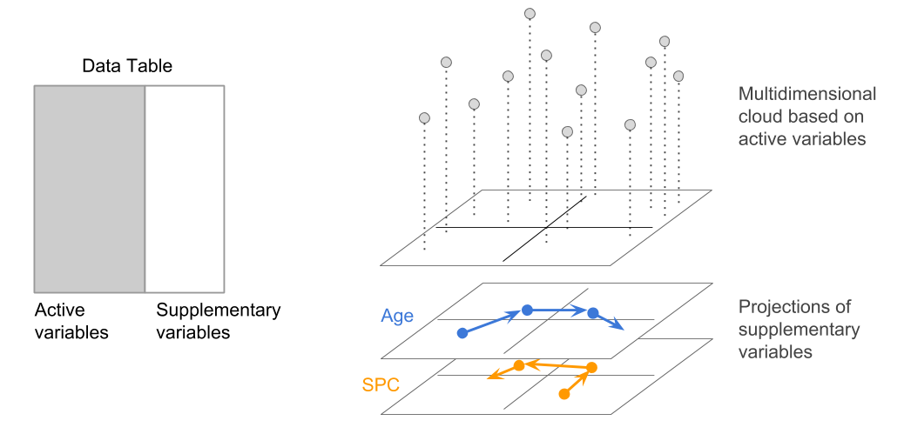
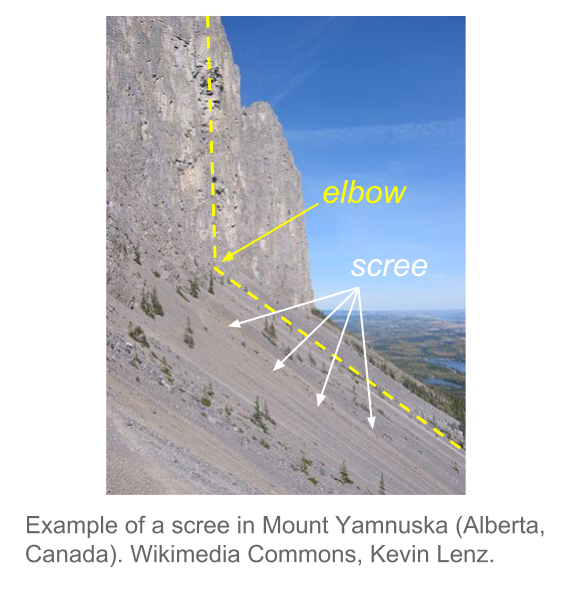

# Analysis {#analysis}

Carrying out a comprehensive Principal Component Analysis is both an art and a science. The analyst must have some degree of analytical experience as well as a reasonable familiarity with the analyzed data. A rushed PCA analysis tends to lead to confusing results, and frustating endeavors. A well applied PCA involves a certain strategy to analyze the data, enforced with common sense, and taking certain precautions.

In this chapter, we present a methodology to carry out a Principal Component Analysis that goes above and beyond what is typically discussed in other texts about PCA. We try to stay away from the narrow perspective of using PCA within with the sole purpose of wroking with few variables that are compatible with a statistical model. Instead, we strongly advocate for analyses that take into account as many variables as possible. This will make the analysis richer, more _holistic_, and with more coherent interpretations.


## Themescope

We are assuming that the data you are working with comes from a context of great _data diversity_. For example, data from surveys or questionnaires, or from a database of clients, in which there is an abundance of different types of variables.

In these cases with a rich variety of variables, we can group those variables in __themes__. Each theme defining a point of view or _multivariate reality_. For instance, when we have a group of socio-economic variables, or when a set of variables have to do with preferences about a set of products. By refer to this approach as __themescope__, that is, a multidimensional description by themes.

The analysis strategy that we propose is to analyze individuals by themes. This involves selecting a particular theme in which the variables associated to it become the active variables. Having a group of active variables, we study the resemblances of the individuals according to this point of view. And then we add all the available information that has not been utilized, but that can shed some light in better understanding the relationship between individuals and variables, by using the projection of supplementary elements.

```{r fig-3-1, echo = FALSE, out.width = '85%', fig.cap='Projection of categorical supplementary variables'}

```


####{-} Various Perspectives, Diverse Analyses

When selecting a particular active theme, this does not stop us from selecting another theme that can then become active in itself. By changing active themes, we have a different perspective of the analyzed data, in analogous way to taking photos of the same subject from different angles.


## Conditions of Application

### Linearity and Symmetry

We have seen the importance of the correlation coefficient (or covariance) in PCA. We can actually present PCA as a visualization technique of a correlation matrix (or coavraince matrix). The technique will excel when the correlation coefficient is a _good_ measure of the association between variables. The ideal conditions to apply PCA are when the association among avriables are linear and their distributions are symmetric (i.e. closer to the normal distribution).

Consequently, we need to be cautious when the distributions are extremely asymmetric or when the associations among variables are not linear.

A common case that can limit the applicability of PCA is when analyzing variables that are seemingly continuous, but that in reality are a hybrid of continuous and nominal scale. For example, this is the case of variables like _payed work time_ of women: this is null for a woman that is a housewife, while the distribution is continuous for women that have a payed job.

Nonlinearity associations can also limit the applicability of PCA. This is illustrated with the relation betwen age and income: overall, income tends to increase with age during active working years, but when a person retires the income tend to decrease.

Phenomena of lack of symmetry and lack of linearity will affect the results of a PCA. If these issues are not indentify, they can lead to wrong interpretations and conclusions. However, the presence of these phenomena will become apparent for the well trained eyes of an experienced analyst.

We should say that techniques such as Multiple Correspondence Analysis (MCA) can always be used after having encoded (categorized) the continuous variables. Compared to PCA, MCA has the advantage of being inherently non-linear, and thus can be used in situations when PCA is limited.


### Balance the content of active variables

More often than not, Principal Component Analysis is performed on variables having different units of measurement. In this case, the variances tend to be vary considerable in magnitude, and are not directly comparable. The typical solution to overcome this issue is to rescale the variables in standard units (i.e. mean of zero, unit variance). In this way, all variables wil be given the same importance, and we don't have to worry about units of measurement anymore. In fact, this type of transformation has become the default solution in most PCA computer programs: to carry out a normalized PCA and work on the matrix of correlations. Keep in mind that this transformation modifies the shape of the cloud of points by providing the same spread among all directions in the space of origin.

Despite the usefulness of transforming variables into standardized scale, this transformation is not always the ideal solution to _balance_ the variables. For example, if thre is a subset of variables that are highly correlated among each other, this subset will dominate the first principal component, and therefore, will have a higher importance in the analysis.

Suppose that you have 5 variables that are measuring the same aspect of a certain phenomenon, and that the other aspects are covered each one by just one variable. You can think of the group of 5 variables as being just one variable but with a variance 5 times larger than the rest of the variables. Consequently, the first axis will be determined by the cumulative effect of the 5 highly correlated variables. In summary, we should pay attention to the effect produced by groups of variables that are highly correlated, and have a mechanism to balance the importance of each aspect in the studied phenomeno.


## Validation: stability and significance

What is the part in PCA results that is not really accounted by the structure of the data, but by the randomness in the data? Are the results stables and reproducibles? Do the configuration of points change based on the studied data? All of these questions make it necessary to assess the stability of the obtained results.

The stability of the results will depend on the randomness of the data collection process (e.g. random samples, sampling surveys), as well as on the measurement errors in the variables.


### How many axes to study and retain?

Are the directions of the first axes will defined and stable? More precisely, are the dispersions in consecutive directions really different? If not, we would have to consider that the factorial plane formed by them is stable but the associated axes are not really different (i.e. indeterminate by a rotation).

One way to answer these questions is to suppose that the data come from a sample drawn from a population with a normal distribution. In this case, the eigenvalues asymptotically follow a normal distribution (Anderson, 1963). The, we can estimate a 95% confidence interval for each eigenvalue with the formula \@ref(eq:31)

\begin{equation}
\left [ \lambda_{\alpha} \left (1 - 1.96 \sqrt{2/(n-1)} \right ); \hspace{1mm} \lambda_{\alpha} \left (1+1.96\sqrt{2/(n-1)} \right) \right ]
(\#eq:31)
\end{equation}

The width of this interval gives us an idea of the stability of the eigenvalue with respect to the sample randomness. The overlapping in the intervals of two consecutive eigenvalues suggests that these eigenvalues are equal (or very similar). The corresponding axes are thus indeterminate by one rotation. Under this situation, the analyst should focus on the interpretation of the subspace defined by the first eigenvalues that are well separated.

Although this result has to do with eigenvalues of covarance matrices, it can also be applied to the eigenvalues of correlation matrices. Simulation studies show that the confidence intervals tend to be "cautious": the coverage percentage of the true eigenvalue, is almost always greater than the anounced confidence level. In any case, the asymptotic nature of the results, and the underlying hypothesis of normality, lead us to consider the results are merely indicative (not a hard rule).

In regards of the factorial axes, it is convenient to distinguish the axes that will be studied, from the axes that will be used. The factorial axes can be seen as an ultimate result, or also as an intermediate stage for further studies.

For example, a PCA can be a preliminary stage before performing a discriminant analysis. In this case, we will try to use the axes with discriminant power, which may not coincide with the axes of largest spread.

If the goal is to classify individuals, it makes sense to retain only the axes expressing real directions of spread, in order to preserve the stable characteristics of the individuals, while excluding those directions that are mainly capturing random noise.


#### Elbow's rule (Cattell's rule, 1966) {-}

One of the most prevalent questions in PCA is "how many principal components (or factorial axes) to retain?" Unfortunately, there is no simple answer to this question.

If we assume that the $n$ values taken by the $p$ variables come from a random process that uniformly fills up the space, without privileging any direction, then the $p$ eigenvalues of the PCA will slowly decrease in a regular form.

If a PCA provides a histogram of the eigenvalues showing one or more staircase steps, we can think that there are sufficiently strong associations between the variables. These associations would be responsible for the appearance of directions or subspaces where most of the dispersion is concentrated.

Such pragmatic considerations, can be used to determine---in a more or less subjective way---a minimum and a maximum number of axes to retain in the analysis. The main way to do this is through visual inspection of the histogram of eigenvalues following the so-called _scree test_ or _elbow criteria_ proposed by Raymond Cattell (1966). This criteria, which is the simplest and oldest one, involves graphing a line plot of the eigenvalues, ordered from largest to smallest, and then look for the "elbow" of the graph where the eigenvalues seem to level off. 

In the example of the cities (first PCA), we obtained the following eigenvalues:

```{r table-3-1, echo = FALSE}
# table of eigenvalues
eigs <- read.csv('data/eigenvalues.csv', row.names = 1)

knitr::kable(
  eigs,
  booktabs = TRUE,
  caption = 'Distribution of eigenvalues in 1st PCA.'
)
```

<br>

We can then plot a histogram of the eigenvales, and add a line connecting the heights of the bars to better see the way in which the sizes of the eigenvalues decrease:

```{r echo = FALSE}
load("data/pca1.RData")
scree1 <- barplot(
  pca$eig[,1], col = 'gray80', border = NA, las = 1, 
  names.arg = 1:nrow(pca$eig), xlab = "eigenvalues",
  main = "Scree plot (PCA 1, table 2.1)")
lines(scree1[,1], pca$eig[,1], lwd = 2.5, col = "#4286f4")
```


In the second PCA of the salaries divided by the mean salary of a city, we obtained the following eigenvalues:

```{r table-3-2, echo = FALSE}
# table of eigenvalues
eigs2 <- read.csv('data/table-2-7.csv', row.names = 1)

knitr::kable(
  eigs2,
  booktabs = TRUE,
  caption = 'Distribution of eigenvalues in 2nd PCA.'
)
```

<br>

Graphing the scree plot we obtain the following display:

```{r echo = FALSE}
scree2 <- barplot(
  eigs2[,2], col = 'gray80', border = NA, las = 1, 
  names.arg = 1:nrow(eigs2), xlab = "eigenvalues",
  main = "Scree plot (PCA 2, table 2.7)")
lines(scree2[,1], eigs2[,2], lwd = 2.5, col = "#4286f4")
```


More formally, Cattell's criteria consist of sorting the lagged differences of second order between eigenvalues, as follows:

\begin{equation}
d(\alpha) = (\lambda_{\alpha + 1} - \lambda_{\alpha}) - (\lambda_{\alpha} - \lambda_{\alpha - 1})
(\#eq:32)
\end{equation}


The reason why is called _scree test_ has to do with the metaphor of a mountain scree. According to [wikipedia](https://en.wikipedia.org/wiki/Scree), a "scree is a collection of broken rock fragments at the base of crags, mountain cliffs, volcanoes or valley shoulders that has accumulated through periodic rockfall from adjacent cliff faces."

```{r echo = FALSE, out.width = '50%'}

```


#### Note {-}

We have seen that when there is a _size effect_ in the first axis, the subsequent eigenvalues are affected and reduced. However, it is possible that subsequent eigenvalues reflect structural oppositions. This is the case of of the second PCA on raw data, which corresponds approximately, to the first axis of the analysis on the ratio data, when the size effect is eliminated.

On the other hands, it is risky to interpret the percentage of inertia as a measure of the information contained in an axis. This percentage can be made as small as possible, just by adding independent random variables to the data of active variables. The overall inertia will increase, while the "information" contained in the first axes will remain the same and, consequently, the percentage of inertia in each axis will decrease.

