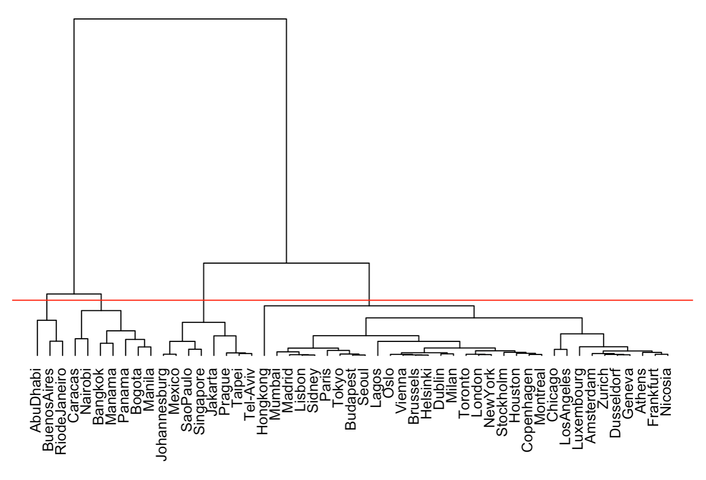
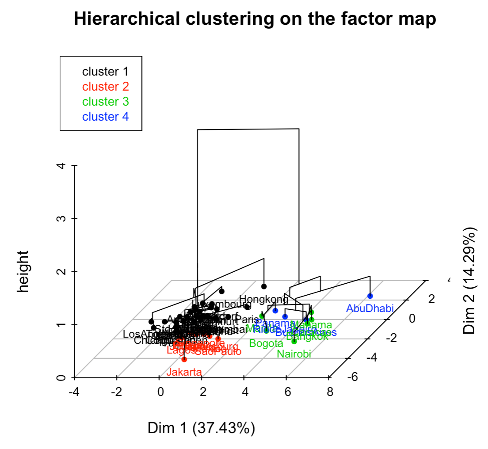
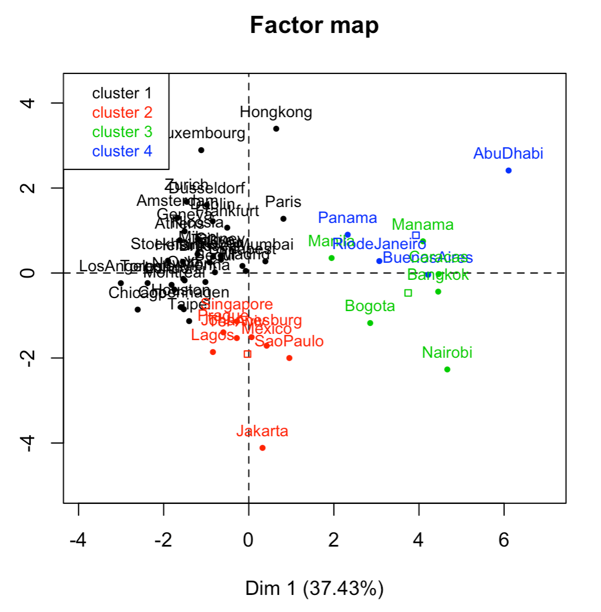
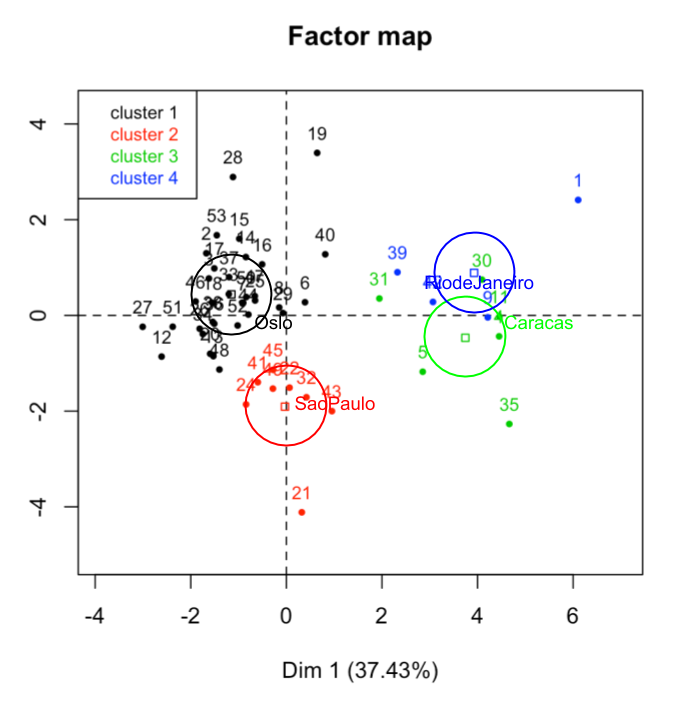
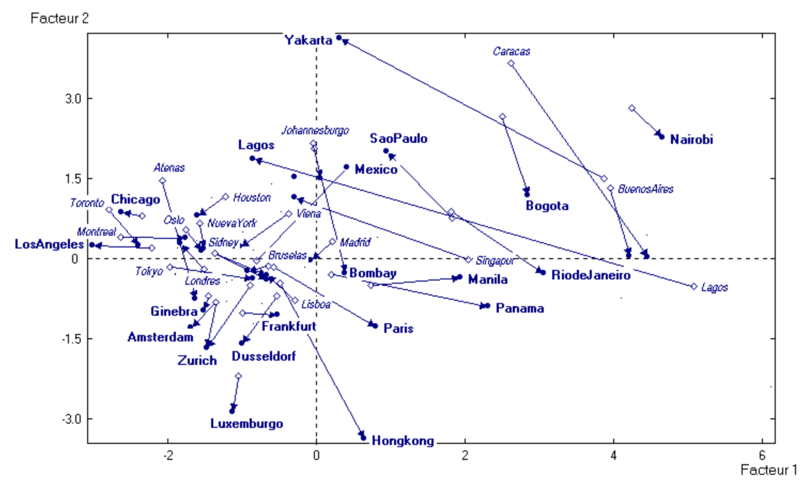
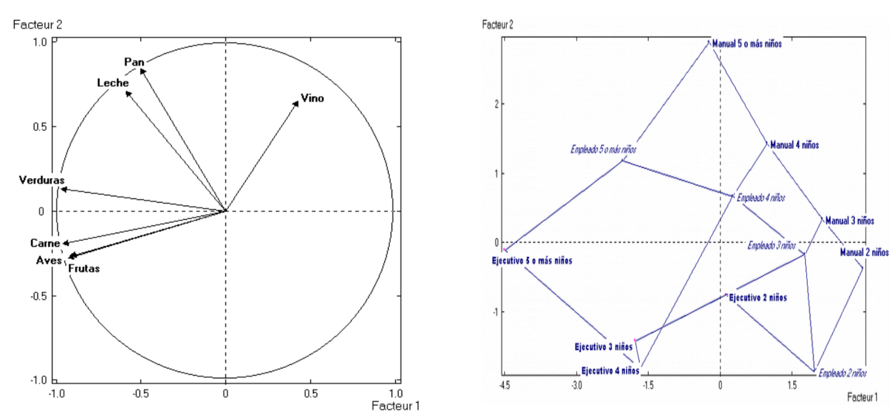
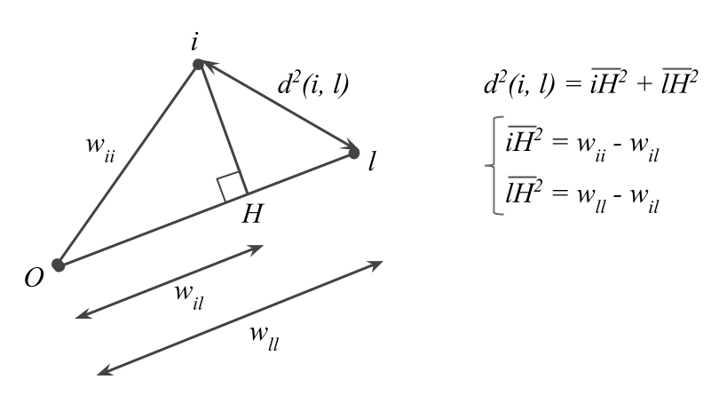
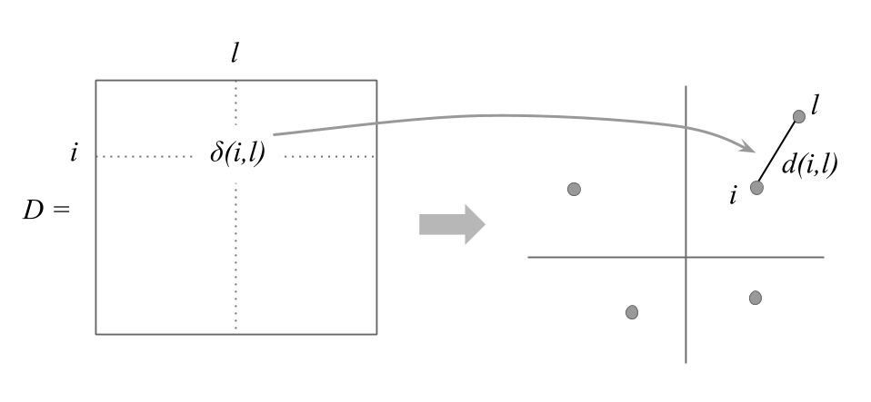
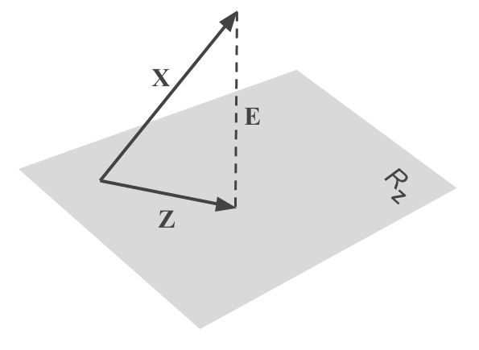
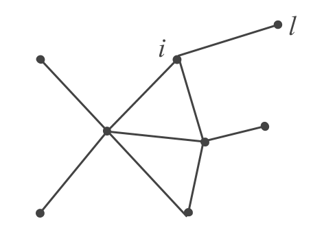

# (PART) Practice {-}

# Analysis {#analysis}

```{r echo = FALSE, message=FALSE}
library(FactoMineR)
```

Carrying out a comprehensive Principal Component Analysis is both an art and a science. The analyst must have some degree of analytical experience as well as a reasonable familiarity with the analyzed data. A rushed PCA analysis tends to lead to confusing results, and frustating endeavors. A well applied PCA involves a certain strategy to analyze the data, enforced with common sense, and taking certain precautions.

In this chapter, we present a methodology to carry out a Principal Component Analysis that goes above and beyond what is typically discussed in other texts about PCA. We try to stay away from the narrow perspective of using PCA within with the sole purpose of working with few variables that are compatible with a statistical model. Instead, we strongly advocate for analyses that take into account as many variables as possible. This will make the analysis richer, more _holistic_, and with more coherent interpretations.


## Themescope

We are assuming that the data you are working with comes from a context of great _data diversity_. For example, data from surveys or questionnaires, or from a database of clients, in which there is an abundance of different types of variables.

In these cases with a rich variety of variables, we can group those variables in __themes__. Each theme defining a point of view or _multivariate reality_. For instance, when we have a group of socio-economic variables, or when a set of variables have to do with preferences about a set of products. By refer to this approach as __themescope__, that is, a multidimensional description by themes.

The analysis strategy that we propose is to analyze individuals by themes. This involves selecting a particular theme in which the variables associated to it become the active variables. Having a group of active variables, we study the resemblances of the individuals according to this point of view. And then we add all the available information that has not been utilized, but that can shed some light in better understanding the relationship between individuals and variables, by using the projection of supplementary elements.

```{r fig-3-1, echo = FALSE, out.width = '85%', fig.cap='Projection of categorical supplementary variables'}
knitr::include_graphics("images/figure-3-1.png")
```


#### Various Perspectives, Diverse Analyses {-}

When selecting a particular active theme, this does not stop us from selecting another theme that can then become active in itself. By changing active themes, we have a different perspective of the analyzed data, in analogous way to taking photos of the same subject from different angles.


## Conditions of Application

### Linearity and Symmetry

We have seen the importance of the correlation coefficient (or covariance) in PCA. We can actually present PCA as a visualization technique of a correlation matrix (or covariance matrix). The technique will excel when the correlation coefficient is a _good_ measure of the association between variables. The ideal conditions to apply PCA are when the association among variables are linear and their distributions are symmetric (i.e. closer to the normal distribution).

Consequently, we need to be cautious when the distributions are extremely asymmetric or when the associations among variables are not linear.

A common case that can limit the applicability of PCA is when analyzing variables that are seemingly continuous, but that in reality are a hybrid of continuous and nominal scale. For example, this is the case of variables like _payed work time_ of women: this is null for a woman that is a housewife, while the distribution is continuous for women that have a payed job.

Nonlinearity associations can also limit the applicability of PCA. This is illustrated with the relation betwen age and income: overall, income tends to increase with age during active working years, but when a person retires the income tend to decrease.

Phenomena of lack of symmetry and lack of linearity will affect the results of a PCA. If these issues are not identified, they can lead to wrong interpretations and conclusions. However, the presence of these phenomena will become apparent for the well trained eyes of an experienced analyst.

We should say that techniques such as Multiple Correspondence Analysis (MCA) can always be used after having encoded (categorized) the continuous variables. Compared to PCA, MCA has the advantage of being inherently non-linear, and thus can be used in situations when PCA is limited.


### Balancing the content of active variables

More often than not, Principal Component Analysis is performed on variables having different units of measurement. In this case, the variances tend to be vary considerable in magnitude, and are not directly comparable. The typical solution to overcome this issue is to rescale the variables in standard units (i.e. mean of zero, unit variance). In this way, all variables wil be given the same importance, and we don't have to worry about units of measurement anymore. In fact, this type of transformation has become the default solution in most PCA computer programs: to carry out a normalized PCA and work on the matrix of correlations. Keep in mind that this transformation modifies the shape of the cloud of points by providing the same spread among all directions in the space of origin.

Despite the usefulness of transforming variables into standardized scale, this transformation is not always the ideal solution to _balance_ the variables. For example, if there is a subset of variables that are highly correlated among each other, this subset will dominate the first principal component, and therefore, will have a higher importance in the analysis.

Suppose that you have 5 variables that are measuring the same aspect of a certain phenomenon, and that the other aspects are covered each one by just one variable. You can think of the group of 5 variables as being just one variable but with a variance 5 times larger than the rest of the variables. Consequently, the first axis will be determined by the cumulative effect of the 5 highly correlated variables. In summary, we should pay attention to the effect produced by groups of variables that are highly correlated, and have a mechanism to balance the importance of each aspect in the studied phenomenon.


## Validation: stability and significance

What is the part in PCA results that is not really accounted by the structure of the data, but by the randomness in the data? Are the results stables and reproducibles? Do the configuration of points change based on the studied data? All of these questions make it necessary to assess the stability of the obtained results.

The stability of the results will depend on the randomness of the data collection process (e.g. random samples, sampling surveys), as well as on the measurement errors in the variables.


### How many axes to study and retain?

Are the directions of the first axes well defined and stable? More precisely, are the dispersions in consecutive directions really different? If not, we would have to consider that the factorial plane formed by them is stable but the associated axes are not really different (i.e. indeterminate by a rotation).

One way to answer these questions is to suppose that the data come from a sample drawn from a population with a normal distribution. In this case, the eigenvalues asymptotically follow a normal distribution (Anderson, 1963). Then, we can estimate a 95% confidence interval for each eigenvalue with the formula \@ref(eq:31)

$$
\left [ \lambda_{\alpha} \left (1 - 1.96 \sqrt{2/(n-1)} \right ); \hspace{1mm} \lambda_{\alpha} \left (1+1.96\sqrt{2/(n-1)} \right) \right ]
(\#eq:31)
$$

The width of this interval gives us an idea of the stability of the eigenvalue with respect to the sample randomness. The overlapping in the intervals of two consecutive eigenvalues suggests that these eigenvalues are equal (or very similar). The corresponding axes are thus indeterminate by one rotation. Under this situation, the analyst should focus on the interpretation of the subspace defined by the first eigenvalues that are well separated.

Although this result has to do with eigenvalues of covariance matrices, it can also be applied to the eigenvalues of correlation matrices. Simulation studies show that the confidence intervals tend to be "cautious": the coverage percentage of the true eigenvalue, is almost always greater than the anounced confidence level. In any case, the asymptotic nature of the results, and the underlying hypothesis of normality, lead us to consider the results are merely indicative (not a hard rule).

In regards of the factorial axes, it is convenient to distinguish the axes that will be studied, from the axes that will be used. The factorial axes can be seen as an ultimate result, or also as an intermediate stage for further studies.

For example, a PCA can be a preliminary stage before performing a discriminant analysis. In this case, we will try to use the axes with discriminant power, which may not coincide with the axes of largest spread.

If the goal is to classify individuals, it makes sense to retain only the axes expressing real directions of spread, in order to preserve the stable characteristics of the individuals, while excluding those directions that are mainly capturing random noise.


#### Scree Test (Cattell's rule, 1966) {-}

One of the most prevalent questions in PCA is "how many principal components (or factorial axes) to retain?" Unfortunately, there is no simple answer to this question.

If we assume that the $n$ values taken by the $p$ variables come from a random process that uniformly fills up the space, without privileging any direction, then the $p$ eigenvalues of the PCA will slowly decrease in a regular form.

If a PCA provides a histogram of the eigenvalues showing one or more staircase steps, we can think that there are sufficiently strong associations between the variables. These associations would be responsible for the appearance of directions or subspaces where most of the dispersion is concentrated.

Such pragmatic considerations, can be used to determine---in a more or less subjective way---a minimum and a maximum number of axes to retain in the analysis. The main way to do this is through visual inspection of the histogram of eigenvalues following the so-called _scree test_ or _elbow criteria_ proposed by Raymond Cattell (1966). This criteria, which is the simplest and oldest one, involves graphing a line plot of the eigenvalues, ordered from largest to smallest, and then look for the "elbow" of the graph where the eigenvalues seem to level off. 

In the example of the cities (first PCA), we obtained the following eigenvalues:

```{r table-3-1, echo = FALSE}
# table of eigenvalues
eigs <- read.csv('data/eigenvalues.csv', row.names = 1)

knitr::kable(
  eigs,
  booktabs = TRUE,
  caption = 'Distribution of eigenvalues in 1st PCA.'
)
```

<br>

We can then plot a histogram of the eigenvales, and add a line connecting the heights of the bars to better see the way in which the sizes of the eigenvalues decrease:

```{r echo = FALSE}
load("data/pca1.RData")
scree1 <- barplot(
  pca$eig[,1], col = 'gray80', border = NA, las = 1, 
  names.arg = 1:nrow(pca$eig), xlab = "eigenvalues",
  main = "Scree plot (PCA 1, table 2.1)")
lines(scree1[,1], pca$eig[,1], lwd = 2.5, col = "#4286f4")
```


In the second PCA of the salaries divided by the mean salary of a city, we obtained the following eigenvalues:

```{r table-3-2, echo = FALSE}
# table of eigenvalues
eigs2 <- read.csv('data/table-2-7.csv', row.names = 1)

knitr::kable(
  eigs2,
  booktabs = TRUE,
  caption = 'Distribution of eigenvalues in 2nd PCA.'
)
```

<br>

Graphing the scree plot we obtain the following display:

```{r echo = FALSE}
scree2 <- barplot(
  eigs2[,2], col = 'gray80', border = NA, las = 1, 
  names.arg = 1:nrow(eigs2), xlab = "eigenvalues",
  main = "Scree plot (PCA 2, table 2.7)")
lines(scree2[,1], eigs2[,2], lwd = 2.5, col = "#4286f4")
```


More formally, Cattell's criteria consist of sorting the lagged differences of second order between eigenvalues, as follows:

\begin{equation}
d(\alpha) = (\lambda_{\alpha + 1} - \lambda_{\alpha}) - (\lambda_{\alpha} - \lambda_{\alpha - 1})
(\#eq:32)
\end{equation}


The reason why is called _scree test_ has to do with the metaphor of a mountain scree. According to [wikipedia](https://en.wikipedia.org/wiki/Scree), a "scree is a collection of broken rock fragments at the base of crags, mountain cliffs, volcanoes or valley shoulders that has accumulated through periodic rockfall from adjacent cliff faces."

```{r echo = FALSE, out.width = '50%'}
knitr::include_graphics("images/scree-mountain.png")
```


#### Note {-}

We have seen that when there is a _size effect_ in the first axis, the subsequent eigenvalues are affected and reduced. However, it is possible that subsequent eigenvalues reflect structural oppositions. This is the case of the second PCA on raw data, which corresponds approximately, to the first axis of the analysis on the ratio data, when the size effect is eliminated.

On the other hands, it is risky to interpret the percentage of inertia as a measure of the information contained in an axis. This percentage can be made as small as possible, just by adding independent random variables to the data of active variables. The overall inertia will increase, while the "information" contained in the first axes will remain the same and, consequently, the percentage of inertia in each axis will decrease.

```{r table-3-3, echo = FALSE}
# table of eigenvalues
table_3_3 <- read.csv('data/table-3-3.csv')

knitr::kable(
  table_3_3,
  booktabs = TRUE,
  caption = 'Distribution of eigenvalues from data with random perturbations.'
)
```

```{r echo = FALSE}
scree3 <- barplot(
  table_3_3[,2], col = 'gray80', border = NA, las = 1, 
  names.arg = 1:nrow(table_3_3), xlab = "eigenvalues",
  main = "Scree plot (random perturbations)")
lines(scree3[,1], table_3_3[,2], lwd = 2.5, col = "#4286f4")
```


### Simulations, random effects on individuals

One way to assess the stability of results involves using the available information in the data, via computational methods to run some simulations. By following this type of approaches, we are able to free ourselves from the probabilistic assupmtions about the data, which are seldom met when dealing with multivariate data.

The strategy that we use is based on random perturbations of the data, in order to simulate a certain natural variability or measurement error in the observations.

Each observation in the data matrix is replaced by the observed value plus a random quantity that follows a normal distribution with mean and variance depending on the variable under modification.

We denote this change of value as:

$$
x_{ij} = x_{ij} + N(x_{ij}, Ks_j)
(\#eq:33)
$$

The observed value $x_{ij}$ is modified by adding a random quantity that follows a normal distribution, centered at $x_{ij}$, and with standard deviation $K$ times the standard deviation $s_j$ of variable $j$.

The value of the constant $K$ determines the amount of perturbation that we introduce in the data. $K=0$ indicates that the observations remain unchanged. A value of $K=1$ means that each observation is affected, on average, one standard deviation.

Once we have modified the data table, we can perform a PCA, calculate its directions, the correlation of the extracted directions with the original-unmodified variables, obtaining a matrix of correlations between axis systems.

In this matrix we will inspect, for each original axis, what other modified axes are most correlated with. We will also check if an axis is correlated with all other axes in analogous way. In the former case, this indicates that an axis is stable, despite the random modifications in the data. In the latter case, this indicates that an axis is the result of randomness in the data.

By looking at the matrix of correlations described in the previous paragraph, we can detect up to what extent the rank of the axes are stables, and from what point the "natural" random fluctuations in data begin.

In the example of the international cities, we show in table (TABLE 3.4) the correlation matrices between the axes (in rows) obtained in the analysis of ratios (salaries of professions with respect to the mean salary of the city) and the axes obtained with a random perturbation of 1%, 5% and 10% of the standard deviation of each variable.


```{r table-3-4a, echo = FALSE}
# perturbation 1%
perturb1 <- read.csv('data/table-3-4a.csv', check.names = FALSE)

knitr::kable(
  perturb1,
  booktabs = TRUE,
  caption = 'Assessment of random perturbations (rows correspond to axes of 2nd PCA).'
)
```

__Perturbation of 5%__

```{r table-3-4b, echo = FALSE}
# perturbation 5%
perturb2 <- read.csv('data/table-3-4b.csv', check.names = FALSE)

knitr::kable(
  perturb2
)
```

__Perturbation of 10%__

```{r table-3-4c, echo = FALSE}
# perturbation 10%
perturb3 <- read.csv('data/table-3-4c.csv', check.names = FALSE)

knitr::kable(
  perturb3
)
```

<br>

By looking at the diagonal of the tables, we observe stability in the first factor, as well as in the second and the third factors, up to a random perturbation of 5% of the original standard deviation. With a high perturbation (of 10%) only the first factor is resistant to the modifications.

Table \@ref(tab:table-3-5) displays the mean and standard deviation of the salary variables (gross salary divided by the city-mean salary), as well as the correlation between the randomly modified variable and the original variable. We can tell that with a random perturbation of 10% the standard deviations increase, while the correlations decrease.

```{r table-3-5, echo = FALSE}
# perturbation 1%
table_3_5 <- read.csv('data/table-3-5.csv', check.names = FALSE)

knitr::kable(
  table_3_5,
  booktabs = TRUE,
  caption = 'Summary Statistics of Active Variables affected by random perturbations.'
)
```


### Bootstrap Simulations

Another way of empirical assessment can be done using random resampling methods on the data. The idea is to obtain a number of data tables, all of the same dimension as the original one, by randomly sampling with replacement the observations in the data. This approach is the so-called Bootstrap method (Efron et al, 1993). Following this approach, it is possible to estimate the sampling errors and the distribution of the various PCA results.

How to implement the bootstrap method? First, we form a large number of samples of $n$ individuals which are drawn with replacement from the $n$ original individuals in the data. This set of samples is referred to as the _bootstrap samples_. For each bootstrap sample, some of the original individuals won't be part of the sample, while some individuals may appear more than once in the sample. Each bootstrap sample gives place to a data table.

On each of the bootstrap tables we calculate its eigenvalues and eigenvectors. We then obtain a bootstrap distribution of the eigenvalues, as well as the bootstrap distribution of the correlations between the eigenvectors and the original axes.

For each eigenvalue we can obtain a confidence interval. Likewise, for each eigenvector we can obtain a confidence cone around the original eigenvector. Examining the correlation between the axes can then reveal potential rotations among axes.

The bootstrap simulations can also be used to assess the stability of the projections of the variables and the categories. We can position the different bootstrap tables as supplementary information in the analysis of the original table (Lebart et al, 1995). In this way, it is possible to visualize in the factorial planes regions of "natural" fluctuation of the different elements in the data table.


## Analysis of Table of Ranks

In PCA, it is assumed that the variables are measured on a continuous scale. When applying a normalized PCA, the results will depend on the matrix of correlations between variables. Such results can be affected by the presence of outliers or atypical observations.

One approach to make the results independent from the scale of measurement and monotone transformations, consists of working with the _ranks_ of the variables and not with the actual observed values.

To do that, we substitute each value by its rank in increasing order, depending on the considered variable. By doing this, the active table becomes a table of ranks, and consequently, the PCA is performed on a correlation matrix of ranks. This is a remarkable feature of PCA: it is a general methodology that can be applied on any correlation matrix defined by the analyst.

One interesting transformation involves working with the Spearman's correlation coefficients. This coefficient measures the monotone dependency between the rank values of two variables according to the following formula:

$$
r_s (j, j') = 1 - \frac{6 \sum_{i}^{n} (x_{ij} - x_{ij'})^2}{n (n^2 - 1)}
(\#eq:34)
$$

where the quantities $x_{ij}$ represent the rank of the individual $i$ of the $j$ variable. The advantage of the Spearman's correlation coefficient is that it coincides with the Pearson's coeffcient (usual correlation coefficient) when applied to a matrix of ranks.

In the case of the international cities, the Spearman's correlations are given in table \@ref(tab:table-3-6) (compare these with table \@ref(tab:table-2-6)).

```{r table-3-6, echo = FALSE, comment = ''}
load('data/table-3-6.RData')
options(knitr.kable.NA = '')

# print table with kable
knitr::kable(
  table_3_6,
  
  booktabs = TRUE,
  caption = "Spearman's Rank Correlation Matrix (variables from 2nd analysis)"
)
```

<br>

We apply a PCA on the matrix of Spearman's correlations. The eigenvalues are depicted in table \@ref(tab:table-3-7) which can be compared to those of table \@ref(tab:table-2-7).

```{r table-3-7, echo = FALSE}
# table of eigenvalues
load('data/table-3-7.RData')

knitr::kable(
  table_3_7,
  booktabs = TRUE,
  caption = 'Distribution of eigenvalues (from table of ranks).'
)
```

<br>

Likewise, table \@ref(tab:table-3-8) displays the results obtained for the ranks of the active variables.

```{r table-3-8, echo = FALSE}
# table of eigenvalues
load('data/table-3-8.RData')

knitr::kable(
  table_3_8,
  booktabs = TRUE,
  caption = 'PCA results of table of ranks'
)
```

<br>

The cloud of points is depicted in figure \@ref(fig:fig-3-2). The configuration of this cloud is similar to the initial cloud displayed in figure \@ref(fig:fig-2-9). The similarity of the results obtained with the table of ratios confirms the good quality of the performed analysis. Also, this similarity shows that the essential information is contained in the rank of the values, and not so much in the observed values.

```{r fig-3-2, echo = FALSE, out.width = '70%', fig.cap='Circle of correlations on the first factorial plane of the second analysis'}
knitr::include_graphics("images/figure-3-2.png")
```

The fact that the cloud of points in figure \@ref(fig:fig-3-2) is similar to the graph \@ref(fig:fig-2-9), indicates that the visual displays do not depend on: the units of measurement, monotone transformations, or possible existance of outliers. Hence, we can say that the observed configurations are _robusts_.

In the absence of robust configurations, we can suggest positioning the elements of the original table as supplementary elements in the analysis of ranks, in order to detect whether there are sensible elements.

Sometimes it is convenient to work with variables that have distributions close to a normal distribution. In this case, each variables con be handled as having a normal distribution with expected value equal to the observation of rank $k$, instead of working directly with the ranks (Lebart et al, 1977).


## Optimal Reconstitution of Data

Principal Component Analysis allows us to approximate a data matrix, generally of column-rank $p$, by using a matrix of lower rank defined by the first eigenvalues and their corresponding eigenvectors.

The formula \@ref(eq:35), referred to as the singular value decompoisition (SVD), lets us approximate the original values $x_{ij}$ with a factorization of some set of eigenvectors and eigenvalues. In other words, we can obtain an approximate reconstitution of the data values by using only a few $q$ values and vectors from the SVD.

$$
\hat{x}^{q}_{ij} = \sum_{\alpha = 1}^{q} \sqrt{\lambda_{\alpha}} \hspace{1mm} v_{i\alpha} u_{j\alpha}
(\#eq:35)
$$

The term $\hat{x}^{q}_{ij}$ is an approximation of the observed value $x_{ij}$ from a small set of coefficients calculated from a PCA: the eigenvalues $\lambda_{\alpha}$, the eigenvectors $v_{i\alpha}$ and $u_{j\alpha}$, of rank 1 to $q$.

This reconstitution is optimal in the sense that it provides the best least-squares approximation of the original matrix: minimizing the sum of squares of the deviations between the observed values and the approximated values (for all $q$):

$$
\min \left \{ \sum_{i} \sum_{j} (x_{ij} - \hat{x}_{ij}^{q})^2 \right \}
$$

It can be proved that:

$$
\sum_{i} \sum_{j} (x_{ij} - \hat{x}^{q}_{ij})^2 = \sum_{\alpha = q+1}^{p} \lambda_{\alpha}
(\#eq:36)
$$

The sum of the $p-q$ excluded eigenvalues measures the amount of error when approximating the original cloud of points by its projection onto a subspace of dimension $q$.

This property is of great practical application. It justifies the utilization of PCA in a data compression problem (for example, in the reconstitution of images, and also in data transmission).


#### Application to Image Reconstitution {-}

Image reconstitution, for instance images from satellites, is one of the most 
interesting applications of principal components analysis. In this case, the
size of the data tables tends to be "large" (with information about the 
gray level for each pixel). Applying PCA on such a table, allows us to detect
a set of significant eigenvalues in terms of the irregularities present in 
an image.

The reconstitution enables an important reduction in storage capacity, because
one goes from an image of $n \times n$ pixels into another image of size 
$q \times (2n + 1)$, where $q$ is the number of retained axes in the analysis.


## Synthetic Variables and Indices

So far we have discussed Principal Component Analysis from a purely geometric perspective: how to obtain a subspace that best approximates the original distances of the data elements.

Interestingly, PCA can also be approached from other points of views. One of them involves looking for a small set of new variables---formed by the original ones---in such a way that the loss of "information" is minimized.

```{r fig-3-3, echo = FALSE, out.width = '50%', fig.cap='Dimension reduction or minimization of "information loss"'}
knitr::include_graphics("images/figure-3-3.png")
```

The new variables (i.e. vectors) are searched for in a way that they are as close as possible (as much correlated as possible) to the set of original variables. 
We can think of these new variables as _synthetic variables_.

The solution is obtained with the vector $\Psi$ of $n$ elements that maximizes the function \@ref(eq:37)

$$
\max \sum_{j} cor^{2} (\boldsymbol{\Psi}, \mathbf{x_j})
(\#eq:37)
$$

In other words, we look for a new variable that is the "closest" to the set of original variables. This will provide a first common factor; the rest of the factors are obtained with the same condition but orthogonal to the directions previously obtained.

Often, the first factor is highly correlated with all the variables. This indicates the so-called _size factor_, which we have discussed in detail in section \@ref(size-factor).

The size factor can be considered as an overall summary, or synthesis, of the entire set of variables. We can compare the first factor with the average of all the original variables, and notice that they are very similar.

$$
\frac{1}{p} (\mathbf{x_1} + \mathbf{x_2} + \dots + \mathbf{x_p}) \approx \boldsymbol{\Psi_1}
(\#eq:38)
$$

```{r table-3-9, echo = FALSE}
# table_3_9
table_3_9 <- read.csv('data/table-3-9.csv', check.names = FALSE)

knitr::kable(
  table_3_9,
  booktabs = TRUE,
  caption = 'Coefficients of the first principal component (i.e. size factor) from first PCA analysis.'
)
```

```{r fig-3-4, echo = FALSE, out.width = '70%', fig.cap='Size Factor of active variables'}
knitr::include_graphics("images/figure-3-4.png")
```

The data set about the international cities provide an example of how to find an _index of mean salary per city_. The components of the unit axis give the linear combination of the original variables (mean-centered and reduced). This is the linear combination of the first principal component, namely, the desired index of mean salaries (see table \@ref(tab:table-2-3)).

A common application of PCA is to build synthetic indices. For instance, a quality index of a given product made from several characteristics of the product. A common example in psychometrics has to do with indices that define a general aptitude factor: e.g. verbal aptitude, or math aptitude. Also in economics, we often find indices of economic capacity for a certain region or city.

Sometimes there is no clear definition of the desired index, but rather a vague notion of the aspects that such an index may comprise. In these cases, the analyst must pay careful attention to collect reliable data, with indicators of the desired index, ideally with highly correlated variables. The computed index (or a first approximation) will be determined by the first principal component of the gathered data.


## Handling Missing Values

With real data, it is common to have individuals for which one or more variable measurements are missing. For example, in a survey about quality of housing, an interviewee may not feel like answering a question about the number of bathrooms in his/her house. Or the same interviewee may not recall the value of the area of the house.
In order to have an idea of the amount of missing values, it is recommended to count the number of missing values per individual. In any case, given a data matrix with missing values, we should have a policy about to handle them.

A first approach to take care of missing values consists of removing the individuals with missing data before performing a PCA. Obviously, this solution implies losing several individuals, which could be detrimental for the overall quality of the calculated results.

Another approach involves replacing the missing values with an estimation. This approach is typically known as _imputing_ missing values.

Keep in mind that PCA relies on the analysis of the dispersion in the individuals around the center of gravity. When we don't have information about an individual, a prudent decision is to place that individual at the center of the cloud. By doing this, we don't privilege any direction of dispersion.

This gives us a first basic rule to handle missing data. We substitute an individual's missing value by the mean of the variable for which there's no available information. This works as long as the amount of missing data for that given variable is small.

Of course, more refined imputation procedures can be devised. This usually depends on the degree of knowledge about the phenomenon under study. For example, if we have an old adult male farmer for which his income is missing, we could estimate this value with the average of the incomes in this category.

Notice that we could also use the results of the PCA to _fine tune_ (in a non-parametric optimization way) the estimation of a missing value. The rationale behind this approach is based on the reconstitution formula \@ref(eq:35) to approximate the data. Under this procedure, we can estimate the value of the $ij$-th cell with the $q$ first factors.


## PCA and Clustering

The graphics obtained from Principal Components Analysis provide a quick way 
to get a "photo" of the multivariate phenomenon under study. These graphical 
displays offer an excellent visual approximation to the systematic information 
contained in data.

Having said that, such visual approximations will be, in general, partial 
approximations. This is because those low dimensional representations are 
given by scatterplots in which only two dimensions are taken into account. 
Unless the information in data is truly contained in two or three dimensions, 
most graphics will give us a limited view of the multivariate phenomenon.

Together with these graphical low dimensional representations, we can also use 
clustering methods as a complementary analytical tasks to enrich the output 
of a PCA. In clustering, we look for groups of individuals having similar 
characteristics. An individual is characterized by its membership to 
a certain cluster. In turn, the average characteristics of a group serve us to 
characterize all individuals in the corresponding cluster.

We can take the output of a clustering method, that is, take the clustering
memberships of individuals, and use that information in a PCA plot. The
location of the individuals on the first factorial plane, taking into 
consideration their clustering assignment, gives an excellent opportunity to 
"see in depth" the information contained in data. In other words, with the 
formed clusters, we can see beyond the two axes of a scatterplot, and gain 
deeper insight into the factorial displays.


### Real Groups or Instrumental Groups?

Given a clustering partition, an important question to be asked is to what 
extent the obtained groups reflect "real" groups, or are the groups simply 
an algorithmic artifact? Do we have data that has discontinuous populations,
or do we just have a continuous reality?

In general, most clustering partitions tend to reflect intermediate situations.
Sometimes we may find clusters that are more or less "natural", but there 
will also be times in which the clusters are more "artificial". Intermediate
situations have regions (set of individuals) of high density embedded within 
layers of individuals with low density. Even in such intermediate cases, the 
obtained clustering partition is still useful. While we cannot say that clusters
are "real" groups differentiated from one another, the formed groups makes it
easier to understand the data. In this sense, clustering acts in a similar 
fashion as when we make bins or intervals from a continuous variable. Simply
put, clustering plays the role of a multivariate encoding. This is why we talk 
about _instrumental_ groups.

In the example of international cities, we obtain the following dendrogram
from a hierarchical agglomerative clustering on the data of ratios.

```{r fig-3-5, echo = FALSE, out.width = '90%', fig.cap='Clustering Dendrogram'}

```

Looking at the dendrogram, we can identify the existence of several groups 
of cities.

The obtained partitions are projected on the factorial plane, that is, the 
centroids of each clustered are projected together with the cities, colored 
by group, as depicted in the following figure:

```{r fig-3-6b, echo = FALSE, out.width = '80%'}

```

On one hand, the 10 cities that are grouped in the first cluster are highly 
homogeneous, and distinct from other cities. The cutting line (red horizontal 
line) isolates well this group, while producing at the same time other three 
different clusters.

Ths cluster of 10 cities involves cities with a large salary inequality, with
high salaries for those managerial/head-type of professions. Opposed to this 
group, there is a considerably large cluster characterized for having elevated 
taxes as well as social contributions, and for having better well payed 
professions that are generally considered to be "lower class".

Separated from the large cluster, there are two more groups, distinguished 
on the second factorial axis. One of them is formed by cities with high
salaries for manual-labor professions. The other group is formed by those 
cities with high salaries for professions that depend on the Public Service.

The obtained partitions are projected on the factorial plane, that is, the 
centroids of each clustered are projected together with the cities, colored 
by group, as depicted in the following figure:

```{r fig-3-6, echo = FALSE, out.width = '80%', fig.cap='Clustering of cities in 4 groups'}

```


### Representants of Groups

For every cluster, we can calculate its corresponding centroid (i.e. average 
individual). We can also determine the individual that is the closest to the 
centroid, called the _representant_. Likewise, we can also look for the 
second best representant, the third best representant, etc.

If we establish the radius of circle (or sphere) around the centroid of a given
cluster, we can capture the representants of the cluster. For a small radius, 
we may get just one representant. As we increase the value of the radius, 
more representants will be captured. Figure \@ref(fig:fig-3-7) shows that the 
cities that are closest to the centroid of a group, are not always the closer
ones in the factorial plane.

```{r fig-3-7, echo = FALSE, out.width = '70%', fig.cap='Representants of each cluster'}

```

On the first factorial plane, we observe the effect of how distances are 
distorted due to the shrinking of the cloud of city-points in this plane. 

In certain applications, it is interesting to identify the representans of 
a certain category, in order to explore its attributes (for example, which 
are the attributes of the category _men_, according to the active variables 
of a survey).


## Data Weighing

In PCA, the weights of the individuals, $p_i$, affect the calculation of the 
means, the covariances, and the correlations.

$$
cov(x_j, x_k) = \sum_{i=1}^{n} p_i \hspace{1mm} (x_{ij} - \bar{x}_j) (x_{ik} - \bar{x}_k)
$$

In general, all the individuals of a data table have the same weight. Consequently, the analysis focuses on the description of the individuals without privileging any of them.

However, if what we are interested in is describing the population (and not just the sample), we should determine whether the sample can be made more representative by reweighing the individuals. 
Notice that in this case, the visual displays and the interpretations are conditioned by the adequacy of the weights: we go from a purely descriptive context with an unweighted analysis, to a more delicate inferencial context.

In any case, the weights of the individuals should not vary drastically. Put it another way, the reweighing is done to refine the estimations, not to create them in an exclusive form (it is a good habit to assess the variability of the weights by looking at their histogram).

We should also highlight the possibility of using the weights to study the _stability_ of the PCA results. This can be done with the bootstrap method with a system of weights ($p_i$ = 0 or 1 or 2, etc, $\sum p_i = n$). Alternatively, we can also use a more classic system of weights ($p_i > 0$; $\sum p_i = n$).

_Note_: we can modify an active individual into a supplementary individual by assigning it a weight of zero.


## PCA as an Intermediate Analytical Stage

Working with the first principal components provides a handful of advantages: 1) the principal components are orthogonal; 2) the random variability part is minimized; 3) the components provide an optimal dimensionality reduction; and 4) calculating the distances between individuals is simplified.

Often, a problem involves modeling a certain response variable $\mathbf{y}$, in term of a series of explanatory variables. When the response variable is a quantitative variable we talk about _regression_ models. In turn, we talk about _classification_ when the response variables is of categorical nature.

One common issue when modeling a response variable---with a regression or classfication technique---has to do with _multicollinearity_ in the explanatory variables. Geometrically, the subspace spanned by the explanatory variables is unstable. This means that small variations in the values of the variables will result in large changes on the spanned subspace.

Performing a regression analysis involves projecting the response variable onto the subspace spanned by the explanatory variables. If two explanatory variables are highly correlated, small variations in these variables will substantially modify the orientation of the space. And consequently, the projection $\hat{\mathbf{y}}$ becomes unstable (see figure \@ref(fig:fig-3-8))

```{r fig-3-8, echo = FALSE, out.width = '50%', fig.cap='Orthogonal projection of y onto the plane spanned by two explanatory variables x'}

```

In this situation, and with more than two variables, it can be interesting to use the principal components obtained on the data table $\mathbf{X}$ formed by the explanatory variables. More specifically, we can keep those components for which their eigenvalues are sufficiently different from zero.

Because the principal components are expressed as linear combinations of the explanatory variables, we can use the components to define the projection subspace for the response variable.

By using only the first principal components, we reduce the random variability in the data. Therefore we can say that the data have been "smoothed".

One is left with the operation to undo the change given by using the components. That is, we need to express the response variable in terms of the original variables. Each principal component is written as a linear combination of the explanatory variables:

$$
\mathbf{y} = b_0 + b_1 \Psi_1 + \dots + b_p \Psi_p = \hat{\beta}_0 + \hat{\beta}_1 \mathbf{x_1} + \dots + \hat{\beta}_p \mathbf{x_p}
(\#eq:39)
$$

The principal components in this case become _instrumental_ variables. This means that they behave like intemediate links for a another subsequent analysis.

We can select the principal components that will be part of a given model. One way to do this is by selecting them with the Furnival-Wilson (1974) algorithm to obtain the best regression equations. In fact, the problem is much simpler given that the factors are orthogonal.

An analogous situation occurs within a classification context. As a particular case, the discriminant analysis of two groups is equivalent to a regression analysis. In this case, we can have a preliminary selection of those principal components with the most discriminant power.


## Comparing Various Tables

Consider a study in which we observe a group of individuals measured by a set of variables. Moreover, suppose that we repeat the study at different time periods, and that we are interested in looking at the evolution of such measurements over time. A study like this will provide several data tables of the same dimension (e.g. one table per time period). Obviously, one of the analytical goals has to do with comparing such tables.

One possible way to compare the tables is to take one of the data tables as the active variables, while the rest of tables are treated as supplementary variables. For example, we can take the first table as the reference table; or also the last table. Likewise, we can take the mean table and use it as a benchmark to compare all the tables against with: the mean table is the active one, and all the other tables become supplementary.

```{r fig-3-9, echo = FALSE, out.width = '65%', fig.cap='Comparison of two tables.'}

```

In the example of the international cities, we have the same study performed at two points in time: 1991 and 1994. So far we have used only the 1994 table. However, we can use the table from 1991. The only difference is that some cities are not included in 1991: Manama, Prague, Budapest, Abu Dhabi, and Bangkok.

We have decided to consolidate both tables into a single one: by stacking both tables by columns. Doing this allows us to consider those cities from 1991 as supplemetary individuals, and then project them on the results from the analysis of the 1994 table.

The axes of this analysis are those defined in the analysis of the 1994 table. The first axis is related with the income inequality. In turn, the second axis is related with the opposition of the salaries of qualified manual labor, versus the salaries of managers and employees in the sector of services.

In this plane we project the the cities in terms of their salaries from 1991. 
Then, the movement of the cities towards the left side suggests a greater 
salary equality; conversely, the those cities moving upward, suggest an 
increment of salaries in manual labor jobs. Interestingly, notice the substantial
changes in cities such as Lagos and Yakarta between 1991 and 1994, indicating 
a unstable pattern of salaries in those cities.

```{r fig-3-10, echo = FALSE, out.width = '75%', fig.cap='Some trajectories of cities between 1991 (in italics) and 1994 (in bold).'}

```

_Note_: There are other multivariate techniques that can be applied to compare
several tables. Some of the common methods derived from PCA are STATIS (Lavit, 
1998), and AFM (Escofier-Pagès, 1990).


## Analysis of a Table of Means

In this section, we consider the table of individual consumption, regarding 
consumption of food, observed in 2000 persons. We also have available information 
for sociodemographic characteristics of each person. The PCA outputs are 
similar to those displayed in figure \@ref(fig:fig-3-11).

```{r fig-3-11, echo = FALSE, out.width = '85%', fig.cap='Analysis of a table of means.'}

```

The first graph has to do with the points "consumption variables" (how much 
it was spend on 7 products); the second graph has to do with the centroids of 
categories for variable "number of children" crossed with "socio-economic 
category" with 3 values (worker, employee, and executive).

We have retained the output from crossing these two nominal variables because 
the dispersion of their categories covers all regions of the factorial plane.
Each point is the centroid of the individuals that have one of the categories
of "number of children" crossed with one of the categories of "socio-economic 
category". With this, we can try to imagine the constellation of points 
around each centroid.

In circumstances like this, we could obtain analogous graphical representations 
by performing PCA on the table formed by the same 7 columns, but with only 9
rows. The rows corresponding to the categories obtained from crossing the 
aforementioned nominal variables. The analysis of this table with the
mean consumption per category, gives the plots shown in \@ref(fig:fig-3-11).

Inspecting the output, we get information about a _global model_ of the 
consumption structure, by using only those two factors.

Notice that the inverse process, does not imply the same conclusions. If we 
begin with the analysis of tables of means, we obtain the plane that best 
differentiates the row categories, while exploring the association among 
consumption from the perspective of such categories. This analysis can be 
quite different from the individual data if the categories under study do not
get to "cover" all of the factorial plane.


## Analysis of a Binary Table

Some times, the analyzed data is exclusively formed of a set of features 
reflecting presence or absence of a certain attribute in individuals. For 
example, a variable Sex with categories "female" and "male" can be mapped 
into this presencs/absence setting: "female" = presence, and "male" = absence. 
Having a set of variables like these, we can numerically encode the categories 
with 0 and 1, e.g. "female" = 1, "male" = 0. We call these features _binary_
variables. Alternatively, we can also think of this type of variables as 
nominal variables containing two categories.

When we have a table of binary variables, we could perform a Multiple 
Correspondence Analysis (MCA). However, applying MCA on a binary table, we 
will see that each category has its complemtary category. It can be proved 
that performing PCA on the binary table, after having removed one of the 
category-columns for each binary variable, produces the same result of an MCA 
on the full binary table. 

There will be a scaling difference between the PCA results and the MCA results,
but we can multiply the binary variables by some coefficient for both 
results to be identical (Lebart et al, 1977).


#### Minimal Encoding {-}

In the example of the table with individual consumptions, we could encode the 
observed information as follows: "1" if the expenses are positive, and "0" 
if expenses are null. Let's suppose that the analysis on this binary table, 
provides a configuration of expenses in the 7 products similar to the one 
obtained in the analysis that uses the original variables. This would indicate
that the exposed relationships only depend on the access to these consumptions
and not on their volume.


## Analysis of a Table of Distances

The following formula gives the distance between two individuals $i$ and $\ell$

$$
d^2(i, \ell) = w_{ii} + w_{i\ell} - 2w_{i\ell}
(\#eq:40)
$$

where:

- $w_{ii} = \sum_{j}^{p} x^2_{ij}$ is the squared distance of the $i$-th 
point to the origin,

- $w_{i\ell} = \sum_{j}^{p} x_{ij} x_{\ell j}$ is the inner product between 
points $i$ and $\ell$.

```{r fig-3-11b, echo = FALSE, out.width = '70%'}

```


Some times the input data is not the matrix $\mathbf{X}$ of original variables,
but the symmetric table of distances between pairs of individuals.

From these distances, it is possible to obtain a representation of the points,
in a low dimensional space, that reflects as much as possible the real distances
between individuals (in the original space).

```{r fig-3-12, echo = FALSE, out.width = '85%', fig.cap='Distances in a low dimensional space'}

```

To carry out a PCA on the table of distances $\mathbf{D}$, we must first 
convert this table into a matrix of inner products $\mathbf{W}$, using the 
formula below:

$$
w_{i\ell} = \frac{1}{2} \big( d^2_{i\cdot} + d^2_{\ell \cdot} - d^2_{\cdot\cdot} - d^2(i, \ell) \big)
(\#eq:41)
$$

where:

$$
d^2_{i \cdot} = \frac{1}{n} \sum_{\ell} d^2(i, \ell) \quad \mathrm{and} \quad d^2_{\cdot \cdot} = \frac{1}{n^2} \sum_{i} \sum_{\ell} d^2(i, \ell)
$$

Then, by diagonalizing matrix $\mathbf{W}$, we obtain a set of eigenvalues and
eigenvectors that provide an optimal solution to the problem.

The analysis of a table of distances via PCA is a completely generic technique.
The reason for this is because PCA is applicable to any table of distances.

If the table of distances has the usual distances of a normalized PCA, then 
this analysis is identical to the one obtained on the cloud of individuals.

We should mention, though, that working with tables of distances, involves
losing the relationship between the rows and columns. This loss prevents us 
from having access to the simultaneous representations of PCA when applied 
to a table $\mathbf{X}$ of individuals and variables.

We should also say that, in order to place an illustrative individual on the 
low dimensional space, we need to know the distance of this individual to all
the active points.


## Conditional PCA

Often, after performing a PCA, we may find that its results are somewhat obvious,
which, for inexperienced users, tends to produce a feeling a frustration about
the capabilities of PCA. This has been the case for the data of international
cities, where we know there is a size effect related with the first extracted 
factor, which makes the other factors relatively smaller. Another example in 
which this situation happens frequently is with socioeconomic data: it is 
not uncommon to see a first factor expressing the level of economic development.
Similarly, with electoral data, we typically obtain a first factor that 
opposes "right" versus "left" (politically speaking). In these situations, 
we should go beyond the first factor; that is, we should eliminate (or control)
the size effect and rerun PCA on the transformed data.

There are various ways to transform the data in order to control the size 
effect. One example has to do with the international cities in which, as you 
recall, we divided the salary of each profession by the mean city salary.

The point that we want to make is that Principal Components Analysis is a tool 
to explore a multivariate reality contained in a data set. The way in which we 
obtain the data to reflect the phenomena of interest, is a matter that pertains 
to the data scientist.

In other cases, PCA can reflect the variability that we are interested in 
studying. But such variability may be mixed with other uncontrolled significant 
effects, that interfer with our reading of the output. Which in turn can lead
us to perplexity, and quitting the method. Only a very careful analysis on 
the sources of variability, allowing us to eliminate the undesired ones, will
lead us to obtain satisfactory resutls.


### PCA on Model Residuals

One way to eliminate the effects due to third-party variables consists of 
modeling the influence that such variables have on the analyzed data. With 
the model residuals, we can then apply PCA on them. Let $\mathbf{X}$ be the
data matrix of $p$ continuous active variables, and let $\mathbf{Z}$ be the
matrix of $q$ variables whose effect we wish to eliminate. Assuming a linear 
relationship between both sets of variables, we can then write:

\begin{align*}
\mathbf{x_1} &= b_{11} \mathbf{z_1} + \dots + b_{1q} \mathbf{z_q} + \mathbf{e_1} \\
\vdots &= \vdots \\
\mathbf{x_p} &= b_{p1} \mathbf{z_1} + \dots + b_{pq} \mathbf{z_q} + \mathbf{e_p}
\end{align*}

The matrix formed by the residuals $\mathbf{e_j}$ (in the columns), denoted as
$\mathbf{E}$, reflect the variability of $\mathbf{X}$ after having eliminated
the linear part explaind by the variables of $\mathbf{Z}$. Note that the 
adjusted model does not contain a constant term because we are assuming 
mean-centered variables.

The figure below illustrates the fitted result, and thus, the difference
between the initial variables $\mathbf{x_j}$ and the analyzed residual 
variables $\mathbf{e_j}$

```{r fig-3-13, echo = FALSE, out.width = '50%', fig.cap='Multiple Regression of X-columns onto the space spanned by Z-columns'}

```

PCA of columns of $\mathbf{E}$ implies analyzing the covariance matrix:

$$
\frac{1}{n} \mathbf{E^\mathsf{T} E} = \frac{1}{n} (\mathbf{X^\mathsf{T} X} - \mathbf{X^\mathsf{T} Z} (\mathbf{X^\mathsf{T} X})^{-1} \mathbf{Z^\mathsf{T} X}) = V(\mathbf{X} \mid \mathbf{Z})
$$

From the diagonal of $V(\mathbf{X} \mid \mathbf{Z})$, we can calculate the 
partial correlations, and therefore, perform a normalized analysis on residuals.
Is is also possible to mean-center and normalize the original variables 
$\mathbf{x_j}$, and then perform PCA on the residuals, in order to give an
importance to each variable based on the variability that is unexplained.

This PCA on a model's residuals, is simple method that allows us to eliminate
the effect of third-party variables, also known as _instrumental_ variables,
that relies on the goodness-of-fit of the explained model (Rao, 1964). 
In practice, other similar analysis are possible; in any case, one needs to 
estimate the model and then obtain the residuals to work with.

Notice that variables of matrix $\mathbf{Z}$ may be reduced to just one 
variable, which can reflect for example, the time sequence, or the level of 
salary of individuals; it can also be one or more of the principal components
found from a first analysis on the raw data. Likewise, the variable can be 
categorical, in which case it will define a partition of the individuals
based on the category of each individual.

$$
\mathbf{Z} = 
\left[\begin{array}{cccc}
1 & 0 & \cdots & 0 \\
1 & 0 & \cdots & 0 \\
0 & 1 & \cdots & 0 \\
\vdots &  \vdots &  \ddots  & \vdots \\
0 & 0 & \cdots & 1 \\
\end{array}\right]
$$

In this case, the analyzed residuals express the difference between the value
taken by each individual in a given variable, and the mean value of such 
variable, among the group of individuals to which it belongs, based on the 
partition defined by $\mathbf{Z}$.

$$
\hat{x}_{i_k j} = \frac{1}{n_k} \sum_{\ell_k = 1}^{n_k} x_{\ell_k s} \qquad e_{ij} = x_{ij} - \hat{x}_{ij}
(\#eq:42)
$$

where $i_k$ indicates an individual belonging to the $k$-th group of individuals.


### Analysis of Local Variation

PCA of a model residuals is based on how well the model translates the effect
of variables in $\mathbf{Z}$ on the data we are analyzing. In addition, we 
need to keep in mind the underlying assumptions of the model, which may not 
be easy to fulfill in practice. Under these conditions, a non-parametric 
alternative, especially interesting when dealing with large data sets, consists 
of performing what is called a _local PCA_. The idea of this analysis is to 
construct an undirected graph among individuals, in such a way that it reflects 
the effect we are interested in eliminating.

For example, if we want to eliminate the effect of the perceived income, 
the graph will be built by connecting the individuals that have an equal 
perceived income, or an income that differs at most by a certain quantity below 
a predefined threshold. If we want to eliminate the effect "North/South" in 
a socioeconomic study of geographical units, then the graph will express 
a relation of contiguity between the geographic units under analysis. If we wish
to eliminate the effect due to gender, the graph will be formed by connecting
all the men among them, and all the women among them.

```{r fig-3-14, echo = FALSE, out.width = '40%', fig.cap='Example of a graph (the nodes are individuals and the edges connect similar individuals based on the variables whose effect we want to eliminate)'}

```

The most natural way to define a model between the variables $\mathbf{x_j}$
eliminating the effect of variables $\mathbf{z_j}$, involves using the 
local regression from the neighbors of each individual $i$ in the graph
(Benali et al, 1990). Let $n_i$ be the number of neighbors of individual $i$,
and let $\mathcal{l}_i$ be the set formed by all of them.

$$
\hat{x}_{ij} = \frac{1}{n_i} \sum_{v_i \in l_i}^{ni} x_{v_i j} \qquad e_{ij} = x_{ij} - \hat{x}_{ij}
$$

where $v_i$ identifies the neighbors of individual $i$. Notice that the above
formula allows us to tune the similarity of an individual $i$ in a much better
way than the one provided in formula \@ref(eq:42) where an individual is
absorbed by the group to which it belongs.

Regardless of the utilized method for modeling the variables $\mathbf{X}$, 
we always decompose the covariance matrix into two terms: one term explains the 
variables $\mathbf{Z}$, whose effect we want to eliminate; the other term 
expresses the remaining or residual variability. The conditional analysis 
involves analyzing this latter term

$$
\mathbf{V} = \mathbf{V_{\text{explained}}} + \mathbf{V_{\text{residual}}}
$$

We should mention that an equivalent decomposition can be obtained by working
with the differences between adjacent nodes in the graph.

The usefulness of this conditioning method derives from the generality of the
graph. Such graph does not depend on any model, and can be defined _ad-hoc_
based on the analyzed problem. For example, we can study the different sources
of variability in ternary tables (one table observed in several occasions)
by working on several graphs. One possible analysis implies connecting all
individuals of the same occasion. Then the local PCA becomes an analysis of 
the variability among individuals, controling the "trend" or evolution 
between different occasions. Likewise, we can join all homologous individuals
between different occasions. In this case, the local PCA reflects the 
oppositions of the same individual through different occasions, that is, 
the _evolution_ between occasions, without taking into account the 
within-individuals variability. On these basic graphs, we could introduce other 
conditions, for example, that of individuals having a certain size above a 
given threshold, etc.
