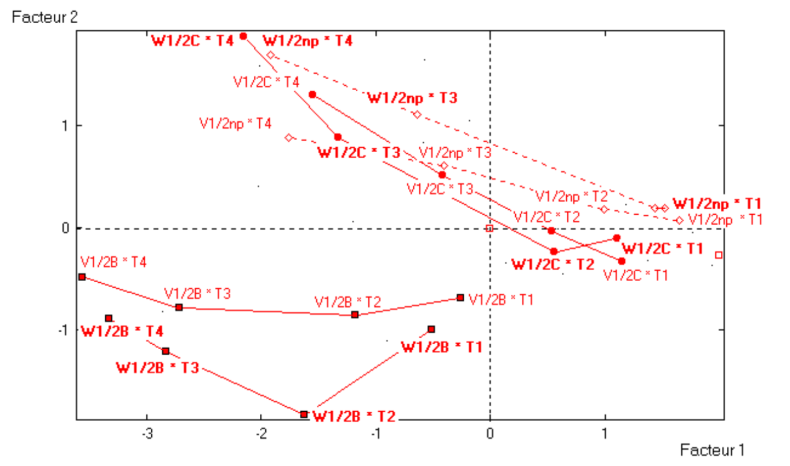
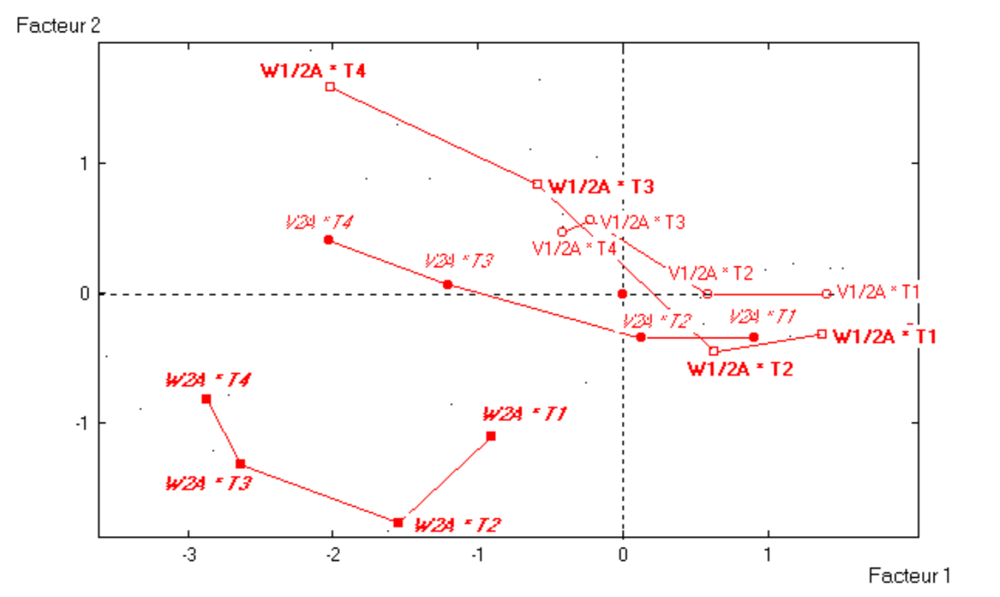

# (PART) Examples {-}

# Application Examples

Principal Component Analysis can be applied to a wide array of disciplines
and fields of application. Some of the fields in which we have had the 
opportunity to use PCA include Public Administration, Sociology, Marketing, 
Quality Control, to mention but a few. In this chapter, we present some 
applications of PCA to various case studies. These examples seek to give you an 
idea of the possibilities and scope of PCA under diverse circumstances.


## Lascaux Cave Temperatures {#lascaux}

Our first example has to do with temperatures in the famous 
<a href="https://en.wikipedia.org/wiki/Lascaux" target="_blank">Lascaux Cave</a>.
This grotto is a complex of caves located in the department of Dordogne in 
southwestern France. The cave contains over 600 parietal wall paintings, 
depicting large animals (e.g. bulls, bisons, ibexes, rhinoceros) from the Upper 
Paleolithic time period.

The control of environmental variables (e.g. temperatures measured in distinct 
places, hydrometry measurements, etc.) in Lascaux cave was done in a manual 
fashion decades ago. The measurements involved daily readings of 77 different
locations in the cave. From these readings, a technical operator in charge
of the machines installed in the cave, controled the settings in order to 
guarantee adequate environmental conditions for the conservation of the paintings.

In the late 1970s, it was acknowledged that a less manual and time consuming work 
for controling the environment conditions in the cave had to be implemented. 
The institution responsible to develop an automatic temperature controling 
system was the _Laboratoire de Recherche des Monuments Historiques_ LRMH 
(research laboratory of historical momuments). One of the stages in this 
research project involved deciding whether to locate the sensors for reading 
temperatures along the cave.

We use a temperature data set that was part of this reserach project. The 
purpose is to see in what way PCA can be applied in order to describe the 
evolution of the cave temperatures, in terms of the reading positions, and 
the date of such readings. We seek to obtain a description that allows us
to better understand the environment conditions of the cave. As part of this 
analysis, we'll see how looking for optimal regressions enable us to select a 
minimum number of temperature points that capture as much of the 
information as possible needed to control the temperature conditions of the cave. 


### Temperature Data

The data of this section have to do with temperatures collected in 30 different 
locations along the cave, observed over 482 days, between February 1981 and 
December 1982. The following diagram shows the location of the measurements
inside the cave. Each label involves a thermometer, installed either on the rock,
or outside.

```{r fig-4-1, echo = FALSE, out.width = '80%', fig.cap='Location of reading temperature sensors'}
knitr::include_graphics("images/figure-4-1.png")
```

The following table lists the 30 active variables used in the analysis 
(continuous variables, representing temperature measurements in Celsius degrees).

```{r table-4-1, echo = FALSE}
tab_4_1 <- read.csv("data/table-4-1.csv")

knitr::kable(
  tab_4_1,
  booktabs = TRUE,
  caption = 'Active variables of temperature in Lascaux Cave.'
)
```


Looking at the diagram of the cave in figure \@ref(fig:fig-4-1), the entrance 
is on the right side of the figure. The machine room is located below the first 
entrance. Then comes the Hall of the Bulls. Ahead this hall, there is the 
Axial Gallery. To the right of the hall, there is the passageway. As you can 
tell from the table of variables, all temperature readings are recorded 
"in the air" as well as "on the rock".


### PCA

We perform a first normalized Principal Component Analysis on the table of 
temperatures. In this analysis, we don't take into account the time component
of the measurements. In other words, we don't take into account the date in 
which the readings were made. However, we do consider the time related variables
(month, and year) as supplementary variables.

Looking at the table of eigenvalues in \@ref(tab:table-4-2), we clearly detect 
two dominant axes __(see table 4.2)__. About 50% of the variability in the 
first axis, and 30% of the variability in the second one. The remaining 28 axes 
account for the less than 20% of the total inertia. Therefore, we are confident 
that the first factorial plane depicts a stable configuration of associations.

```{r table-4-2, echo = FALSE}
# table 4.2: eigenvalues
eigvals <- c(14.8677, 9.0366, 1.8428, 1.3074, 0.9548, 0.4578, 0.3835, 
              0.2860, 0.1900, 0.1010, 0.0855, 0.0706, 0.0656, 0.0564,
              0.0468, 0.0397, 0.0353, 0.0314, 0.0269, 0.0215, 0.0143,
              0.0140, 0.0121, 0.0110, 0.0097, 0.0070, 0.0063, 0.0053,
              0.0045, 0.0033)

eig_temps <- data.frame(
  num = 1:30,
  eigenvalue = eigvals,
  percentage = round(100 * eigvals / sum(eigvals), 2),
  cumulative = round(cumsum(100 * eigvals / sum(eigvals)), 2)
)

knitr::kable(
  eig_temps,
  booktabs = TRUE,
  caption = 'Table of eigenvalues from PCA on 30 temperature variables.'
)
```


#### Configuration of Temperature-Points {-}

The configuration of the temperatures (active variables) in the first factorial
plane, see figure \@ref(fig:fig-4-2), shows a regular pattern, with arrows 
close to the circumference of radius one. This means that the position of the 
variables on the first plane provides a good approximation of the correlations
between the measurement points. This is less true for the exterior temperatures
(`temi` and `tema`) and for those observed in the machine room, which show a 
less regular evolution, as well as a less direct association with the internal
temperatures of the cave. Notice the central position of the arrow corresponding
to the temperature near the shaft (`tpmr`).

```{r fig-4-2, echo = FALSE, out.width = '70%', fig.cap='Circle of correlations.'}
knitr::include_graphics("images/figure-4-2.png")
```

We also see that those observation points that are physically close to each 
other inside the cave, are also close on the factorial plane. Which is a 
translation of the fact that closer readings, measure similar things (this is
particularly seen among the temperatures "in the air" that always appear next 
to the temperatures "on the rock").

Likewise, we observe that temperatures are scattered all around the 
circumference in a counterclockwise direction: starting from the variables 
that have to do with the external temperature (`temi` and `tema`), and then 
moving "upward" with the variables corresponding to the readings of the 
entrance in the cave, followed by the readings from the Hall of the Bulls 
which are in an opposite direction to the external temperatures. Finally, we 
observe the readings from the axial gallery, and then the readings from the
nave and the shaft.

```{r echo = FALSE, out.width = '70%'}
knitr::include_graphics("images/figure-4-1.png")
```

This configuration reflects the effect of "distance from the cave's entrance".
The farther from the entrance, the less the correlation of a given reading and
the reading from the external temperature, except with the readings in the 
Hall of the Bulls that are negatively correlated with the external temperature.

Those readings from locations near the entrance are the ones that have the most
variability. This is due to the fact that they are more influenced by the 
external temperature, but also because their proximity to the machine room. 
Beyond the second entrance, the associations between the temperatures become
more stable and clearly reflect the geographic proximity and distance to the 
entrance. Notice that the reading of point `tdvf`, located at the end of the 
axial gallery, behaves in a similar fashion as those readings located in the 
nave.

The only exception to the previous pattern is the temperature of the shaft.
According to the experts, the system of temperatures in this location is 
independent from what happens in the rest of the cave, because of the presence
of carbonic gas under the surface. The temperatures of the machine 
room seem to be relatively far from the circumference, which is explained by
the closeness of the sensors to the machines.


### Seasonal Phenomenon

As we previously mentioned, the data collected in the Lascaux Cave involves 
temperatures measured in 30 different locations along the cave, observed over 
482 days, between February 1981 and December 1982.

So far, we have presented the results of the variables, that is, the results 
from analyzing the 30 temperature readings. However, we also have the 482 days 
that correspond to the rows of the data table (i.e. the individuals). In other
words, we also have the 482 points that correspond to the cloud of row-points.

As we know, two days will appear close to each other if their 30 temperatures 
are similar. Conversely, if two days have very different temperatures, they
will appear far from each other (the more different their profiles, the farther
they will be). In order to better visualize the scatterplot of the 
cloud of points, we calculate the monthly averages, obtaining 23 points, 
from February 1981 to December 1982 (see figure \@ref(fig:fig-4-3)).

```{r fig-4-3, echo = FALSE, out.width = '80%', fig.cap='Average monthly temperature values in Lascaux Cave'}
knitr::include_graphics("images/figure-4-3.png")
```

As you can tell from this scatterplot, we have connected all consecutive 
months with a dotted line, starting in Feb-1981, and following the direction 
of the arrows till the last point in Dec-1982. It is interesting to see that 
the connected points form two loops. One loop for points of 1981, which is 
the outer loop; and another loop for points of 1982, which is narrower and
offset to the left from the center of the plane.

It seems that the factorial plane describe the transition of the year seasons, 
in a counterclockwise manner. The first axis opposes Summer months to Winter 
months. In turn, the second axis opposes Spring months to Fall months.

In addition, we observe that, from the interior of the cave, the years 1981 and
1982 are not that similar with respect to the monthly temperatures. 1981 seems
to have a hotter Summer and colder Winter, whereas in 1982 the seasons are 
less different, and overall, less cold. This has been confirmed by checking 
the records from local weather stations.


#### Thermal Wave Penetration {-}

We can now take a look at both graphs (\@ref(fig:fig-4-2) and \@ref(fig:fig-4-3))
and enrich the interpretation of results. The configuration of the temperatures
in the circle of correlations, and the pattern of the monthly temperatures,
reveal the penetration of the thermal wave inside the cave.

We are able to observe how temperature changes and moves inside the cave. 
The high temperatures of July and August, move from the exterior towards the 
first entrance during the months of September and October. By Fall, the maximum
recorded temperatures occur in the second entrance (October and December).
Then, in Winter (January, February, and March) the maximum temperatures are 
recorded in the Hall of the Bulls. The further we go into the cave, the more 
we advance in time (from the thermal point of view). The factorial plane allows
us to visualize the average time that the thermal wave takes to reach every 
recording location in the cave.


### Modeling Propagation of Thermal Wave

The discovered patterns of variability in the cave's temperature and the
thermal wave, suggests us a modeling approach based on two aspects: 1) the 
factorial plane shows that each month corresponds to an almost 
constant rotation; 2) on the circle of correlations, the variables are 
positioned in terms of their distance from the entrance to the cave.

Let's consider the variation of the temperature to be modeled with a sine curve. 
The penetration of the thermal wave in the cave is a function of the distance 
between two reading-temperature locations. Let $i$ be the day, and let $j$ be 
the distance to the entrance. Also, the amplitude of variation varies according 
to the year (coefficients $\alpha_1$ and $\alpha_2$), as well as the average 
annual temperature ($\mu_1$ and $\mu_2$).

We model the temperature of the first year, in day $i$, and with a distance 
$j$ to the entrance, with the following equation:

$$
T_1(i,j) = \alpha_1 \sin \big( 2\pi (i+j) \big) + \mu_1
$$

Analogously, the equation for the second year is:

$$
T_2(i,j) = \alpha_2 \sin \big( 2\pi (i+j) \big) + \mu_2
$$

It can be shown that, in a data table that has these relationships, the 
following properties are verified:

1) If the amplitudes and the annual means are equal, we obtain two non-null
identical eigenvalues. The temperatures are ordered by a subindex on the 
circle of correlations, and the months progress in chronological order, 
confounded for both years on the same circumference 
(see diagram A in figure \@ref(fig:fig-4-4)).

2) If there is a difference between the annual temperature means 
($\mu_1$ and $\mu_2$), the clouds of 1981 and 1982 become separated. If the 
difference is not too large, then the two first eigenvalues are similar, 
whereas the third eigenvalue is much more small. In turn, the months will be 
arranged in an elliptical way, with two off-centered ellipses 
(see diagram B in figure \@ref(fig:fig-4-4)). If the difference between the 
annual means is more substantial, the first axis will be a function of this 
difference (see diagram C in figure \@ref(fig:fig-4-4)), while in the second 
and third axes, the annual circumferences that are identical will be 
displayed.

3) If additionally, there is a difference of annual amplitude 
($\alpha_1$ and $\alpha_2$), then the size of the ellipses is modified.


```{r fig-4-4, echo = FALSE, out.width = '85%', fig.cap='Three shape patterns of month-points'}
knitr::include_graphics("images/figure-4-4.png")
```


#### Reconstitution of the Data {-}

Without loss of generality, let us simplify things a bit by assuming that the
data table has weekly observations, instead of daily observations. The year 1981
involves weeks $i = 1, 2, \dots, 52$, and year 1982 involves weeks 
$i = 53, 54, \dots, 104$. Based on the original data, we take 
$\mu_1 - \mu_2 = 0.7$, and set amplitudes to $\alpha_1 = 1$ and $\alpha_2 = 1.5$.
For the $j$-th variable, we define the distance between reading points according
to their groupings in the cave, except for the first 8 reading locations for
which we introduce a variable distance (see table below) that corresponds to
the sepration of the reading points in the entrances and the machine room.

```{r table-4-3, echo = FALSE,}
knitr::kable(
  data.frame(j="week", d="distance"),
  booktabs = TRUE,
  caption = 'Modeling weekly-lag data'
)
```

$$
\begin{array}{c|c}
j & \text{distance} \\
\hline \text{1 to 8} & 2\pi (j - 8) / 21 \\
\text{9 to 15} & \pi / 3 \\
\text{16 to 25} & \pi / 2 \\
\text{26 to 30} & \pi
\end{array}
$$

Analyzing the weekly data table previously described, we obtain a configuration 
of points very similar to the one obtained with the original data. There is a 
big loop for 1981, and a smaller loop for 1982, off-centered and overlaping with 
the big loop in the winter zone. The inertia percentages of the first three 
axes are: 59%, 31%, and 14%, very similar to the original inertias. This 
indicates that the chosen model is acceptable.


### Stability of the Axes

The histogram of eigenvalues suggests a good stability of the first two axes.
This is due to the existance of the seasonal phenomenon.

To determine the number of stable axes, we add random noise to the data.
The "important" axes must remain (for the most part) unchanged by the added
noise, as long as they convey the structural relationships between data points.

As an illustration, let's review how a large random noise (of up to 50% of 
the variability in the series) is not enough to destroy the seasonal structure
in data, while remaining stable in the first two axes.

The way we add random noise to data is by adding a random amount generated from a
Normal distribution, using mean zero, and standard deviation of 1/4 the standard 
deviation of the annual temperatures in a given reading location. We perform
PCA on this modified data set, examining the obtained principal components, 
as well as the circle of correlations between the original components and the 
ones obtained from the data with random noise (see table below).

```{r table-4-4, echo = FALSE, comment = ''}
options(knitr.kable.NA = '')
cor_4_4 <- cbind(
  c(0.996, 0.019, 0.000, 0.002, 0.003),
  c(0.000, 0.994, 0.013, 0.000, 0.006),
  c(0.000, 0.000, 0.974, 0.027, 0.006),
  c(0.000, 0.000, 0.000, 0.921, 0.043),
  c(0.000, 0.000, 0.000, 0.000, 0.920)
)

rownames(cor_4_4) <- paste0("original", 1:5)
colnames(cor_4_4) <- paste0("random", 1:5)

cor_4_4[upper.tri(cor_4_4, diag = FALSE)] <- NA

# print table with kable
knitr::kable(
  cor_4_4,
  
  booktabs = TRUE,
  caption = 'Stability analysis of first 5 axes'
)
```

It turns out that with this added random noise, the first five axes remain 
stable. 

Next, we repeat the same procedure, but this time adding a larger
amount of random noise: half of the standard deviation of each variable
(see results in table below).

```{r table-4-5, echo = FALSE, comment = ''}
options(knitr.kable.NA = '')
cor_4_5 <- cbind(
  c(0.986, 0.039, 0.000, 0.003, 0.005),
  c(0.000, 0.975, 0.025, 0.000, 0.011),
  c(0.000, 0.000, 0.908, 0.057, 0.016),
  c(0.000, 0.000, 0.000, 0.761, 0.064),
  c(0.000, 0.000, 0.000, 0.000, 0.751)
)

rownames(cor_4_5) <- paste0("original", 1:5)
colnames(cor_4_5) <- paste0("random", 1:5)

cor_4_5[upper.tri(cor_4_5, diag = FALSE)] <- NA

# print table with kable
knitr::kable(
  cor_4_5,
  
  booktabs = TRUE,
  caption = 'Stability analysis of first 5 axes (continued)'
)
```

Despite the larger amount of introduced random noise, the first three axes
still remain mostly unchanged, whereas the fourth and the fifth axes have 
been slightly modified.


### Selecting Best Temperature Reading Locations

As we mentioned in the introduction of this chapter, one of the stages of the 
Lascaux Cave research project involved deciding whether to locate the sensors 
for reading temperatures along the cave.

We seek to obtain a small subset of reading locations, such that they provide
essential information for the totality of the observations. Simply put, we
seek to conserve the stable factorial directions.

The first decision that we made was to retain just one of the measurements 
for every pair of temperature "rock/air"; this reduced the number of readings
from 30 to 15 temperature variables.

We provide only the sketch idea used to find the solution. The methodology 
consists of eliminating, step by step, the more redundant variables. We use the
correlation between the new computed factorial axes (PCA on retained temperature 
reading locations) and the original factorial axes (PCA on all variables).
To be more precise, we calculate the sum of squared correlations between
homologous axes (diagonal of the correlation matrix). Finally, we obtain a 
subset of 8 variables that adequately reconstitute the subspace of the first 
three initial factorial axes (with correlations of 0.986, 0.980, and 0.865, like 
in the table \@ref(tab:table-4-6) below).

```{r fig-4-5, echo = FALSE, out.width = '80%', fig.cap='Location of best 8 reading temperature sensors'}
knitr::include_graphics("images/figure-4-5.png")
```


```{r table-4-6, echo = FALSE, comment = ''}
options(knitr.kable.NA = '')
cor_4_6 <- cbind(
  c(0.986, 0.162, 0.046),
  c(0.000, 0.980, 0.008),
  c(0.000, 0.000, 0.865)
)

rownames(cor_4_6) <- paste0("original", 1:3)
colnames(cor_4_6) <- paste0("random", 1:3)

cor_4_6[upper.tri(cor_4_6, diag = FALSE)] <- NA

# print table with kable
knitr::kable(
  cor_4_6,
  
  booktabs = TRUE,
  caption = 'Reconstitution of 3 first factorial axes with 8 temperature readings'
)
```

<br>


## Design of Experiments and PCA

Our second example has to do with material coatings degrading over time that 
need to be replaced with protection coverings, paint, or chemical filters.
We are interested in studying the effect of three factors associated with 
the aging of material coatings. To do this, an experimental design is carried
out with the following factors:

| Factor                     | Levels      |
|:---------------------------|:------------|
| Radiation type             | Radiation V |
|                            | Radiation W |
| Radiation intensity        | 1/2 dose    |
|                            | 2 dose      |
| Chemical protection filter | Filter A    |
|                            | Filter B    |
|                            | Filter C    |

The material coatings go through an artifical aging process. Several parameters
are measured that have to do with the apparent degradation of the surface. 
The experiment involves five series of measurements obtained in different times:
$\mathsf{T}_0, \mathsf{T}_1, \mathsf{T}_2, \mathsf{T}_3$ and $\mathsf{T}_4$.
The duration of the tests is of one year. In addition, we also have a series of
coatings with no protection, which have been subjected to radiations in order
to establish comparisons, whereas the other coatings are used as "control"
units without being exposed to any radiation (only measuring their natural aging).

The observed aging parameters have been: _color_, _thickness_, _lackluster_,
_wrinkles_, and _cracks_. We also have available an assessment of the overall
aging aspect, as well as other "non controlled" variables, all of them 
observed as continuous variables.


### PCA

Principal Component Analysis has been performed on a data set containing the 
five time periods of tests $\mathsf{T}_0$, $\mathsf{T}_1$, $\mathsf{T}_2$,
$\mathsf{T}_3$, and $\mathsf{T}_4$ (i.e. each coating is repeated 5 times).
The table also contains, as nominal variables, the variable that indicates
the period and the interactions with the factors of interest (radiation type,
radiation dose, and type of chemical filter). The active variables are the 
5 aging measurement parameters. All of the variables are listed in the following 
table:

```{r table-4-7, echo = FALSE, comment = ''}
tbl_4_7a <- data.frame(
  Variable = c(
    'Radiation type', 
    'Radiation dose',
    'Protection filter',
    'Time period',
    'Color',
    'Lackluster',
    'Cracks',
    'Thickness',
    'Wrinkles',
    'Assessment'),
  Type = c(
    rep('supplementary nominal', 4),
    rep('active continuous', 5),
    c('supplementary continuous')
  ),
  Scale = c(
    '6 categories',
    '4 categories',
    '6 categories',
    '5 categories',
    'continuous',
    'continuous',
    'continuous',
    'continuous',
    'continuous',
    'continuous')
)

# print table with kable
knitr::kable(
  tbl_4_7a,
  booktabs = FALSE,
  caption = 'Table of Active and Supplementary Variables'
)
```

<br>

Likewise, the table below shows the correlations among the active variables:

```{r table-4-7b, echo = FALSE, comment = ''}
options(knitr.kable.NA = '')
cor_4_b7 <- cbind(
  c(1.00, 0.45, 0.24, 0.88, 0.60),
  c(0.00, 1.00, 0.74, 0.48, 0.64),
  c(0.00, 0.00, 1.00, 0.35, 0.57),
  c(0.00, 0.00, 0.00, 1.00, 0.65),
  c(0.00, 0.00, 0.00, 0.00, 1.00)
)

rownames(cor_4_b7) <- c('color', 'lackluster', 'cracks', 'thickness', 'wrinkles')
colnames(cor_4_b7) <- c('color', 'lackluster', 'cracks', 'thickness', 'wrinkles')

cor_4_b7[upper.tri(cor_4_b7, diag = FALSE)] <- NA

# print table with kable
knitr::kable(
  cor_4_b7)
```

As you can tell, all correlations are positive. This will produce a first 
factor with the so-called _size effect_, opposing the more deteriorated coatings
against those that are in better shape (in the sample of size 830, we consider 
a non-null correlation to be 0.07, with a significance level $\alpha = 0.05$).

The table \@ref(tab:table-4-8) shows the distribution of eigenvalues from the
principal component analysis on the five aging parameters.

```{r table-4-8, echo = FALSE}
# table 4.8: eigenvalues
eigvals <- c(3.2531, 1.0675, 0.3284, 0.2424, 0.1085)

eig_temps <- data.frame(
  num = 1:5,
  eigenvalue = eigvals,
  percentage = round(100 * eigvals / sum(eigvals), 2),
  cumulative = round(cumsum(100 * eigvals / sum(eigvals)), 2)
)

knitr::kable(
  eig_temps,
  booktabs = TRUE,
  caption = 'Table of eigenvalues from PCA on 5 aging parameters.'
)
```

<br>

In the figure below (circle of correlations), look at the correlation between 
the supplementary variable "overall assessment" and the first factor. This 
indicates that the first axis opposes the more degradated coatings to the less 
deteriorated. In turn, the second factor opposes the degradation due to 
lackluster and cracks, versus the degradation in color and thickness. Wrinkles 
are located in an intermediate position, very correlated with the overall 
assessment. These two factors account for 86% of the total inertia.

```{r fig-4-6, echo = FALSE, out.width = '60%', fig.cap='Circle of correlations for aging parameters'}
knitr::include_graphics("images/figure-4-6.png")
```


### Evolution of Factor Trajectories over Time

To gain insight into the relationship between the extracted dimensions and the 
active variables, we project, as supplementary points, the different explanatory 
factors crossed with the five time periods. This operation defines trajectories
in the factorial plane that help us understand the aging phenomenon under study.

We first project the different types of filters per time period, which produces
trajectories fA, fB and fC in figure \@ref(fig:fig-4-7). We also project the
non-treated coatings that have been subjected to radiation, as well as those 
that have not been subjected to any radiation. The latter show natural againg 
of the material coatings. Recall that these non-treated samples are used as 
control units to which we compare the different filters.

```{r fig-4-7, echo = FALSE, out.width = '85%', fig.cap='Average aging of filters per period'}
knitr::include_graphics("images/figure-4-7.png")
```

We observe that filter B quickly degrades coatings, especially on cracks and 
lackluster. In contrast, filter C has a trajectory quite close to the 
"non-treated" and the two time periods, close to the control samples. Then, 
the degradation increases, mostly in color and thickness (compare the direction
of this trajectory with that of figure \@ref(fig:fig-4-6)). With respect to 
filter A, this is located in an intermediate position between filters B and C.

Actually, figure \@ref(fig:fig-4-7) shows the average evolutions per filter,
independently of the radiation type and dose.

It is interesting to project the interactions between filter type, radiation 
type, and radiation dose (which are the cells of the experimental design) onto 
the first factorial plane. Because of the large number of points to be 
plotted, we have divided them in two graphs. One plot contains the points 
for filters B and C, and the "non-treated" (figure \@ref(fig:fig-4-8)); the
other plot (see figure \@ref(fig:fig-4-9)) contains the observations for filter 
A for which two types of radiation have been used: normal (1/2 dose) and high 
dose (2 dose).

The graph in figure \@ref(fig:fig-4-8) distinguishes two types of trajectories.
We have a set of trajectories going from the right side of the plane to the
top left corner: filter C and "non-treated", with degradation in color and 
thickness. The other set of trajectories are in the left bottom part of the 
plane: filter B, with degradation in cracks and lackluster.

```{r fig-4-8, echo = FALSE, out.width = '85%', fig.cap='Evolution of filters B and C, according to type and dose of radiation '}

```

Note that for both, filter C and "non-treated", there is a small divergence
depending on the type of radiation, V or W. Moreover, the type of radiation W
is more degradating. Likewise, filter B strongly degrades the material coating.
The degradation is stronger between $\mathsf{T}_0$ and $\mathsf{T}_1$, and 
then it keeps going on but at a slower pace. Here again, the radiation W appears 
to be more dominant in cracks and lackluster.

With respect to filter A, we distinguish two levels of radiation intensity 
(dose 1/2 and 2), as well as the 2 types of radiation (V and W), shown in 
figure \@ref(fig:fig-4-9). We find that trajectory of filter A and V1/2 has 
a small degradation effect. In contrast, the trajectory of filter A and 
radiation type W behaves a lot like that of filter C and non-treated. When we 
move to the high dose (dose 2), the degradation of radiation V is accentuated
with respect to the level that it has with lower dose (dose 1/2). However, 
this degradation is less than the one shown in filter B in a central position.
In contrast, when we use radiation W with a dose equal to 2, then filter A
behaves like filter B with the same radiation, but dose 1/2.

```{r fig-4-9, echo = FALSE, out.width = '85%', fig.cap='Evolution of filters A, according to type and dose of radiation '}

```


### Analysis of Variance

We want to study how the aging of the coating surface is related with time and 
group. Time is expressed by the period of measurement, and the groups are 
defined by the combination of factors in the experimental design (interaction
of filter, radiation type, and radiation dose).

We perform an analysis of variance (anova) using variable "overall assessment" 
as the response variable, and using period (4 dates) and group (12 combinations) 
as anova factors. The obtained results are displayed in table \@ref(tab:table-4-9).
This table contains the model's summary statistics, and the table with the 
decomposition of variance.

```{r table-4-9, echo = FALSE}
# table 4.9: eigenvalues
anova_tbl <- data.frame(
  term = c(
    paste0('period T', 0:4),
    paste0('rad. V 1/2 ', c('non-treated', 'filter A', 'filter B', 'filter C')),
    paste0('rad. V 2 ', 'filter A'),
    paste0('rad. W 1/2 ', c('non-treated', 'filter A', 'filter B', 'filter C')),
    paste0('rad. W 2 ', 'filter A'),
    c('control', 'not applicable', 'constant')),
  coefficient = c(-4.5940, -2.1695, -0.3717, 2.4890, 4.6463, -0.5353, -0.7255,
                  3.1480, -0.2815, 0.8372, -0.5601, -0.0464, 3.6387, 0.3510,
                  4.1088, -1.5533, -8.3816, 8.8687),
  stdev = c(0.138, 0.138, 0.140, 0.142, 0.145, 0.232, 0.252, 0.232, 0.234, 
            0.234, 0.208, 0.207, 0.210, 0.207, 0.270, 0.235, 0.464, 0.077),
  t_stat = c(33.262, 15.671, 2.665, 17.551, 32.00, 2.311, 2.878, 13.587,
             1.205, 3.585, 2.696, 0.225, 17.299, 1.699, 15.233, 6.597, 
             18.065, 114.840),
  p_val = c(0.000, 0.000, 0.008, 0.000, 0.000, 0.021, 0.004, 0.000, 0.228,
            0.000, 0.007, 0.822, 0.000, 0.090, 0.000, 0.000, 0.000, 0.000),
  v_test = c(-26.42, -14.65, -2.66, 16.16, 25.74, -2.31, -2.87, 12.90, -1.20,
             3.57, -2.69, -0.22, 15.96, 1.70, 14.28, -6.51, -16.56, 48.11)
)

knitr::kable(
  anova_tbl,
  booktabs = TRUE,
  caption = 'Analysis of Variance.'
)
```

```{r echo = FALSE, comment = ''}
cat('Residual standard error: 3260.0056 on 15 degrees of freedom')
cat('Multiple R-squared: 0.7780')
cat('F-statistic: 190.134 on 15 and 814')
cat('p-value: 0.0000')
cat('\n\n')
cat('          Df    Sum Sq  F-value  Pr(>F)  v-test')
cat('Periods:   8  8574.453  535.245   0.000   32.08')
cat('Groups:   14  2886.327   88.217   0.000   42.29')
```


We observe that both factors, time period and group, are clearly significant.
The coefficients of each period are arranged in a similar fashion to the way 
they appear in the fatorial planes. The only positive coefficients for groups
(indicating a greater degradation) are for filter B with any type of radiation,
and for filter A with radiation W and dose 2.


## Defining an Economic Capacity Index

Our third example has to do with assessing the mean "economic capacity" of 
micro metropolitan components in a given year. To be more precise, the 
statistical units correspond to the smallest administrative units in a big 
Spanish city (these units are tehnically known as "census sections"). One of 
the goals is to draw a map of the city showing the distribution of the economic 
capacity in different areas.

This type of analysis seeks to provide support in economic studies in which 
a geographical element is taken into account, for example, urban development 
projects, location of shops, services, operational branches of businesses, etc.

We will focus on the indicators about income and wealth, routinely collected
by municipal data bases, and service provider companies.

Due to confidentiality issues, the treatment of the data has to be done at 
an aggregated level by census section. Therefore, the resulting index won't
be a family economic capacity index, but raher an estimation of the average
family economic capacity by census section.


### Analyzed Information

The analyzed information comes from four sources: municipal registry data, 
office of motor vehicles, municipal land registry, and telephone bills.
Because the related data files contain a large number of variables, the main 
problem has been the selection of the variables (indicators of the economic
capacity of families) to be used in the construction of the index.

The goal is to find a list of indicators in a balanced way such that all 
indicator subgroups have a similar importance, as well as being highly 
correlated.

The chosen indicators are:

1. First factor from a simple correspondence analysis performed on the 
"socioprofessional categories" of the municipal registry.

2. Tax potential based on car registrations.

3. Age of cars.

4. Construction value of properties (from municipal land registry)

5. Value of properties (from municipal land registry)

6. Total monthly telephone bill of all families.

These retained variables give us an idea of either the income (based on 
telephone bills), or the wealth (based on property values). Other variables
are more complex, for instance, the tax potential of vehicles is an indicator 
of both income and wealth; the age of vehicles is related with renewal periods
of the stock of cars; the tax value of land is associated to speculation of 
real estate prices, and therefore the prices of real estate in a given area.
Likewise, the first factor (from a correspondence analysis of socioprofessional
categories) can be interpreted as an indicator of social status in a given area.

The analyzed data are the mean values by census section. The following table
shows the matrix of correlations of the described indicators.

```{r table-4-10, echo = FALSE, comment = ''}
options(knitr.kable.NA = '')
cor_4_10 <- cbind(
  c(1.00, 0.57, 0.82, 0.67, 0.71, 0.74),
  c(0.00, 1.00, 0.41, 0.45, 0.65, 0.49),
  c(0.00, 0.00, 1.00, 0.71, 0.74, 0.75),
  c(0.00, 0.00, 0.00, 1.00, 0.71, 0.71),
  c(0.00, 0.00, 0.00, 0.00, 1.00, 0.76),
  c(0.00, 0.00, 0.00, 0.00, 0.00, 1.00)
)

var_labels <- c('socioprof', 'cars age', 'land value', 'cars tax', 
  'dwelling value', 'phone bill')

rownames(cor_4_10) <- var_labels
colnames(cor_4_10) <- var_labels

cor_4_10[upper.tri(cor_4_10, diag = FALSE)] <- NA

# print table with kable
knitr::kable(
  cor_4_10,
  
  booktabs = TRUE,
  caption = 'Correlation matrix of retained indicators.'
)
```


### PCA

The table \@ref(tab:table-4-11), shown below, displays the distribution of 
eigenvalues from the principal component analysis on the six economic indicators.

```{r table-4-11, echo = FALSE}
# table 4.11: eigenvalues
eigvals <- c(4.3235, 0.6800, 0.3653, 0.2768, 0.2315, 0.1230)

eig_temps <- data.frame(
  num = 1:6,
  eigenvalue = eigvals,
  percentage = round(100 * eigvals / sum(eigvals), 2),
  cumulative = round(cumsum(100 * eigvals / sum(eigvals)), 2)
)

knitr::kable(
  eig_temps,
  booktabs = TRUE,
  caption = 'Table of eigenvalues from PCA on 6 economic indicators.'
)
```

<br>

Figure \@ref(fig:fig-4-10) depicts the circle of correlations. Note how all 
variables, except "age of vehicles", are highly correlated with the first axis. 
This reflects the so-called _size effect_. The amount of inertia captured by 
the first axis is 72% (of the total inertia).

```{r fig-4-10, echo = FALSE, out.width = '70%', fig.cap='Circle of correlations of economic indicators'}

```

The correlations of the original variables with the first principal component 
are as follows:

| Variable                   | Correlation |
|:---------------------------|:------------|
| Value of properties        |    0.90     |
| Socioprofessional category |    0.89     |
| Construction value         |    0.88     |
| Telephone bill             |    0.88     |
| Tax potential based on car |    0.84     |
| Age of vehicles            |    0.68     |


As you can tell, these are high correlations, which indicates that the first
factor is a good representant of all the analyzed variables. These correlations
give the coefficients for the explanatory model using the first factor (assuming 
mean-centered and reduced variables). The fact that most of the coefficients 
are very similar, implies that the first factor is a good approximation to the 
arithmetic mean of the variables. Consequently, the first principal component
allows us to order the census sections according to their level of economic 
capacity. The centroid of this factor corresponds to the average economic 
capacity of the city.

We should say that the obtained index is an abstract index. It does not 
represent a concrete measurement, centered around 0 and with an arbitrary
variance. Using information from other research studies,we can transform the 
scale of the index in order to have a more conventional scale ranging from 
0 to 100. Which provides the following distribution depicted in figure 
\@ref(fig:fig-4-11).

```{r fig-4-11, echo = FALSE, out.width = '80%', fig.cap='Histogram of Economic Capacity Index'}
knitr::include_graphics("images/figure-4-11.png")
```


