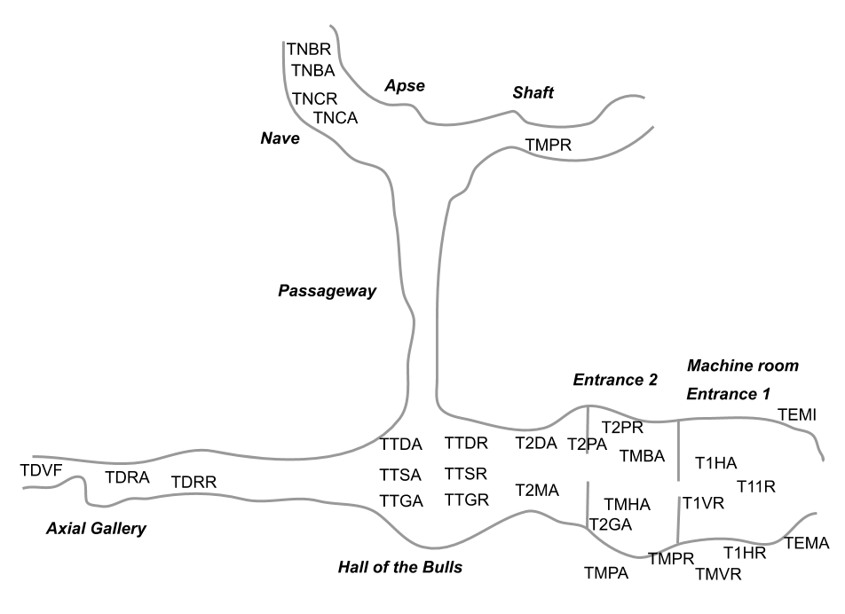
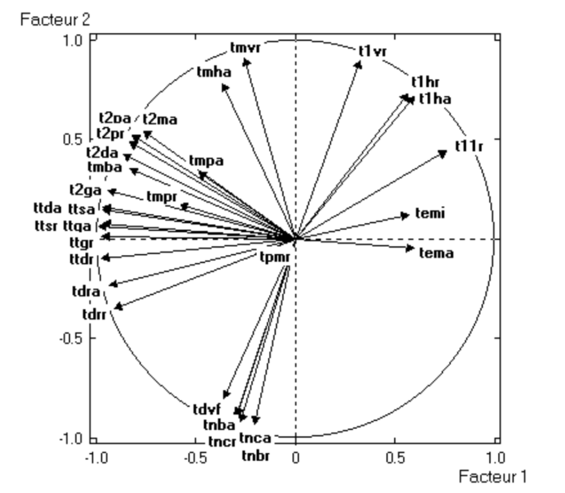

# (PART) Examples {-}

# Application Examples

Principal Component Analysis can be applied to a wide array of disciplines
and fields of application. Some of the fields in which we have had the 
opportunity to use PCA include Public Administration, Sociology, Marketing, 
Quality Control, to mention but a few. In this chapter, we present some 
applications of PCA to various case studies. These examples seek to give you an 
idea of the possibilities and scope of PCA under diverse circumstances.


## Lascaux Cave Temperatures {#lascaux}

Our first example has to do with temperatures in the famous 
<a href="https://en.wikipedia.org/wiki/Lascaux" target="_blank">Lascaux Cave</a>.
This grotto is a complex of caves located in the department of Dordogne in 
southwestern France. The cave contains over 600 parietal wall paintings, 
depicting large animals (e.g. bulls, bisons, ibexes, rhinoceros) from the Upper 
Paleolithic time period.

The control of environmental variables (e.g. temperatures measured in distinct 
places, hydrometry measurements, etc.) in Lascaux cave was done in a manual 
fashion decades ago. The measurements involved daily readings of 77 different
locations in the cave. From these readings, a technical operator in charge
of the machines instaled in the cave, controled the settings in order to 
guarantee adequate environmental conditions for the conservation of the paintings.

In the late 1970s, it was acknowledged that a less manual and time consuming work 
for controling the environment conditions in the cave had to be implemented. 
The institution responsible to develop an automatic temperature controling 
system was the _Laboratoire de Recherche des Monuments Historiques_ LRMH 
(research laboratory of historical momuments). One of the stages in this 
research project involved deciding whether to locate the sensors for reading 
temperatures along the cave.

We use a temperature data set that was part of this reserach project. The 
purpose is to see in what way PCA can be applied in order to describe the 
evolution of the cave temperatures, in terms of the reading positions, and 
the date of such readings. We seek to obtain a description that allows us
to better understand the environment conditions of the cave. As part of this 
analysis, we'll see how looking for optimal regressions enable us to select a 
minimum number of temperature points that capture as much of the 
information as possible needed to control the temperature conditions of the cave. 


### Temperature Data

The data of this section have to do with temperatures collected in 30 different 
locations along the cave, observed over 482 days, between February 1981 and 
December 1982. The following diagram shows the location of the measurements
inside the cave. Each label involves a thermometer, installed either on the rock,
or outside.

```{r fig-4-1, echo = FALSE, out.width = '80%', fig.cap='Location of reading temperature sensors'}

```

The following table lists the 30 active variables used in the analysis 
(continuous variables, representing temperature measurements in Celsius degrees).

| Num | Variable    | Description                          |
|:----|:------------|:-------------------------------------|
|  7  | `temi`      | Minimum outside temperature          |
|  8  | `tema`      | Maximum outside temperature          |
|  9  | `t11r`      | SAS1 left 1 - rock                   |
| 12  | `t1ha`      | SAS1 left 3 up - air                 |
| 13  | `t1hr`      | SAS1 left 3 up - rock                |
| 14  | `t1vr`      | SAS1 under dome 3 - rock             |
| 15  | `tmpa`      | Machine room left wall - air         |
| 16  | `tmpt`      | Machine room left wall - rock        |
| 17  | `tmvr`      | Machine room, left dome - rock       |
| 18  | `tmha`      | Machine room top wall left - air     |
| 19  | `tmba`      | Machine room bottom wall left - air  |
| 20  | `t2pa`      | SAS2 right wall - air                |
| 21  | `t2pr`      | SAS2 right wall - rock               |
| 22  | `t2ma`      | SAS2 dome - air                      |
| 23  | `t2da`      | SAS2 ground right - air              |
| 24  | `t2ga`      | SAS2 ground left - air               |
| 28  | `ttda`      | Hall of the Bulls right wall - air   |
| 29  | `ttdr`      | Hall of the Bulls right wall - rock  |
| 30  | `ttsa`      | Hall of the Bulls ground - air       |
| 31  | `ttsr`      | Hall of the Bulls ground - rock      |
| 32  | `ttga`      | Hall of the Bulls left wall - air    |
| 33  | `ttsr`      | Hall of the Bulls left wall - rock   |
| 34  | `tdra`      | Axial Gallery narrow dome - air      |
| 35  | `tdrr`      | Axial Gallery narrow dome - rock     |
| 36  | `tdvf`      | Axial Gallery end dome - air         |
| 37  | `tnca`      | Nave of Deer - air                   |
| 38  | `tncr`      | Nave of Deer - rock                  |
| 39  | `tnba`      | Nave of Bisons - air                 |
| 40  | `tnbr`      | Nave of Bisons - rock                |
| 41  | `tpmr`      | Shaft edge - rock                    |

Looking at the diagram of the cave in figure \@ref(fig:fig-4-1), the entrance 
is on the right side of the figure. The machine room is located below the first 
entrance. Then comes the Hall of the Bulls. Ahead this hall, there is the 
Axial Gallery. To the right of the hall, there is the passageway. As you can 
tell from the table of variables, all temperature readings are recorded 
"in the air" as well as "on the rock".


### PCA

We perform a first normalized Principal Component Analysis on the table of 
temperatures. In this analysis, we don't take into account the time component
of the measurements. In other words, we don't take into account the date in 
which the readings were made. However, we do consider the time related variables
(month, and year) as supplementary variables.

Looking at the table of eigenvalues in \@ref(tab:table-4-2), we clearly detect 
two dominant axes __(see table 4.2)__. About 50% of the variability in the 
first axis, and 30% of the variability in the second one. The remaining 28 axes 
account for the less than 20% of the total inertia. Therefore, we are confident 
that the first factorial plane depicts a stable configuration of associations.

```{r table-4-2, echo = FALSE}
# table 4.2: eigenvalues
eigvals <- c(14.8677, 9.0366, 1.8428, 1.3074, 0.9548, 0.4578, 0.3835, 
              0.2860, 0.1900, 0.1010, 0.0855, 0.0706, 0.0656, 0.0564,
              0.0468, 0.0397, 0.0353, 0.0314, 0.0269, 0.0215, 0.0143,
              0.0140, 0.0121, 0.0110, 0.0097, 0.0070, 0.0063, 0.0053,
              0.0045, 0.0033)

eig_temps <- data.frame(
  num = 1:30,
  eigenvalue = eigvals,
  percentage = round(100 * eigvals / sum(eigvals), 2),
  cumulative = round(cumsum(100 * eigvals / sum(eigvals)), 2)
)

knitr::kable(
  eig_temps,
  booktabs = TRUE,
  caption = 'Table of eigenvalues from PCA on 30 temperature variables.'
)
```


#### Configuration of Temperature-Points {-}

The configuration of the temperatures (active variables) in the first factorial
plane, see figure \@ref(fig:fig-4-2), shows a regular pattern, with arrows 
close to the circumference of radius one. This means that the position of the 
variables on the first plane provides a good approximation of the correlations
between the measurement points. This is less true for the exterior temperatures
(`temi` and `tema`) and for those observed in the machine room, which show a 
less regular evolution, as well as a less direct association with the internal
temperatures of the cave. Notice the central position of the arrow corresponding
to the temperature near the shaft (`tpmr`).

```{r fig-4-2, echo = FALSE, out.width = '70%', fig.cap='Circle of correlations.'}

```

We also see that those observation points that are physically close to each 
other inside the cave, are also close on the factorial plane. Which is a 
translation of the fact that closer readings, measure similar things (this is
particularly seen among the temperatures "in the air" that always appear next 
to the temperatures "on the rock").
