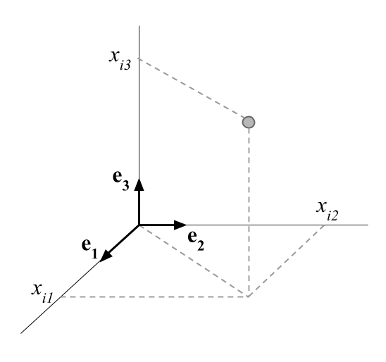
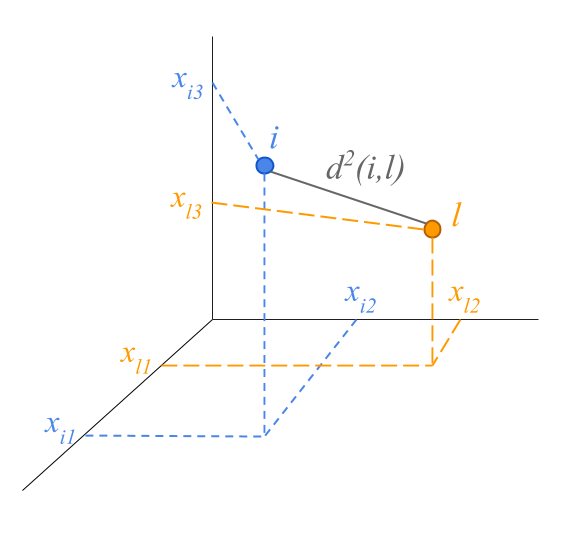
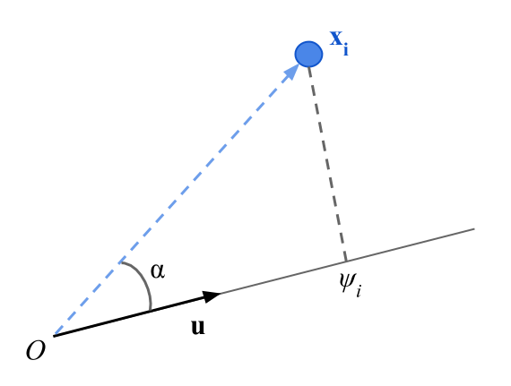
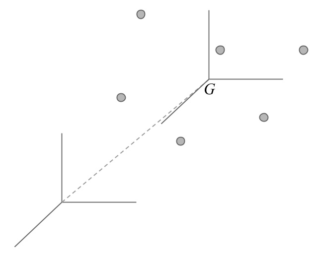

# Appendix A: Fundamentals {#appendixa}

In this appendix we discuss some fundamental notions that will allow us to provide a geometrical development of Principal Component Analysis.


## Space of $p$ Dimensions

The objects that surround us are in a three dimensional space. Each object is defined by its coordinates in a basis formed by an origin and three orthogonal axes.

```{r fig-5-1, echo = FALSE, out.width = '50%'}

```

The axes are defined by vectors of unit length the provide a direction to each axis. The three vectors $(\mathbf{e_1}, \mathbf{e_2}, \mathbf{e_3})$ define a basis in the space of three dimensions. We can actually define various basis for the same space.

It is possible to generalize the space of three dimensions to spaces of higher dimensions. However, objects in spaces of dimensions greater than three cannot be visualized.

The points located in a space of $p$ dimensions are defined by their $p$ coordinates on the associated $p$ axes:

$$
i \longrightarrow (x_{i1}, x_{i2}, \dots, x_{ip})
$$

This kind of multidmensional spaces are introduced in data analysis methods in order to _map_ each point to a row of a data table. The coordinates are defined by the values of the row. Geometrically, these points are located in a space of as many dimensions as number of columns in the table.

Analogously, the columns of the table (i.e. the variables) can be regarded as points in a space in which the coordinates are the values of the column.


## Distances between points

The squared of the distance between two points can be calculated by the sum of the squared of the differences between coordinates:

$$
d^2(i,l) = (x_{i1} - x_{l1})^2 + (x_{i2} - x_{l2})^2 + (x_{i3} - x_{l3})^2
$$

```{r fig-5-2, echo = FALSE, out.width = '50%'}

```

The distance formula can be extended to spaces with more than three dimensions.

$$
d^2(i,l) = (x_{i1} - x_{l1})^2 + (x_{i2} - x_{l2})^2 + \dots + (x_{ip} - x_{lp})^2
$$


## Center of Gravity

For every cloud of points, there is an average point, called the _center of gravity_.

```{r fig-5-3, echo = FALSE, out.width = '50%'}
knitr::include_graphics("images/figure-5-3.png")
```

If the points have an associated weight ($p_i$ for individual $i$), the coordinate of the center of gravity on the $i$ axis is:

$$
G_j = \sum_{i=1}^{n} p_i \hspace{1mm} x_{ij}
$$

The center of gravity corresponds the statistical notion of _mean_ or average point.


## Inertia of a cloud of points

We measure the inertia of a cloud with respect to its of gravity by:

$$
I = \sum_{i=1}^{n} p_i \hspace{1mm} d^2(i,G)
$$

The inertia is a measure of spread; to be more precise, it is a measure of weighted spread of the points.

The statistical notion associated to the inertia is the variance (i.e. spread around the mean).


## Projection of the cloud of points on a line

The projection of a point can be obtained by the scalar product of the point and the unit vector $\mathbf{u}$ defining the line on which the projection is performed.

```{r fig-5-5, echo = FALSE, out.width = '45%'}

```


$$
\psi_i = ||\mathbf{x}|| \hspace{1mm} ||\mathbf{u}|| \hspace{1mm} cos(\alpha) = \sum_{j=1}^{p} x_{ij} u_j
$$

with

$$
||\mathbf{u}||^2 = \sum_{j=1}^{p} = u_{j}^{2} = 1
$$

The inertia of the projected cloud on a line is the variance of the projections on the line $\mathbf{u}$. The square root of the variance is called _standard deviation_.

$$
I_u = \sum_{i=1}^{n} p_i \hspace{1mm} \psi_{i}^{2}
$$

with 

$$
\sum_{i=1}^{n} \psi_i = 0
$$

There is an equivalence between the mechanics notion of Inertia and the statistical notion of Variance.


## Centered and Standardized Variable

We say that a variable is mean-centered when its mean is zero. When we centered all the variables, we shift the origin of a cloud of points to the center of gravity.

```{r fig-5-6, echo = FALSE, out.width = '50%'}

```

In addition, if we divide each value by the standard deviation of the variable, this becomes mean-centered and standardized. The variance of a centered and standardized variable is equal to one.

\begin{align*}
z_{ij} &= \frac{x_{ij} - \bar{x}_j}{s_j} \\
& \\
var(\mathbf{z_j}) &= \sum_{i=1}^{n} p_i (z_{ij} - \bar{z}_j)^2 = \frac{\sum_{i=1}^{n} p_i (x_{ij} - \bar{x}_j)^2}{s_{j}^{2}} = 1
\end{align*}

The variance of a variable is the squared of the distance from the variable-point to the origin. The centered and standardized variables have a distance of one unit from the origin (i.e. they are on a sphere of radius 1).

