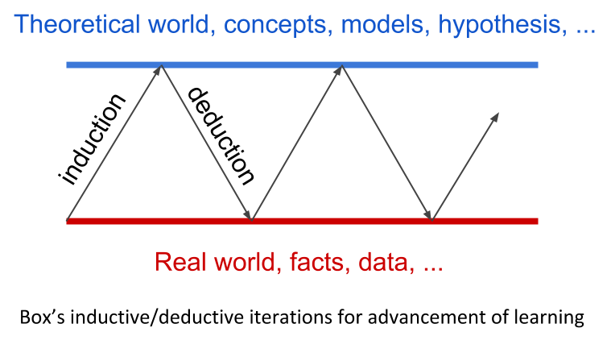
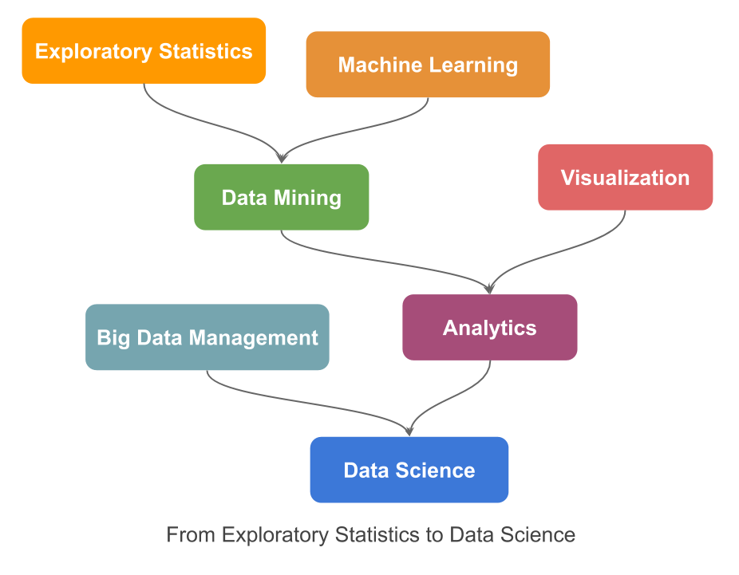

# From "L'Analyse des Données" to Data Science {-}

> "When the Lord created the world and people to live in---an enterprise which
> according modern science, took a very long time---I could well imagine that 
> He reasoned with Himself as follows: “If I make everything predictable, these 
> human beings, whom I have endowed with pretty good brains, will undoubtedly 
> learn to predict everything, and they will thereupon have no motive to do 
> anything at all, because they will recognize that the future is totally 
> determined and cannot be influenced by any human action. On the other hand, 
> if I make everything unpredictable, they will gradually discover that there 
> is no rational basis for any decision whatsoever and, as in the first case, 
> they will thereupon have no motive to do anything at all. Neither scheme would 
> make sense. I must therefore create a mixture of the two. Let some things be 
> predictable and let others be unpredictable. They will then, amongst many 
> other things, have the very important task of finding out which is which."
> 
> _E.F. Schumacher._  (Small is beautiful, 1973)


Observation is our first human activity. Observation of our surrounding world 
had been the first approach to unveil the signals of the existing relationships, 
the first paradigm of Science. However, in our perceptual world, observed data 
is largely contaminated by random noise, making it hard to discover the true models. 
George Box, in his paper _Science and Statistics_ (JASA, 1976), synthetized in 
a simple diagram how learning in science occur, not by just mere theoretical 
speculation, neither by just observation of practical facts, but rather by a 
motivated iteration process between the theoretical world of ideas, hypothesis, 
or models on one hand; and the real world of facts, events, data, on the other.

```{r fig-pref1, echo = FALSE, out.width = '60%'}

```

From observed data, a hypothesis may be conjectured, which it would be tested by 
an appropriate design, where the analysis of the collected data may led to a 
modified hypothesis, which in turn it would be tested by a new design ..., and 
then, by iteration of these inductive/deductive phases, knowledge emerges. 
Statistics is the key discipline of this feedback loop. According to C.R. Rao, "Statistics is the methodology for extracting information from data and expressing the amount of uncertainty in decisions we make" (Statistics and Truth, 1989).

However, Statistics has privileged the top-down approach: setting first the model, 
then collecting data, and finally analyzing and validating the model, giving 
raise to what it is understood by Classical Statistics. Statistics, which 
appeared as a formal discipline in the beginning of the XX century, is largely
indebted to the scientific spirit of the XIX century where the search of 
universal laws was the _leitmotif_.

Everything changed with the advent of computers, giving raise to what has been 
called _Computational Statistics_. In 1973, French statistician Jean-Paul 
Benzécri published his revolutionary book _L'Analyse des Données_, where he 
stated five principles of data analysis: 

1. Statistics is not probability, under the name of (mathematical) statistics 
was built a pompous discipline based on theoretical assumptions that are rarely 
met in practice.

2. The models should follow the data and not vice versa.

3. You must simultaneously process the information relating to the greater 
number of possible dimensions so as to provide a sufficiently complete 
representation of the phenomena of interest.

4. You need the computer to process the data for the analysis of complex 
phenomena.

5. The use of the computer implies the abandonment of the classical paradigm of 
Statistics.

That is, learning starts from the observed facts, the data. Data is multivariate 
and should be analyzed jointly, with as many variables as possible in large data 
sets, in order to enable patterns to rise up, by accumulation of congruent facts;
without any probabilistic hypothesis about the generating mechanism of data, 
which are indeed totally unrealistic in large scale datasets; relying on 
simulation procedures to assess the validity of the results, adapting the 
scientific method to the specificities of data, and logically, using computers. 
This movement had been called in France _Analyse des Données_, which can be 
translated in English more-or-less to as _Multivariate Description of Data_. It 
relies on the paradigm that data contains information about its generating
mechanism which can be revealed by using multivariate descriptive techniques. 
It encompasses three steps: 

1. A visualization of the information (the inertia) contained in the data, by 
means of a Factorial Descriptive technique (such as Principal Components 
Analysis, Correspondence Analysis or a Multiple Correspondence Analysis), and 
relating the different semantic topics existing in the data by means of 
supplementary information. 

2. Performing clustering to synthesize the reality in a small number of 
operational classes.

3. And finally, interpreting the obtained classes in clear understandable 
cluster profiles. 

Later, from the obtained results, we can better understand the data, and new 
hypotheses can be conjectured, and models can be estimated.

This is the philosophy of the _Analyse des Données_ which is patently inherited 
in this book. We focus on the most used multivariate technique, Principal 
Component Analysis (PCA). We present it from a very practical point of view, 
downsizing the mathematical aspects (which had been transferred to appendix 
sections), while emphasizing the practical problems that an analyst must 
address, for instance: 

- How many significant dimensions are there?, 
- Looking at the possibility of changing the focus of an analysis by changing 
the active topic of it, in order to analyze the same phenomenon from a different 
point of view, 
- How to interpret the supplementary positioning of points using the v-test,
- Obtaining synthetic indices,
- Interpreting the joint representation (biplot) of individuals with the 
growth’s direction of variables.

In this book, we cover theoretical concepts illustrated with case studies, 
(the UBS Earnings and Prices survey,
https://www.ubs.com/microsites/prices-earnings/); supplemented by three real analyses covering different types of applications. These examples
illustrate how a visual descriptive technique such as PCA, allows gaining deep 
insight into the analyzed phenomena. Principal Component Analysis is a 
data-driven method for the understanding of data. It works like an ultrasound 
scan in medicine, that allows us to visualize the reality, invisible to the 
human eye. Of course, without forgetting the researcher’s responsibility 
of correctly "preparing" the data under study.

The first editions of this book were written in French and Spanish in the 1990s 
under the title:

__Learning from Data: Principal Component Analysis. An Approch from Data Mining__

Twenty years later, we wonder whether this title it is still applicable. In the 
1990s we assisted to the boom of Data Mining, which was described by Usama 
Fayyad---one of his founders---as "the process of identifying valid, novel, potentially useful and understandable patterns in data." (Data Mining to 
Knowledge Discovery, 1996). 

In fact, Data Mining is the natural continuation of the exploratory approach of 
Statistics, but it's more much than that. Data Mining intersects with the 
emergent, at that time, Machine Learning discipline; "with an overall goal to
extract information (with intelligent methods) from a data set and transform the
information into a comprehensible structure for further use" (Wikipedia, 2020). 
In essence, Data Mining consists of transforming data into knowledge. Clearly 
this goal overlaps with that of Statistics.

At the beginning, Statistics and Machine Learning had developed independently 
from one another, establishing their own notation and models, totally strange 
for the other discipline, like two foreign languages. It was Ludovic Lebart who 
in one seminar in Barcelona in 1995, presented a _Roseta Stone_ to decipher the 
matching notation in both fields.

| Statistics            | Machine Learning            |
|:----------------------|:----------------------------|
| Variables             | Attributes or features      |
| Individuals           | Instances or samples        |
| Explanatory variables, predictors | Inputs          |
| Response variables    | Outputs or targets          |
| Model                 | Machine or learner          |
| Coefficients          | Weights                     |
| Fit criterion         | Cost function               |
| Estimation            | Learning / Training         |
| Clustering            | Unsupervised classification | 
| Discrimination        | Supervised classification   | 

<br>

Both disciplines share the same goal, learning from data; nevertheless they have 
an intrinsic difference. (Classical) Statistics is prone towards theory-driven 
models, whereas Machine Learning is clearly bending to data-driven models. In 
the former, the focus is to understand the true generative mechanism of data 
(ultimately trying to look for the causal relationships of the response), this 
implies that models have to be interpretable and parsimonious; hence, we use 
parametric (statistical) models with known error probability distribution. This 
leads to global measures of fit and test the significance of coefficients (by 
computing p-values). Prediction then may allow forecasting the future in 
presence of change. On the contrary, in data-driven models we are just interested 
in the accuracy of predictions (significance is secondary). We focus on the Generalization Error of the model, error should be made minimal, indeed, in 
some applications (i.e. computer vision) it is possible to fit (almost) exactly 
the target. The model is considered a black box (interpretability is not an issue). 
Models are mere algorithms trained to fit future observations, but with the same 
generating mechanism as the training data; hence predictions may fail in presence 
of change. (Leo Breiman, Two cultures. 2011).

This divergence has jumped up with the appearance of the Big Data movement, 
with new challenges in various fields of application (e.g. computer vision, 
speech recognition) that clearly demand very complex models relying in huge 
quantities of data. This pushes Big Data Management and data intensive 
computing discovery to the front edge. Calling Data Science the multidisciplinary 
field formed by joining all previous methodologies to extract knowledge and 
insights from data, in whatever form it may have: numeric, textual, sequential 
logs, pixel images, audio snippets, etc. The following diagram illustrates the 
evolution process from Exploratory Statistics to Data Science.

```{r fig-pref2, echo = FALSE, out.width = '80%'}

```

Beyond the fact that intensive computing discovery may provide accurate 
technological solutions to solve actual problems, data alone is not a universal 
solution, "a cure-all solution" as it is claimed in 
_The End of Theory: The Data Deluge Makes the Scientific Method Obsolete_ (Chris 
Anderson, 2008). Overwhelming data is not synonym of useful data; most of the 
data, nowadays easily and cheaply collected, is just redundant or noise. In
predictive analytics understanding the context is crucial to obtain reliable 
predictions, with more available data, greater risk to detect patterns in random 
noise; then, understanding the information contained in data achieves all of its 
sense. Multivariate Descriptive Analysis will continue to have a prominent place 
under the Data Science era; this is why we think this book it is, and it will 
still be useful.

Tomàs Aluja-Banet

Barcelona, May 17th, 2020.
